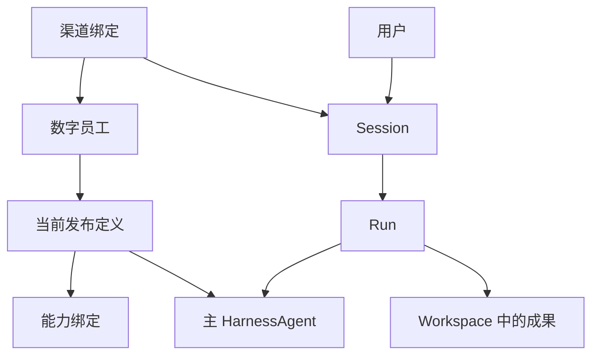

# 海卓智慧大脑：数字员工平台功能地图与框架骨架

| 项目 | 内容 |
| --- | --- |
| 版本 | 0.4，首个业务闭环方案对齐 |
| 日期 | 2026-09-26 |
| 设计阶段 | 功能与模块骨架；暂不确定 API、数据库表、具体 Java 接口及执行器实现 |
| 依据 | 当前 `haizhuo-brain` 工程；[多渠道](../04-渠道与执行/数字员工多渠道接入与消息流转设计.md)、[用户身份](../02-身份与会话/用户身份与跨系统Token设计.md)、[Agent 权限](../02-身份与会话/Agent资源与动作权限设计.md)和[能力发布](../03-Agent与能力/Agent能力配置与发布架构.md)设计 |

本文是功能地图。身份、权限、能力修订和多渠道消息的具体规则，分别以本套文档的对应专题为准。这里的“当前设计”表示产品规则已形成，并不表示仓库功能已经实现。

## 0. 本阶段要回答什么

平台的主线是：**一个预置数字员工拥有一个当前已发布定义；该定义绑定若干能力；用户通过不同渠道与这个员工交互；主 HarnessAgent 负责完成工作；平台保存会话、执行过程和成果。**

当前工作要确定功能归属及边界，而不是先把所有功能做成接口。判断一项设计是否完成，可以问四个问题：它对应哪个产品对象？由哪个模块负责规则？需要和哪个模块协作？以后增加第二个数字员工或渠道时，现有关系是否仍成立？

本文区分三种状态：**已确认方向**沿用已有概要设计；**本轮建议**用于梳理骨架，仍可调整；**实现现状**仅描述仓库目前有哪些模块或占位契约，不代表产品能力已经可用。

## 1. 平台要提供的功能

### 1.1 管理面：决定数字员工是什么、能用什么

| 功能域 | 产品能力 | 一期边界 |
| --- | --- | --- |
| 数字员工 | 管理面向用户的员工身份、名称、状态与当前发布定义 | 先有一个平台预置员工；后续再支持多个员工及用户自建 |
| 定义与发布 | 管理角色指令、模型选择、能力组合和历史版本；发布后成为可执行依据 | 一个员工有一个当前已发布定义；新发布只影响后续 Run |
| 能力目录 | 登记 Skill、Tool、MCP、知识资源的含义、修订和可用范围 | 首批由平台预置与维护；不做用户自建能力市场 |
| 能力绑定 | 将某项能力的确定修订纳入员工的已发布定义 | 绑定表达“可供这个员工使用”，实际操作还要经过权限判断 |
| 渠道配置 | 将 Web、OA 或第三方账号关联到员工，管理启停与可接入范围 | 一期所有已启用渠道指向同一个预置员工 |
| 模型接入 | 管理模型来源与可用性，并为员工定义选择模型 | 平台管理配置来源；真实调用由 AgentScope 适配层完成 |

管理面是产品功能边界，**不要求本阶段就建设完整的管理后台**。预置内容也应遵守相同的发布关系，以免未来开放多个员工时更换整个概念模型。

### 1.2 执行面：接收工作、保持上下文、交付成果

| 功能域 | 产品能力 | 归属原则 |
| --- | --- | --- |
| 接入与身份 | 管理员创建账号、手机号密码登录；识别可信渠道、真实用户及其可以访问的员工 | 手机号唯一用于登录与外部系统定位，稳定 `UserId` 用于归属；消息渠道需验证身份绑定 |
| Session | 保持用户与员工的持续交互及相关资源引用 | 一个用户可有多个 Session；不同渠道默认不合并历史 |
| Run | 表达一次工作尝试及其进度、等待、完成、失败和取消 | 一个 Session 同时最多一个活跃 Run；Run 可以跨越多次框架调用 |
| 主 Agent 执行 | 理解需求、使用 Skills/Tools、必要时委派专业子 Agent、检查并交付 | AgentScope 执行模型与工具循环；主 Agent 对最终交付负责 |
| 个人 Workspace | 组织用户的资料、历史会话和成果归属 | 属于平台资源空间；不直接等同于 Harness Workspace |
| 资料与知识 | 上传资料、保存长期资料、按需引用或检索 | 一期 Web 支持上传并在工作中引用；消息渠道只接收文字，可按权限引用已有个人资料 |
| 成果管理 | 保存文档等成果，记录版本、来源、修改和跨会话引用 | 成果是平台对象，不因框架写出文件就自动成为正式交付 |
| 交互控制 | 追问、补充、回应等待、确认操作、取消及抢占 | 等待回复关联原 Run；活动 Run 期间普通新任务一期不自动排队，其运行机制留待详细设计验证 |

首个业务闭环以会议室预定贯穿这条链路：用户通过 API 提出完整需求，员工调用受控工具查询 Mock 会议室，再完成有明确授权的 Mock 预定，平台保存可核验结果和工作事件。会议资料整理与纪要生成放到后续场景；两者都不要求恢复独立 `meeting` Maven 模块。具体边界见[会议室预定详细设计](../05-业务闭环/会议室预定首个业务闭环详细设计.md)。

### 1.3 治理面：让能力可控、过程可追

| 功能域 | 需要回答的业务问题 | 工程归属 |
| --- | --- | --- |
| 身份与权限 | 谁发起 Run？员工能看见哪些能力？这位用户在当前资源范围内能执行什么动作？ | `security` 负责账号、平台登录态、授权与确认规则；平台执行协调组织检查，外部系统保留最终授权 |
| 操作确认 | 哪些操作需要用户明确同意？同意后权限是否仍有效？ | `security` 保存确认决定；实际调用前重新检查 |
| 审计与工作记录 | 输入、授权、动作、成果和失败之间如何关联？ | 平台保存业务事实，`observability` 提供技术追踪 |
| 运行观测 | 哪次 Run 使用了哪个模型、工具与能力，产生多少用量与错误？ | `observability` 独立承接，不替代平台业务记录 |
| 外部凭证 | 用户调用某个目标系统时，如何取得并更新对应的 Token？ | 独立凭证管理按 `UserId + 目标系统` 维护；不绑定数字员工、Tool 或 MCP |

能力绑定、用户权限、操作确认是三个不同的判断：**绑定限定候选能力；权限限制可执行范围；确认批准某次需确认的操作，但不能提升原有权限。**

## 2. 核心对象及关系

| 对象 | 它代表什么 | 应避免混同的对象 |
| --- | --- | --- |
| `DigitalEmployee` | 面向用户的数字员工身份 | 一个运行中的 HarnessAgent 实例、内部子 Agent |
| `AgentDefinitionVersion` | 一次发布的员工配置：指令、模型与能力范围 | 可被随意修改的运行态 Workspace |
| `CapabilityBinding` | 发布定义对能力及其修订的引用 | 用户授权记录、实际工具调用 |
| `ChannelBinding` | 某个入口或外部账号与员工的接入关系 | Session、员工定义 |
| `Session` | 用户与某员工持续交流的业务会话 | 外部渠道的会话 ID、框架内部消息记录 |
| `Run` | Session 中一次具体工作过程 | 长期业务目标、一次模型调用 |
| `Workspace` | 用户资料与成果的业务归属空间 | Harness 的指令/Skills/工作文件组织 |
| `Artifact` | 有归属、来源和版本的交付成果 | 临时文件、工具输出片段 |
| `AgentState` | 框架用于续接 Agent 上下文的内部状态 | 平台 Session 和业务聊天记录 |

这张图表示**归属与使用关系**，不是对象调用顺序。一个员工以后可以关联多个渠道账号，并陆续发布新版本；一次 Run 只使用它开始执行时确定的有效版本。多位用户可以使用同一个员工，但各自的 Session、Workspace 与权限相互隔离。

## 3. 从一个需求看功能边界

用户先通过 Web API 提出“预定明天 14:00 到 15:00、供 6 人使用且有投屏的会议室”；以后也可能从 OA 或企业微信发送其他需求。整体过程在骨架层可理解为六步：

1. **入口找到人和员工**：确认消息来源，将渠道身份关联到平台用户，并确定本次服务的数字员工。
2. **平台找到会话**：用户继续已有 Session 或开启新 Session，确定本次可引用的资料和成果。
3. **平台建立工作**：一次输入触发一个 Run；在开始执行时确定员工已发布定义和能力范围。
4. **主 Agent 完成工作**：AgentScope 根据有效配置运行 HarnessAgent，按需使用 Skill、Tool 或内部子 Agent；涉及资源操作时走平台的检查入口。
5. **平台保存事实与结果**：记录可向用户展示的工作进度、最终回答与可核验的 Mock 预定引用；以后有正式成果时再保存产物及其来源。框架内部状态按自身职责保存。
6. **原渠道收到反馈**：把工作状态和结果交付给发起渠道；用户以后仍可在所属 Session 发起新的工作。

这里已经足以检查模块归属。消息字段、接口路径、数据库事务和具体恢复手段都属于下一阶段。

## 4. 当前工程模块如何承接

继续使用现有模块化单体，不因功能地图中的每个功能域额外增加 Maven 模块。下表省略 `haizhuo-brain-` 前缀。

| 现有模块 | 骨架职责 | 本阶段需要定清的边界 |
| --- | --- | --- |
| `platform` | 数字员工及能力发布、渠道关联、Session/Run、Workspace/成果等平台规则 | 内部按功能域组织；不重做模型循环、Skill 加载或子 Agent 调度 |
| `runtime-api` | 平台执行语义与 AgentScope 适配之间的薄边界 | AgentScope 已选定，无需为了假设中的其他运行框架设计大而全的通用 Runtime |
| `runtime-agentscope` | 把已确定的员工定义和执行上下文交给 AgentScope，承接其运行机制 | 不自行选择用户权限、业务 Session 归属或成果版本 |
| `api` | Web、OA、外部渠道的接入与结果呈现边界 | 不承担员工发布、Run 生命周期或业务授权规则 |
| `security` | 用户账号、密码与登录态、角色、权限判断、确认与撤销规则 | `api` 承接登录协议；渠道身份绑定由 `platform.channel` 管理；确认不提升权限 |
| `observability` | 技术链路、模型与工具用量、异常诊断 | 不作为唯一业务事实来源 |
| `infrastructure` | 持久化、文件存储和外部系统适配 | 不决定 Session、成果版本、能力发布等产品规则 |
| `kernel` | 少量真正共享的标识和基础契约 | 不成为各种业务模型的集中仓库 |
| `bootstrap` | 单体启动及模块装配 | 不放业务流程 |
| `test-support` | 验证辅助 | 不进入生产功能链 |

`platform` 内部沿用五个功能分区：**员工与能力配置、渠道接入、资源管理、会话管理、执行协调**。这些是职责目录，不承诺五套服务或五个 Maven 模块。`security` 与 `observability` 维持已讨论过的独立模块。

## 5. 哪些关系现在应定，哪些可以等

### 5.1 沿用已确认的方向

- 一期一个预置数字员工、一个当前已发布定义和若干能力绑定；主 Agent 可直接工作，必要时顺序委派专业子 Agent。
- 渠道共享员工身份，不默认合并不同渠道的 Session；未来切换员工时应重新判定会话归属。
- 智慧大脑产品拥有用户、资源、发布、Session、Run、授权及交付规则；工程内账号与授权归 `security`，其他业务规则归 `platform`，AgentScope 优先承担模型与工具循环、Skills 加载、内部上下文和委派机制。
- 平台个人 Workspace、Harness Workspace 与 `AgentState` 各有用途；不能因为用了同一存储或同一个用户 ID 就视为相同对象。
- 会议室预定先作为 Skill 与受控工具的首个业务闭环，会议整理后续接入；两者不需要恢复 `meeting` 框架模块。
- 平台面向单一公司内部使用，不增设公司或租户产品维度；管理员创建用户，普通用户以手机号和密码登录并默认使用预置员工。
- 普通用户默认只能访问自己的 Session、Workspace、资料和成果；公司公共知识源由管理员开放并绑定员工，外部只读动作只有经管理员按系统与动作明确纳入才默认开放。
- `CapabilityBinding` 引用确定修订；Skill 内容、Tool 行为或 MCP 子工具 schema 变化时产生新修订。新发现的 MCP 工具先进入候选清单，须选择、登记、绑定、发布后才可用。
- 同一个 Session 的新 Run 可使用最新发布定义；等待续接的旧 Run 继续使用其固定版本。紧急停用即时拦截未发生的动作，回滚生成新的发布版本。
- 外部用户 Token 单独按 `UserId + 目标系统` 动态维护；仅轮换连接密钥值不产生能力修订，连接身份或授权范围改变则另行审核。

### 5.2 骨架图中应维持的边界

1. **配置来源**：发布定义是员工的产品依据；Harness Workspace 或部署默认配置是运行视图和初始化来源，避免出现第二套互相覆盖的员工配置。
2. **能力与权限**：能力目录、员工绑定、用户授权由不同职责维护；工具间接调用及子 Agent 委派仍受同一业务授权约束。公司公共知识来源与用户个人 Workspace 资料分别管理；后者按 `UserId` 判断归属。
3. **身份主体**：真实用户、执行所用的服务身份与 Agent Identity 分别可追溯；`DigitalEmployee` 不代替授权主体。Role、Scope、Resource、Action 等产品语义见权限专题；本阶段不指定数据库模型。
4. **信息归属**：一项资料是用户 Workspace 中的资源；一次对话属于 Session；一次动作属于 Run；正式成果归 Workspace 并关联来源。
5. **状态归属**：平台负责 Run 的业务状态和用户可见记录；AgentScope 的续接状态属于运行边界。一次框架调用结束不直接宣布 Run 完成。
6. **渠道扩展**：渠道入口关联员工与用户，交付仍回到对应渠道；增添新渠道不应复制一套会话、权限和成果规则。

已有的 `platform` Java 记录、渠道端口及运行事件名称只是**待校准的骨架草稿**。对象关系定稿后再决定这些类型是否保留，不能把现有类名和签名反过来当作产品约束。

### 5.3 放到下一阶段

- API 资源路径、请求与响应结构、数据库表和索引，以及单体内 worker 的具体实现。一期确定数据库 inbox/outbox 与有并发上限的内部 worker，不引入独立消息队列；后者仅作为未来规模变化时的演进选项。
- `HarnessAgent` 的具体构造参数、Workspace 映射、SkillRepository 适配与模型客户端配置。
- 取消、补充、等待续接等交互控制的具体技术实现；仍保留它们作为初版产品目标。
- 多员工自动路由、群聊、用户自建能力、跨会话自动长期记忆、多 Agent 并行，以及完整的管理后台。

## 6. 架构骨架的验收标准

进入详细设计前，团队应能用本文件回答以下问题，而无需先读 Java 接口：

- 第二个数字员工加入时，需要增加或复用哪些定义、能力和渠道关系？
- Web 与企业微信接入同一员工时，哪些产品规则完全一致，哪些信息必须按渠道和用户隔离？
- 一次会议室预定成功时，Session、Run、工作事件与外部预定引用分别记录什么？后续纪要成果接入时，Workspace 和 Artifact 又分别记录什么？
- 员工配置了“发送通知”的工具，但某用户无发送权限时，在哪个功能边界拒绝？
- 框架保存了 AgentState、压缩了上下文或委派了子 Agent 后，平台还能否解释用户看到的工作状态和成果归属？

这些答案稳定后，才能把骨架逐步转成详细设计和实现任务。当前代码仍是模块与契约骨架，不能据此认为上述功能已完成。

