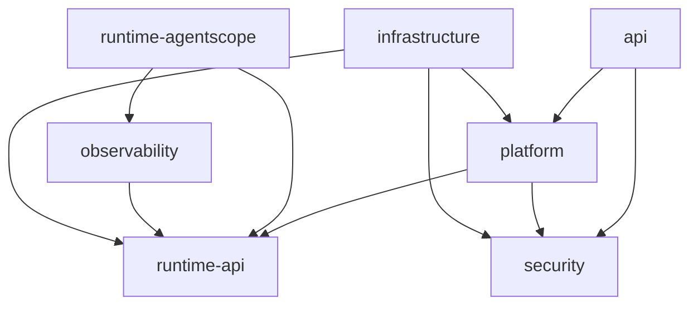

# Agent 平台整体工程架构

| 项目 | 内容 |
| --- | --- |
| 文档版本 | 0.5 |
| 状态 | 架构文档草案，待审阅；架构原则已经逐项讨论确认，工程能力尚未实现或完整验证 |
| 更新日期 | 2026-09-26 |
| 技术基线 | JDK 17、Spring Boot 3.5.16、AgentScope Java 2.0.3、MyBatis-Plus 3.5.17，以根 pom.xml 为准 |
| 适用范围 | 初版模块职责、依赖、数据归属、执行链路及详细设计前的验证事项 |

本文承接[概要设计](平台概要设计.md)与[请求执行链路](../04-渠道与执行/请求执行链路与控制.md)。产品行为以概要设计为入口，本文集中维护工程职责与架构约束，不展开数据库字段、接口参数、完整类设计或实现代码。

2026-09-26 的身份、权限、发布与多渠道规则见[当前设计总览](设计文档总览.md)及对应专题。现有工程已加入 `platform` 骨架并将旧 `meeting` 源码移出构建；下文“目标”模块职责不能解读为已实现功能。

状态用语：**现有实现**指仓库已有代码；**已确认设计**指本轮及概要中已确认的目标；**官方能力核查**指锁定版本的官方文档或源码证据，不等于项目已接入；**待验证**指还需要源码核查或运行实验的能力；**本轮建议**用于尚未确认的复用方案和后续验证安排。文档草案待审阅不意味着已确认原则重新变为待定，也不意味着这些原则已经实现。

本文未加限定的 Workspace 指平台个人资源空间；涉及框架时明确称为 **Harness Workspace**。二者不可互换，详见第 5.1 节。

## 1. 架构结论与范围

以下为已确认设计：

- 采用模块化单体，单个 Spring Boot 应用内通过有并发上限的内部执行器调度；不引入消息队列，不拆分执行服务。
- 新增 `haizhuo-brain-platform`，承接通用平台业务与执行协调，内部按职责分区，初版不再拆成多个 Maven 模块。
- Workspace 是用户个人资源空间，不依赖本地目录；服务端执行目录与 Workspace 分开管理。
- 主 Agent 可以直接组合 Skills 与工具完成工作，必要时顺序委派专业 Agent，仍统一检查和交付。
- Session 管理持续会话，Run 管理一次执行，业务 Task 保持目标和计划层面的轻量概念。
- 框架对象尽量限制在适配边界内；平台依赖契约，外围模块实现或扩展契约，由 `bootstrap` 统一装配。
- 平台保留配置发布、资源归属、产物版本、授权和 Run 等业务规则；框架已有的加载、压缩、等待、续接及委派机制优先验证复用，仅对不能满足平台要求的部分补充适配，不并行建设职责相同的第二套机制。

本轮不扩大概要中已确认的初版范围，不引入多 Agent 并行、跨会话自动记忆、用户自建能力或完整执行回放。

## 2. 现有工程评估

检查依据为[根构建配置](../../pom.xml)、各模块构建配置与主要代码。当前仍是工程骨架，不是完整平台。

| 现有实现 | 评估及调整方向 |
| --- | --- |
| 根工程声明 10 个 Maven 模块，已包含 `platform` | `platform` 现为契约骨架，仍需业务实现、持久化与运行集成 |
| `AgentScopeRuntime` 当前明确报“execution is not configured”，相关适配仍为空骨架 | 尚无真实 Agent 执行链路；不能将占位接口视为已验证能力 |
| 运行请求和事件已使用 Session / Run 标识，安全契约仍有 `taskId` / `AgentTaskId` 遗留 | 将确认与任务授权按 Session / Run 及具体操作校准，避免业务 Task 承担执行生命周期 |
| 旧 `meeting` 源码已移出根构建；API 尚无业务对话入口 | 首个 Skill / Tool 验证场景改为 Mock 会议室预定；通用执行与预定结果归平台，资料成果管理仍由平台承担 |
| `infrastructure` 有 MyBatis-Plus 配置，未形成业务存储实现 | 保留适配方向，存储接口由规则和数据的拥有方定义 |
| `runtime-api` 使用 Reactor `Flux`，API 使用 WebFlux | 已隔离 AgentScope 类型，但并非完全技术无关；响应式契约和阻塞访问配合仍待验证 |
| `runtime-agentscope` 仍需验证统一工具检查接入 | 目标设计由平台协调工具检查，`security` 作业务授权；会议能力通过受控 Skill / Tool 接入 |
| 声明 AgentScope JDBC 扩展和 Redis 等基础设施依赖 | 依赖存在不代表实际启用或存储方案已选定，不据此引入额外运行组件 |

当前修订只对齐设计与工程现状，不新增 Maven 模块或修改代码依赖。

## 3. 模块划分（已确认）

表中省略统一前缀 `haizhuo-brain-`。模块是同一应用内的工程边界，不是独立服务。

| 模块 | 处理 | 负责内容 | 不负责内容 |
| --- | --- | --- | --- |
| `platform` | 已有骨架，继续实现 | 员工与能力配置、渠道绑定和路由、Workspace、资料与产物、Session、Run、执行协调 | 不直接使用 AgentScope 对象，不实现数据库与文件存储细节 |
| `api` | 保留并扩展 | 登录及 Web / webhook 协议、请求与控制接入、状态查询、结果获取、进度订阅 | 不拥有 Run 生命周期，不以网页连接决定执行存亡 |
| `runtime-api` | 保留并调整 | 平台运行输入、事件、控制、工具桥接与必要运行状态存取契约 | 不管理业务生命周期，不暴露 AgentScope 类型；具体接口待验证后设计 |
| `runtime-agentscope` | 保留 | Agent 装配、模型与工具循环、委派、事件转换、控制适配、框架状态解释 | 不决定业务权限，不自行管理平台 Session / Run 规则 |
| `security` | 保留并扩展 | 平台账号、密码与登录态、角色、授权判断、操作确认及撤销规则 | 不把确认作为权限提升，不承担 Run 调度和等待生命周期 |
| `infrastructure` | 保留 | 数据库、文件存储、外部服务及框架状态存取实现 | 不定义资源身份、产物版本、会话隔离等业务语义，不解释框架状态 |
| `observability` | 保留，采用 Langfuse | 执行追踪、模型调用、耗时、用量、异常诊断及上报适配 | 不作为平台状态与工作记录的唯一来源，不决定 Run 是否继续 |
| `kernel` | 保持小规模 | 公共标识、基础错误及少量共享契约 | 不集中收纳所有业务对象，不成为通用业务服务集合 |
| `bootstrap` | 保留 | 应用启动、部署配置及组件装配 | 不承载业务流程 |
| `test-support` | 保留 | 测试辅助设施，仅测试依赖 | 不进入生产运行链路 |

### 3.1 platform 内部分区

| 分区 | 数据与规则归属 | 协作边界 |
| --- | --- | --- |
| 能力配置 | 模型接入、Agent Profile、Skills 与修订、工具定义及权限和确认要求 | 提供有效配置的解析依据，不创建运行中的 Agent，不代替实时授权 |
| 渠道接入 | 已验真的外部身份绑定、渠道配置、会话路由与异步投递意图 | 不替代 `security` 的平台账号状态和业务授权 |
| 资源管理 | 个人 Workspace、附件、资料库、产物身份与版本、格式文件、来源关系和冲突规则 | 统一管理资源；Session / Run 维护关联，不各自实现文件与产物规则 |
| 会话管理 | Session、用户输入、助手正文与最终答复、摘要、会话资源引用 | 保存持续上下文，不承担单次执行调度 |
| 执行协调 | Run、去重、内部调度、工作过程记录、补充输入、等待点、控制反馈、收尾和恢复判定 | 组织其他分区及运行契约，不直接改写其他分区的数据 |

统一工具调用入口先放在执行协调分区，不新增工具模块。各分区通过明确的应用能力协作，具体业务操作保留在所属分区或模块。

账号、密码、平台登录态与授权归 `security`；`api` 处理登录协议，`platform.channel` 管已验真外部身份到稳定 `UserId` 的绑定，Workspace 个人归属由资源管理维护。具体接口和持久化仍待详细设计；现有 `TenantId` 不构成产品租户维度。

## 4. 依赖方向与装配（已确认）

下图表示主要编译依赖，箭头从使用方指向依赖方；不表示业务执行顺序。公共基础依赖按需引用 `kernel`，图中未全部画出。



`bootstrap` 装配上述生产模块；`test-support` 只供测试使用。依赖 `platform` 的模块只使用其公开能力契约，不访问内部实现。

- `platform` 不依赖 `runtime-agentscope` 或 `infrastructure`；会议业务能力通过发布的 Skill / 受控 Tool 接入。
- 运行适配层通过 `runtime-api` 的工具桥接契约调用平台检查入口；目标设计移除其对 `security` 的直接依赖，避免两套授权流程。
- 业务存储与外部能力接口由业务拥有方定义，`infrastructure` 依赖这些接口并提供实现。
- 框架状态存取契约放在 `runtime-api`，因此 `infrastructure` 可以依赖该模块，但不能反向要求运行契约依赖存储实现。
- Spring Boot 将契约与实现装配起来；运行时回调平台能力不要求适配模块编译依赖 `platform`，不得由此形成循环依赖。

## 5. 技术作用与边界（已确认）

| 技术 | 本项目作用 | 边界 |
| --- | --- | --- |
| Spring Boot 3.5.16 | 单体启动、组件装配、Web 接入、配置与事务等支撑 | 应用协调和适配层可使用 Spring；业务对象保持普通 Java 对象，不为隔离额外拆模块 |
| AgentScope Java 2.0.3 | Agent 执行、模型与工具循环及交互机制的运行基础 | Agent、消息、运行上下文与内部状态限制在适配边界，转换为平台自己的契约 |
| MyBatis-Plus 3.5.17 | 持久化实现 | 数据库实体、Mapper、查询包装器不进入业务调用链与运行契约；不负责业务状态转换 |
| Langfuse | `observability` 的实现方向 | 版本及接入方式未定，不预设原生集成；对象和客户端留在观测边界 |

当前 Reactor / WebFlux 的使用不直接决定整个平台必须采用同一种执行模型。事件流契约、数据库阻塞访问与内部执行器的线程安排，需要验证后设计。

### 5.1 官方 Harness Workspace 的定位（官方能力核查）

核查范围为 AgentScope Java **v2.0.3** 的 core / harness 文档和相关源码，不泛指其他语言版本或 AgentScope Service 产品。

官方 Workspace 承载 Agent 的定义与持续积累内容：`AGENTS.md` 表达指令，`skills/`、`subagents/`、`tools.json` 表达能力配置；另有知识、记忆、计划和会话日志等文件。它是逻辑文件组织，可由本地、远程存储或沙箱承载，不要求终端用户提供本地目录。配置也可通过编程接口提供，不能将 Workspace 简化为纯粹的临时执行目录。[官方 Workspace 文档](https://github.com/agentscope-ai/agentscope-java/blob/v2.0.3/docs/v2/en/docs/harness/workspace.md)

需要区分四个概念：

| 概念 | 定位 | 与其他概念的关系 |
| --- | --- | --- |
| 平台 Workspace | 个人资源的业务归属空间 | 管理资料、会话和产物的归属与规则，不等于框架目录 |
| 平台 Agent Profile | 可复用的 Agent 配置定义 | 内容与 Harness 的部分配置有交集，但不是框架 Workspace；本次核查未发现 core / harness 中与本项目定义对应的独立 `AgentProfile` 类型 |
| Harness Workspace | 框架的配置和工作内容组织机制 | 可承载 Profile 的部分配置及执行文件，由适配层接入，不直接成为平台业务模型 |
| 服务端执行环境 | 文件处理或程序执行的实际环境 | 按需使用后端工具服务或受控环境；Workspace 不是执行进程或容器本身 |

此外，**`AgentState` 不属于 Harness Workspace 文件**。续接上下文由独立的 `AgentStateStore` 保存；Workspace 中的日志、计划文件与续接状态具有不同生命周期。其文件命名空间隔离与状态存储寻址也不是同一件事，不能用用户文件隔离推导出平台会话访问授权。[官方状态分工](https://github.com/agentscope-ai/agentscope-java/blob/v2.0.3/docs/v2/en/docs/harness/workspace.md#design-philosophy)

源码提供模型、系统指令、工具配置和子 Agent 等装配入口。因此 Profile 可以转换为程序配置，也可以按需输出框架读取的配置资源；这属于适配方式，不要求 Profile 与平台 Workspace 一一对应。[HarnessAgent 源码](https://github.com/agentscope-ai/agentscope-java/blob/v2.0.3/agentscope-harness/src/main/java/io/agentscope/harness/agent/HarnessAgent.java)

### 5.2 与当前设计的重叠评估

**评估结论：存在技术职责交集，但目前代码仍是骨架，尚不能称为已经重复实现。** 平台拥有业务规则不意味着必须重新实现框架机制。以下职责分工与优先复用方向已确认；具体实现仍需验证后定型，不改变已确认的产品边界或新增模块。确认复用方向不代表所有框架能力已经满足要求。

| 交集 | 若直接各做一套的问题 | 已确认分工与复用方向 |
| --- | --- | --- |
| Profile 与 Workspace 指令、工具和子 Agent 配置 | 平台配置与可变文件各自成为来源，实际执行偏离 Run 记录 | 平台发布配置作为业务依据，适配层生成有效运行配置；若使用框架文件加载，约束其来源与修订，不维护第二套独立配置后台 |
| 平台 Skills 管理与 Harness Skills 加载 | 重写发现、加载逻辑；多来源覆盖使指定修订失效 | 平台负责目录、发布、授权范围与修订保留，优先验证框架仓库与加载扩展；只暴露当前 Run 允许的有效来源 |
| 会话摘要与 Harness 上下文压缩 | 两边分别压缩同一上下文，造成重复模型消耗和信息漂移 | 优先复用框架压缩机制；平台保留原始业务记录和摘要关联，不默认再启动第二套压缩流程。界面摘要是否独立生成另行设计 |
| 平台对话记录与 Harness transcript / 历史查询 | 两套原文记录独立维护，检索结果或保留期限不一致 | 验证统一原文存储或单向派生适配；平台业务消息与框架消息仍可不同，不强行合表。所有原文检索限制在当前 Session |
| 平台权限与框架工具清单、确认机制 | 允许规则覆盖平台拒绝，或同一动作反复审批 | 平台负责最终业务授权，框架承接能力过滤与交互机制；权限映射和实际执行检查必须覆盖内置、Skill 间接调用及专业 Agent 工具 |
| Run / 等待管理与框架调用、状态续接 | 将框架调用结束当成 Run 结束，或重写 Agent 执行循环 | 保留平台 Run 和控制记录，复用框架调用、等待和状态机制；续接状态由适配层解释，基础设施负责存取 |
| 资源管理与框架文件系统、文件交付 | 将普通文件写入等同于正式产物提交，绕过版本和权限规则 | 优先复用适合的文件访问机制，业务产物仍经资源管理登记、检查版本并交付；Workspace 文件不能自动成为正式成果 |
| 专业 Agent 定义与框架委派 | 平台另建一套与框架竞争的子 Agent 执行机制 | 平台管理委派范围与预算约束，适配层优先复用框架委派；初版限定顺序执行，主 Agent 统一交付 |

复用依据：[Harness 能力分工](https://github.com/agentscope-ai/agentscope-java/blob/v2.0.3/docs/v2/en/docs/harness/architecture.md)、[Skills 来源与加载](https://github.com/agentscope-ai/agentscope-java/blob/v2.0.3/docs/v2/en/docs/harness/skill.md)、[上下文压缩及历史记录](https://github.com/agentscope-ai/agentscope-java/blob/v2.0.3/docs/v2/en/docs/harness/compaction.md)。这些能力是否满足平台的权限、版本和恢复要求，仍需运行验证。

### 5.3 对现有设计的修正与复用约束

以下复用约束已确认，具体实现方式尚未定型：

- **平台管理，框架执行。** Profile、资源归属、产物版本和 Run 继续保留在平台；配置解析、上下文处理、Skills 加载和委派等技术机制优先验证复用，不因新增 `platform` 全部自行实现。
- **控制额外配置来源。** `WorkspaceContextMiddleware` 会读取工作空间内容并追加到系统提示词；仅设置 Profile 的指令不足以保证最终指令一致。续接、重新装配和按需读取时均须保持 Run 绑定的配置依据。[上下文装配源码](https://github.com/agentscope-ai/agentscope-java/blob/v2.0.3/agentscope-harness/src/main/java/io/agentscope/harness/agent/middleware/WorkspaceContextMiddleware.java)
- **不整体映射个人资源空间。** 适配层只提供当前执行允许的资料视图或工具访问能力；用户上传的同名 `AGENTS.md`、Skill 文件等是工作资料，不能自动成为可信配置。具体命名空间、挂载和配置生成方式待验证。
- **不继承超出初版的功能。** 自动跨会话记忆、自学习 Skills 与用户自定义配置不因采用 Harness 自动纳入。应检查并关闭或隔离相关路径；是否关闭不能只看工具列表，还应覆盖自动加载和后台处理。
- **避免隐藏的跨会话访问。** 历史查询、框架日志和文件工具必须遵守当前 Session 检索边界。同一用户命名空间不足以替代这项规则。
- **不预设所有 Harness 内置工具直接开放。** 模型可调用的实际操作仍受统一入口检查；接入中必须验证桥接能否覆盖内置和间接执行路径。不能满足时限制暴露范围，不绕过平台权限。

对话压缩与长期记忆需要分别配置，不能为复用压缩而顺带启用跨会话记忆。官方文档描述了压缩前记忆写入及历史检索能力，因此应验证相关开关组合与访问范围；文档和源码中的默认值、触发时机也应以实际装配路径核实，不直接作为项目承诺。[压缩与记忆的配合](https://github.com/agentscope-ai/agentscope-java/blob/v2.0.3/docs/v2/en/docs/harness/compaction.md#coordination-with-memory)

本轮不新增“框架 Workspace 管理模块”，也不将平台 Workspace 改名或改成文件目录。是否采用只读配置文件视图、程序装配或两者组合，属于下一步验证决策。

## 6. 配置、数据与状态归属（已确认）

### 6.1 配置从定义到执行

| 类别 | 管理位置 | 规则 |
| --- | --- | --- |
| 部署配置 | 各技术模块声明，`bootstrap` 汇总装配 | 数据源、存储连接、执行容量、Langfuse 连接等由部署环境提供 |
| 平台能力配置 | `platform` 能力配置 | 管理模型接入、Profile、Skills、工具定义；部署默认值可作初始化或默认来源 |
| Run 有效配置 | `platform` 执行协调 | 创建 Run 的事务中解析并记录使用依据；Worker 读取冻结配置，运行中不主动切换新发布配置 |
| 框架运行对象 | `runtime-agentscope` | 根据有效配置装配，不自行重新选择模型或放宽能力范围 |
| 敏感凭据 | 受控基础设施能力 | 平台配置传递凭据引用，按需在适配边界解析；不进入会话上下文或前端事件 |

按需加载 Skill 使用当前 Run 绑定的修订内容，不扩展为全量配置快照。等待后继续仍属于原 Run，不能借重新装配而静默切换配置。权限撤销、授权失效和工具紧急停用在实际调用时检查，及时生效。

### 6.2 业务数据拥有方

| 数据 | 规则与生命周期拥有方 | 存取实现 |
| --- | --- | --- |
| 能力定义及修订 | `platform` 能力配置 | `infrastructure` |
| Workspace、附件、资料库、产物及版本 | `platform` 资源管理 | `infrastructure` |
| Session、对话、摘要及资源引用 | `platform` 会话管理 | `infrastructure` |
| Run、执行工作记录、等待点、控制与补充输入记录 | `platform` 执行协调 | `infrastructure` |
| 确认决定、有效授权及撤销相关记录 | `security` | `infrastructure` |
| 会议场景的专有业务数据（如后续确需） | 所属业务能力；一期不预设独立 `meeting` 模块 | `infrastructure` 适配 |
| AgentScope 内部状态 | `runtime-agentscope` 解释并转换 | 经 `runtime-api` 契约交给 `infrastructure` |
| 技术追踪和观测数据 | `observability` | Langfuse 接入；具体客户端与传输方式待验证 |

业务 Task 暂不强制建立独立生命周期或存储体系。Session / Run 只引用资源管理维护的资料和产物，遵循概要中已确认的版本、跨会话引用和冲突规则。

### 6.3 平台状态与框架状态

- 主 Agent 的框架会话状态沿平台 Session 连续使用，Run 不默认从空上下文开始；不要求一直复用同一个 Agent 实例。
- 一次 Run 可以包含多次框架调用，适配层必须维护当前执行归属，不能仅以框架会话标识处理取消或补充。
- 专业 Agent 使用独立上下文，由主 Agent 传入目标、必要材料与约束，返回结果和产物引用；不直接共享完整主 Agent 状态。
- 平台会话记录与框架上下文不要求逐条相同；工具结果等内部信息不直接成为前端聊天记录。
- 框架状态由适配层序列化、解释和恢复；基础设施保存内容但不解析内部执行位置。平台只组织恢复判定，不直接修改框架内部结构。
- 状态可使用相同数据库基础设施，但平台业务记录与框架检查点不天然构成同一事务。已有 AgentScope JDBC 依赖不代表默认采用其存储实现。
- 后续 Run 更新配置时，已有框架状态与新配置的兼容关系待验证；权限上下文不能作为绕过实时校验的依据。

## 7. 主执行链路（已确认）

```text
网页提交需求
  → api：识别认证身份，接收显式操作与引用
  → platform：调用会话、资源和安全能力校验归属与权限
  → 执行协调：请求去重、活跃执行校验、建立 Run
  → 内部执行器：取得执行名额
  → 执行协调：重检账号，固定届时已发布定义和能力修订，准备输入、会话背景与资源引用
  → runtime-api → runtime-agentscope：装配并运行主 Agent
      → 按需加载 Skill、读取资料、调用工具
      → 必要时顺序委派专业 Agent，由主 Agent 汇总
      → 根据真实结果自检与统一交付
  → 所属业务能力通过 infrastructure 保存数据与产物
  → 执行协调：记录结果、处理未决操作并结束 Run

执行事件 → 适配为平台事件 → 保存工作记录 → api 查询/推送 → 前端聚合展示
技术观测 → observability → Langfuse
```

平台准备确定信息，主 Agent 负责需求理解与下一步选择，不引入固定业务意图分类或固定多次模型调用流水线。主 Agent 可以直接组合工具完成复杂工作。

### 7.1 工具调用与权限

```text
AgentScope 工具适配
  → runtime-api 工具桥接
  → platform 统一工具调用入口
  → security 授权判断、必要的操作确认
  → 资源管理 / 所属业务能力
  → infrastructure 实际存取或外部操作
  → 返回真实结果，更新平台工作记录与运行上下文
```

已发布定义限定可用工具与修订；工具登记说明业务动作、目标资源识别和确认要求，运行时结合用户权限、可信资源范围与有效授权检查。不能确定完整影响或目标的通用工具不对普通用户开放。没有权限直接拒绝，不能通过用户确认突破权限。

统一入口协调权限、确认等待、取消、超时及预算约束。实际执行前重查权限撤销、工具停用和授权有效性。业务能力仍检查资源归属、产物版本冲突等规则，工具获准调用不能绕过这些规则。澄清回答不构成操作授权，框架建议的允许规则不能自动成为平台权限。

## 8. 交互控制与执行资源（已确认设计，实现待验证）

平台管理 Run 生命周期；适配层落实控制并报告实际情况。框架调用返回或流结束不直接等于 Run 完成。

### 8.1 等待、回应与安全收尾

业务澄清由平台交互工具承接，优先适配框架的外部结果等待机制；操作审批独立适配确认机制。二者共享平台等待管理，但不混用业务语义。

1. 收到提问或确认事件后，可以先保存并展示问题，但不能仅凭事件认定执行已经停下。
2. 进入等待收尾后不再新增派发；同批已启动操作应完成或安全停止，保存真实结果。这是平台目标，框架批次边界需验证。
3. 当前执行片段结束、必要状态可靠保存后，进入可继续的等待状态，释放执行名额，不长期占用执行线程。
4. 等待中的 Run 仍占用 Session 的活跃位置。活动 Run 期间普通新任务一期保存忙时拒绝事实并反馈，不自动排队；显式补充、取消及等待点回复关联原 Run。
5. 用户可以提前回答，平台保存但不提前应用；有效回应在安全收尾后使原 Run 重新申请名额，期间显示“回答已收到，等待继续”。

平台决定等待点有效性。重复回应不重复应用或调度；已取消、关闭或过期的等待点不能继续，也不能把回应自动应用到其他等待点或下一 Run。回应与取消竞争时按受控顺序处理；已恢复执行则进入执行中取消流程。等待过期策略和具体时长未定。

### 8.2 等待状态保存失败

可以继续的前提是平台等待记录与框架续接状态都可靠保存，且关联正确；不要求二者必须在同一数据库事务中完成。

任一侧保存失败时暂不允许继续，对可安全重试的保存动作做有限重试。仍失败则结束本次执行尝试、关闭继续入口，保留已保存内容和成果并反馈异常；不自动将已收回答转为新 Run。实际执行结束且有限收尾完成后释放名额，不因持久化失败永久占用资源。数据库不可用时不得假报终态已保存，后续需进行状态收敛。

### 8.3 取消与抢占

| 责任方 | 职责 |
| --- | --- |
| 平台执行协调 | 记录取消，阻止新的业务工具操作和继续安排，汇总实际停止情况 |
| 运行适配层 | 将取消关联到正确的执行实例，传播中断并报告框架调用结束情况 |
| 具体工具及基础设施适配 | 尽可能停止在途操作；不可立即停止时报告进展，核查实际结果 |

等待期间取消关闭等待点；回应已接收但尚未调度时取消待继续安排。只有确认相关执行已停止后才能标记取消；不能把收到请求当作已停止。旧操作仍可能修改资源时，不启动抢占后的替代 Run。已完成外部操作不自动回滚。

### 8.4 补充当前执行

平台校验目标 Run，保存补充输入及顺序；适配层通过 `runtime-api` 在安全边界读取，纳入执行上下文后报告应用情况。请求线程不直接修改 Agent 内部上下文。

已接收不等于已应用；不承诺改变已经发出的模型请求或撤销已有工具动作。Run 已结束时保留晚到输入并提示重新发送，不自动应用到下一 Run。安全边界、应用确认与持久化的一致性、重复应用防护仍待实验验证。

### 8.5 服务重启与工具副作用

重启后由平台组织判定、适配层报告可恢复范围。仅恢复经过验证能安全继续的执行；等待点与续接状态完整时恢复等待，已有有效回应时重新调度。其余明确标记中断，关闭失效入口，保留问题、回应与成果。

保存聊天历史不等于恢复执行位置。用户可主动基于已有成果发起新 Run，平台不自动将从头运行伪装成恢复。已取消的执行不因重启重新激活。

工具结果处理遵循：已确认成功则复用结果；确认未执行且具备安全条件时才执行或重试；结果不确定时先核查，无法核实且可能产生额外影响时暂停该操作并说明。平台记录调用身份与进展，具体工具提供适合自身的去重或核查能力，不承诺所有外部副作用恰好执行一次。

## 9. 持久化与事务（已确认）

采用按业务动作组织的短事务，不以数据库事务包住整个 Run，不在事务中等待模型、外部工具或用户。

| 场景 | 一致性要求 |
| --- | --- |
| 建立 Run | 请求去重、Session 活跃执行约束与 Run 建立需要一致性保障 |
| 异步渠道入站 | 按提供方事件号作用域去重并持久化接收、控制或忙时拒绝事实；Web 按认证用户及客户端请求键去重 |
| 模型与外部工具 | 在事务外执行，分别保存必要的调用前后状态 |
| 保存产物版本 | 资源管理保证版本检查、登记与来源关联一致 |
| 回应等待点 | 不重复接受和应用；实际继续执行由协调层安排 |
| 收尾 | 核实已有成果与未决操作，保存结果、工作事件和终态；异步渠道同时可靠保存 outbox 意图后释放 Session，不等待实际送达 |

业务分区定义一致性要求，应用层组织事务，`infrastructure` 实现存取。文件与数据库不天然处于同一事务：资源管理定义何时算保存成功，文件尚未可靠保存不能宣称产物可用。

外部动作成功但平台记录失败时，需要核查与状态收敛，不能重跑整个操作。具体事务、幂等和补偿机制在详细设计中确定，不预设分布式事务或额外中间件。

## 10. 前端反馈与 Langfuse（已确认）

平台工作记录是查询和页面恢复的依据。Web 从已保存的工作事件经 SSE 或查询读取，断线不取消 Run，重连补齐已有内容和真实状态，不重复启动执行。异步消息渠道由独立 outbox worker 投递；Web 不创建第三方投递记录。具体事件字段和 SSE 细节待详细设计。

会话管理保存正文，执行协调保存关键动作、等待点和控制反馈，资源管理提供真实产物版本。前端聚合展示和生成常规文案，不解析模型内部推理，不从技术日志推断业务状态。

`observability` 使用 Langfuse，接入、转换与上报集中在模块内部。平台 Session / Run 与观测关联，覆盖模型、工具及专业 Agent；Run 预算使用执行过程直接反馈的用量，不依赖 Langfuse 上报完成或查询返回。

Langfuse 上报与主执行解耦，采用有界缓冲和有限重试，上报不可用不阻断 Run，观测故障需留下可诊断信息。业务状态持久化失败按第 9 节处理，不能视为可忽略的上报故障。

默认不全量上报附件正文、完整上下文和工具原始结果；采集、脱敏与截断策略在详细设计中明确。连接设置属于部署配置。Langfuse 及客户端版本、接入方式、与 AgentScope 的事件对接均待核查，不预设原生集成，也不将平台配置管理迁移到 Langfuse。

## 11. AgentScope 2.0.3 核查记录与验证清单

### 11.1 已有证据与能力边界

讨论期间查阅了官方 `v2.0.3` 标签文档与源码，并检查本地 2.0.3 依赖中相关类的存在。**尚未进行运行实验，不能据此宣称完整链路已验证。** 交互控制核查主要针对 core 层，另已核查 Harness Workspace 的定位及上下文加载路径；完整 Harness 装配与配置组合仍需验证。

| 主题 | 源码核查发现 | 平台补充与限制 |
| --- | --- | --- |
| 等待 | 存在确认事件、外部结果等待及后续调用续接路径；配置状态存储后有保存路径 | 需平台等待点、调度与安全收尾，不能收到等待事件就释放名额 |
| 取消 | 有会话中断标记及推理、流式片段、工具阶段前检查点 | 不构成所有外部动作已经停止的证明，需具体工具配合 |
| 补充 | `observe()` 实现写入默认会话状态；同会话调用有串行控制；存在中间件扩展点 | 不能直接视为目标 Run 的安全补充机制，适配方案待实验 |
| 持久化恢复 | 有 `AgentStateStore` 等状态存储抽象 | 状态可保存不等于任意步骤可恢复；JDBC 扩展与平台一致性待验证 |
| Workspace 与 Profile | Harness Workspace 覆盖部分 Agent 定义和工作文件，续接状态另存；编程接口可提供配置 | 平台概念不与其等同；配置来源、资源视图及已确认复用方向见第 5.1—5.3 节，接入方式仍待验证 |

证据入口（固定到锁定版本）：

- [Agent 文档](https://github.com/agentscope-ai/agentscope-java/blob/v2.0.3/docs/v2/en/docs/building-blocks/agent.md)：交互与状态存储说明。
- [ReActAgent](https://github.com/agentscope-ai/agentscope-java/blob/v2.0.3/agentscope-core/src/main/java/io/agentscope/core/ReActAgent.java)：执行、等待、状态保存及观察消息路径。
- [AgentBase](https://github.com/agentscope-ai/agentscope-java/blob/v2.0.3/agentscope-core/src/main/java/io/agentscope/core/agent/AgentBase.java)：调用生命周期及串行控制。
- [InterruptControl](https://github.com/agentscope-ai/agentscope-java/blob/v2.0.3/agentscope-core/src/main/java/io/agentscope/core/interruption/InterruptControl.java)：中断信号。
- [ToolExecutor](https://github.com/agentscope-ai/agentscope-java/blob/v2.0.3/agentscope-core/src/main/java/io/agentscope/core/tool/ToolExecutor.java)：工具调度、外部等待及超时路径。
- [MiddlewareBase](https://github.com/agentscope-ai/agentscope-java/blob/v2.0.3/agentscope-core/src/main/java/io/agentscope/core/middleware/MiddlewareBase.java)：执行扩展点。

### 11.2 进入详细设计前的验证安排（本轮建议）

按以下顺序进行最小验证，再定型运行契约；每项结果区分框架原生支持、平台补充和实际限制。

| 优先顺序 | 验证项 | 需要取得的证据 |
| --- | --- | --- |
| 前置 | Harness 装配与重叠消解 | 固定配置来源和修订，受控资源视图不泄漏其他 Session；内置工具不绕过统一检查；长期记忆和自学习禁用；摘要、Skills、原文记录复用方案成立 |
| 1 | 等待与继续 | 澄清和审批可结束当前片段；平台与框架状态可靠保存；释放名额；回应后原 Run 继续；覆盖同批工具及提前回答 |
| 2 | 取消传播 | 模型无响应、流式输出、工具执行及专业 Agent 中的停止行为；取消与完成竞争；确认停止前不启动抢占执行 |
| 3 | 补充输入 | 目标 Run 隔离、安全生效时点、顺序与应用确认；持久化失败、重复输入和晚到输入的处理 |
| 4 | 状态存取与重启 | JDBC 扩展能否复用；状态关联、恢复范围、双侧保存失败、未决副作用及取消后不复活；跨 Run 配置兼容 |
| 5 | 资源、超时与预算 | WebFlux、阻塞数据库访问、框架调度与平台执行名额配合；模型/工具超时、重试分工、主子 Agent 用量归集 |
| 6 | Langfuse | 确定版本与接入方式；事件关联、脱敏、上报失败隔离及有界资源占用 |
| 7a | 首个会议室预定闭环 | API 提交需求、AgentScope 查询/预定 Mock 会议室、授权与幂等、冲突/不确定结果、工作事件和结果查询；见[详细设计](../05-业务闭环/会议室预定首个业务闭环详细设计.md) |
| 7b | 扩展业务和完整交互 | 再做会议资料、产物修改、等待/补充/取消/抢占、失败与重连；验证状态与界面反馈一致 |

并发额度、等待容量与过期时间、数据保留期限、文件存储选型、SSE 事件格式、线程模型和接口形式尚未确定。验证结果如影响已确认行为，应先明确能力缺口再讨论调整，不以框架默认行为静默替代平台要求。

## 12. 变更记录

| 日期 | 版本 | 摘要 |
| --- | --- | --- |
| 2026-09-26 | 0.5 | 首条业务验证调整为 Mock 会议室预定，并与后续纪要及完整交互验收分阶段衔接 |
| 2026-09-26 | 0.4 | 对齐当前模块骨架及专题设计：身份职责、渠道分区、活动 Run 忙时拒绝、Web 事件读取和异步 outbox 收尾边界 |
| 2026-09-23 | 0.3 | 确认平台业务规则与框架技术机制的分工及优先复用方向，保留具体接入、存储映射和能力验证为待定事项 |
| 2026-09-23 | 0.2 | 补清官方 Harness Workspace、平台 Workspace 与 Profile 的区别，明确 AgentState 独立存储；新增重叠评估、复用建议及前置验证 |
| 2026-09-23 | 0.1 | 汇总已确认的模块分区、依赖、数据归属、执行控制、事务及 Langfuse 边界，记录版本源码核查与待验证事项；草案待审阅 |

