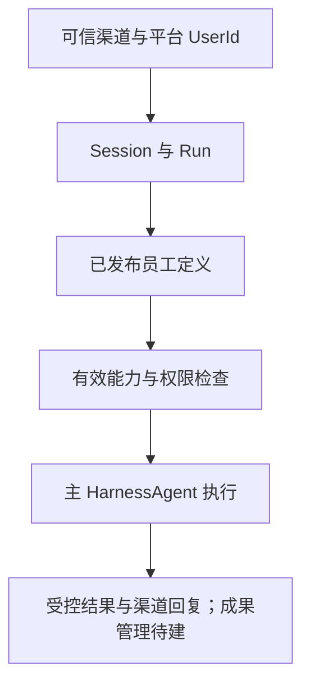

# 海卓智慧大脑：当前设计文档总览

| 项目 | 内容 |
| --- | --- |
| 核对日期 | 2026-09-28 |
| 范围 | 当前代码能力、仍有效的架构规则与历史方案的阅读边界 |
| 阶段 | 身份、Session/Run、Harness、实时流、渠道模拟底座和 MCP 模拟闭环均有代码；真实业务系统与真实 MCP 身份未接入 |

## 阅读顺序与文档清单

| 顺序 | 文档 | 当前版本 | 主要回答的问题 |
| --- | --- | --- | --- |
| 1 | [功能地图与框架骨架](功能地图与框架骨架.md) | 0.3 | 产品有哪些功能域，现有模块各负责什么 |
| 2 | [项目说明](../../项目说明.md) | 当前代码 | 先确认已实现与未接入的功能边界 |
| 3 | [工具与 MCP 实施详细设计](../03-Agent与能力/工具MCP实施/工具与MCP实施详细设计.md) | 当前切片 | MCP 治理、Run 可见性和执行错误怎样落地；各 SPEC 从此进入 |
| 4 | [工具与 MCP 模拟闭环报告](../07-测试报告/工具与MCP模拟闭环功能验收报告.md) | 已执行测试 | 哪些路径在模拟环境验证，哪些仍需真实对接 |
| 5 | [Agent 资源与动作权限](../02-身份与会话/Agent资源与动作权限设计.md) | 长期规则 | 本地 Tool、可信 MCP、确认与资源判权的不同责任 |
| 6 | [多渠道与实时交互方案](../04-渠道与执行/AgentScope服务示例与实时交互改造方案.md) | 历史阶段方案 | 理解分期目标；实际进度以代码及阶段报告为准 |

设计规则与代码状态分开阅读：本页和[项目说明](../../项目说明.md)概括当前实现；专题设计说明目标与约束；带日期的测试报告仅证明当时执行过的场景。若描述冲突，以当前源码、迁移和可复现测试为准。

Mock 退出过程见[历史基线设计](../04-渠道与执行/Mock退出与真实开发基线设计.md)。旧[会议室预定详细设计](../05-业务闭环/会议室预定首个业务闭环详细设计.md)及[测试报告](../07-测试报告/会议室预定闭环测试报告.md)保留为历史原型记录，其 API、Mock 表和运行方式已退出。

## 一页看清当前结论

| 主题 | 已确认的规则 |
| --- | --- |
| 数字员工 | 管理员可编辑草稿、选择能力并发布不可变定义；Run 创建时冻结发布版本。用户自建员工、员工市场及受控子 Agent 尚未交付。 |
| 业务与框架 | 原会议室 Mock 闭环已退出。当前没有可调用的会议室预订业务入口；真实业务适配器须依据目标系统契约重新设计。不恢复独立 `meeting` 框架模块。 |
| 多渠道 | Web 已有 Session/Run 与会话级 SSE；渠道侧已有管理 API、身份绑定、入站去重、outbox、等待消息提升和模拟发送，使用 AgentScope `ChannelManager` 承载运行时。真实 IM 提供方尚未联调；Web 普通消息会排队，不沿用旧稿的“忙时一律拒绝”。 |
| 用户登录 | 仅管理员创建用户；普通用户没有自助注册。用户以唯一手机号和密码登录；稳定 `UserId` 作为数据归属与授权主体。仅面向公司内部，不引入公司或租户产品维度。 |
| 平台权限 | 可信账号、管理员角色、Session/Run 归属和工具执行网关已接入。员工绑定不直接给用户授权，确认也不提升权限；资料/成果的完整资源能力仍是目标设计。 |
| 企业知识与外部动作 | 知识库、个人资料与真实业务适配器未交付。本地 Tool 走平台资源与动作判权；可信 MCP 子工具经过管理员逐项批准后，目标资源由 MCP Server 使用终端用户身份逐次判权。 |
| 外部 Token | 平台登录态与外部用户凭证分离。本机 MCP 模拟器可签发短效测试 Token；真实终端用户凭证的取得、续期与 Server 信任联调尚未完成，非模拟模式拒绝调用。 |
| 能力变化 | 管理 API 已受管理员身份保护；MCP 连接、发现快照、差异视图、逐工具批准和修订已实现。远端声明变化须重新审核；Skill/Knowledge 的平台级目录与发布尚未交付。 |
| 发布与运行 | 新 Run 在创建事务内固定定义、能力修订及模型可见工具集合；等待与恢复沿用旧版。能力或连接停用可收窄未发出的调用，不能给旧 Run 新增工具。 |

## 目标关系示意

未来真实外部系统 Token 应由执行时的受控适配器按 `UserId + 目标系统` 获取；当前仅模拟 MCP Token。渠道凭据、MCP 连接密钥及外部系统用户 Token 的用途不同，均不应写入能力绑定或 Prompt。

## 仍待下一阶段决定

1. 真实 MCP Server、它认可的终端用户 Token 取得/续期及错误契约；本机模拟签名不能用于生产。
2. 真实 IM 提供方、跨实例交付与重启恢复；当前模拟和单进程验证不能替代提供方联调。
3. 真实业务系统、资源/知识库与受控子 Agent。本机当前配置模型和浏览器自动交互已跑通模拟工具；用户人工验收、真实第三方 MCP 联调仍待完成。
4. 共享资料、部门范围、用户自建员工、群聊及跨渠道 Session 转移等后续产品范围。

平台继续以数据库持久事实管理 Session/Run 与渠道 outbox；上述事项不因已有接口、模拟器或设计文档而视为完成。

## 历史文档的使用方式

早期会议室方案、StaffDeck 选型和工程骨架评估保留为决策过程；不能覆盖本页当前状态。旧稿取舍见[历史设计文档核对与迁移说明](历史设计文档核对与迁移说明.md)。

