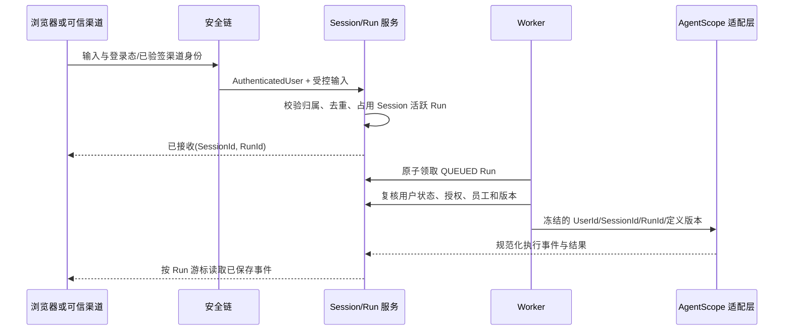

# 海卓智慧大脑：Session 与 Run 可信身份接入详细设计

> 当前 Session 规则（2026-10-07）：创建时固定员工定义版本；新会话业务 `sessionId` 直接作为 Harness `RuntimeContext.sessionId`，平台不再持久化 Runtime 映射/桥接摘要。存量会话显式保持旧状态槽兼容。具体存储边界、V19 迁移与限制见[Harness 当前实现](../03-Agent与能力/数字员工Harness运行时与版本状态切换详细设计.md)。

> 阶段记录：此页是 2026-09-27 的接入前方案；“业务 API 关闭”“活跃 Run 时直接拒绝新输入”已不符合当前实现。当前普通消息排队、运行控制和历史事件见[专项设计](../04-渠道与执行/Session与Run历史队列及运行中引导详细设计.md)及[项目说明](../../项目说明.md)。下文保留当时的边界与验收记录。

| 项目 | 内容 |
| --- | --- |
| 版本 | 0.1，实施前评审稿 |
| 日期 | 2026-09-27 |
| 范围 | 已认证用户发起的业务 Session、Run、事件查询与异步执行身份边界 |
| 依据 | [平台用户身份与管理员识别详细设计](平台用户身份与管理员识别详细设计.md)、[数字员工多渠道接入与消息流转设计](../04-渠道与执行/数字员工多渠道接入与消息流转设计.md)、[Agent资源与动作权限设计](Agent资源与动作权限设计.md) |
| 实现状态 | 原阶段实施前状态；当前业务 API 已开放，普通消息按同会话排队 |

## 1. 结论与不变量

1. `UserId` 只从已验证的 `AuthenticatedUser` 获得；请求体、路径、消息文本和渠道声明都不能指定当前用户。
2. `Session` 是用户与数字员工的一段持久对话上下文；`Run` 是该 Session 中一次可审计的执行尝试。两者均由平台创建稳定 ID，不复用浏览器 WebSession、第三方会话号或 AgentScope 内部 ID。
3. 同一 Session 最多一个活跃 Run。活跃包括 `QUEUED`、`RUNNING`、`WAITING_CONFIRMATION`、`CANCELLING`；普通新输入在活跃期间明确返回“忙”，一期不隐式排队。
4. Run 创建时冻结 `user_id`、`session_id`、`employee_id`、已发布的 Agent 定义版本及能力修订；运行时不能因员工重新发布而改用新版本。
5. 浏览器登录态用于授权“此刻能否发起或读取”；异步 Run 不依赖 Cookie 一直存在，但每个执行边界仍复核用户状态、资源授权和动作权限。停用后禁止新 Run 与未发生的外部动作。

## 2. 身份、标识与归属

| 标识 | 产生方 | 作用 | 禁止替代 |
| --- | --- | --- | --- |
| `UserId` | 平台身份服务 | 数据归属与资源授权 | 手机号、员工 ID、请求参数 |
| WebSession ID | Spring Session / Redis | 浏览器登录态 | 业务 `SessionId`、`RunId` |
| `SessionId` | Session 应用服务 | 用户与员工的一段业务上下文 | 外部会话号；AgentScope 的 ID 不反向决定业务属主 |
| `RunId` | Run 应用服务 | 一次执行、事件和最终结果 | 入站事件 ID、投递 ID |
| `providerEventId` | 渠道提供方 | 入站去重 | Run ID |

`session.user_id` 与 `run.user_id` 都是不可变快照。Run 读取 Session 时必须校验二者一致；不一致视为数据完整性异常，停止执行并留审计。管理员身份只适用于管理动作，并不允许绕过用户私有 Session 正文的归属检查。

## 3. 最小数据模型与约束

| 记录 | 核心字段 | 必须约束 |
| --- | --- | --- |
| `agent_session` | `id`、`user_id`、`employee_id`、`channel`、`status`、`created_at`、`last_active_at`、`row_version` | 所有按 ID 的读取都附带 `user_id`；软关闭后不能再新建 Run |
| `agent_run` | `id`、`session_id`、`user_id`、`employee_id`、`definition_version_id`、`status`、`input_id`、`started_at`、`finished_at`、`failure_code` | `(session_id, active_marker)` 唯一，保证一个活动 Run；`user_id` 与 Session 一致 |
| `run_event` | `run_id`、`sequence_no`、`type`、面向用户载荷、`created_at` | `(run_id, sequence_no)` 唯一；不记录密码、Cookie、外部 Token |
| `run_input` | `id`、`user_id`、`session_id`、`client_request_id`、内容摘要、状态 | Web 唯一 `(user_id, client_request_id)`；重复键须比对输入摘要和 Session 意图 |
| `run_audit` | Run、操作者/系统、阶段、结果摘要、时间 | 审计与用户展示事件分离；仅保留可追溯的脱敏事实 |

创建 Session、登记输入、创建 Run 和占用活跃位必须在同一数据库事务中完成。Worker 仅领取已提交的 `QUEUED` Run；进程在提交后崩溃时，任务仍可恢复发现，不能由 HTTP 重试再次创建。

## 4. 主链路

Web 入口从安全上下文传递 `AuthenticatedUser` 到应用服务；渠道入口先由验签与绑定将外部身份映射为同一 `UserId`。两条路径在进入 Session/Run 服务后完全一致。适配层只消费已确定的身份与版本，不能重新从 Prompt、渠道文本或 Agent 输出推导用户。

## 5. 状态机与控制请求

| 状态 | 可迁移到 | 语义 |
| --- | --- | --- |
| `QUEUED` | `RUNNING`、`CANCELLED`、`FAILED` | 已持久化，尚未被 worker 领取 |
| `RUNNING` | `WAITING_CONFIRMATION`、`SUCCEEDED`、`FAILED`、`CANCELLING` | 正在执行；同 Session 禁止普通新 Run |
| `WAITING_CONFIRMATION` | `RUNNING`、`CANCELLED`、`EXPIRED` | 只接受绑定该等待点的明确确认或取消 |
| `CANCELLING` | `CANCELLED`、`FAILED` | 记录请求，不承诺回滚已发生的外部操作 |
| 终态 | 不迁移 | `SUCCEEDED`、`FAILED`、`CANCELLED`、`EXPIRED` 均释放活跃位 |

确认请求必须携带服务端生成的等待点 ID，并由 Session 所有者提交；“同意”等自然语言不得自动成为高风险外部动作确认。取消、超时和 worker 崩溃恢复都留下事件与审计，不伪造成功或回滚。

## 6. API 与授权边界

| API（目标） | 认证与授权 | 结果 |
| --- | --- | --- |
| `POST /api/v1/sessions` | 已登录 `USER`；身份取安全上下文 | 创建本人 Session |
| `POST /api/v1/sessions/{id}/runs` | 已登录且 Session 属于本人 | 去重后创建或返回原 Run；活跃 Run 时明确忙拒绝 |
| `GET /api/v1/sessions/{id}` | 已登录且属于本人 | 返回元数据，不跨用户枚举 |
| `GET /api/v1/runs/{id}`、`/events?after=` | 已登录且 Run 属于本人 | 读取本人已保存状态和事件；支持断线续读 |
| `POST /api/v1/runs/{id}/confirm`、`/cancel` | 已登录且属于本人，且状态允许 | 受控状态迁移与留痕 |

未登录或会话失效返回 401；已登录但资源不属于本人时按统一策略返回 404 或 403，不能借此枚举他人资源。管理 API 若需要运营查询，应单独定义最小元数据、理由和审计，不复用用户正文读取接口。

## 7. 执行复核与失败关闭

Worker 在“领取 Run”“调用受控工具”“提交外部副作用前”至少复核：用户仍启用、Session/Run 归属一致、员工与冻结定义可用、工具当前未紧急停用、目标资源仍允许该用户访问。身份库、授权库或关键持久化不可用时停止推进并标记可诊断失败/待恢复，不退化为固定用户。

浏览器登出或 WebSession 自然过期不取消已经接受的 Run；密码修改、账号停用、角色/资源撤销的影响按下一执行边界复核。已成功调用第三方后的网络不确定性按真实结果记录为成功、失败或不确定，禁止无依据重试。

## 8. 验收清单

1. 两名用户不能用 URL、请求体或事件游标读取对方 Session、Run 或正文。
2. 同一 `(user_id, client_request_id)` 重试不产生第二个 Run；不同用户相同键不互相影响。
3. 并发提交同一 Session 时数据库只保留一个活跃 Run；忙拒绝有可追溯记录。
4. Run 使用创建时的发布定义和能力修订；员工随后发布新版本不改变旧 Run。
5. 停用用户、撤销资源或紧急停用工具后，后续执行边界拒绝外部动作；既有事实不伪造回滚。
6. Web 断线后可从事件序号继续读取；重启后已提交的 `QUEUED` Run 可被安全领取。
7. 审计、日志和事件中不含密码、WebSession ID、CSRF 值及外部 Token。

## 9. 实施顺序（尚未开始编码）

1. 先评审上述表、唯一约束、状态机和 API 错误语义；补充 Flyway 迁移设计与数据保留策略。
2. 再实现 Session/Run 领域服务与持久化，并以事务竞争测试证明活跃 Run 约束。
3. 随后接入已验证的 Web 身份、事件读取与 worker；最后才连接 `runtime-agentscope` 和受控工具。
4. 完成双用户隔离、停用复核、重启恢复和真实工具副作用验收后，才恢复对应业务 HTTP 入口。

本文不恢复任何 Session/Run API，也不改变当前管理员登录、Redis WebSession 或 Agent 定义管理实现。

