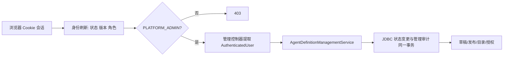

# 海卓智慧大脑：Agent 定义管理可信身份接入详细设计

| 项目 | 内容 |
| --- | --- |
| 版本 | 0.1 |
| 更新日期 | 2026-09-27 |
| 状态 | 本轮已实现；身份与管理员链路保护下的 Agent 定义管理入口与脱敏审计已恢复 |
| 目标 | 以当前登录的 `PLATFORM_ADMIN` 作为唯一管理操作者，恢复通用 Agent 定义、能力目录和用户能力授权管理 API |
| 上位设计 | [平台用户身份与管理员识别详细设计](../02-身份与会话/平台用户身份与管理员识别详细设计.md)、[Agent 定义版本与运行时能力动态装配详细设计](Agent定义版本与运行时能力动态装配详细设计.md)、[Mock 退出与真实开发基线设计](../04-渠道与执行/Mock退出与真实开发基线设计.md) |

## 1. 结论

1. 管理接口统一挂在 `/api/admin/v1/**`；只有当前账号仍启用、会话 `auth_version` 有效且当前角色包含 `PLATFORM_ADMIN` 时才能访问。不能恢复原 `meeting-mock` Profile、回环地址限制或配置文件中的固定 `admin-actor-id`。
2. 管理操作的操作者是安全上下文中的 `AuthenticatedUser.userId`。请求体、请求头、路径参数都不能声明或覆盖操作者身份；路径里的 `userId` 只表示被授权能力的目标用户。
3. 原有 `AgentDefinitionManagementService` 继续负责草稿校验、发布和能力配置规则；Web 控制器只完成输入校验、从 `@AuthenticationPrincipal` 取得操作者并将阻塞 JDBC 调用切换到 `boundedElastic`。`platform` 模块不依赖 WebFlux 或 Spring Security。
4. 每次管理写操作必须在与状态变更相同的数据库事务中追加管理审计。审计保存操作者、动作、目标、原因、发布幂等键和配置摘要，不保存完整提示词、凭据、Cookie、会话值或工具参数。
5. 本轮只恢复 Agent 定义管理，不恢复普通 Session/Run、会议室、Mock 能力提供者或任何真实业务工具。用户能力授权只改变未来有效能力解析与尚未越过执行检查的调用；它本身不等于开放用户侧业务入口。

## 2. 现有基础与责任边界

当前安全链已经将 `/api/admin/**` 约束为 `ROLE_PLATFORM_ADMIN`，并在授权前从身份库刷新账号状态、`auth_version` 和角色。因此管理员被停用、修改密码或撤销管理员角色后，旧 Redis 会话不能继续调用管理接口。

| 模块 | 本轮职责 | 不承担的职责 |
| --- | --- | --- |
| `security` | 认证主体、当前角色和会话失效 | Agent 草稿、能力目录或 HTTP DTO |
| `api` | 管理路由、输入校验、当前操作者提取、错误响应 | 固定管理员、业务规则、JDBC 事务 |
| `platform` | 草稿、发布、能力启停、用户能力授权及管理审计契约 | 登录、Cookie、CSRF 或框架权限注解 |
| `infrastructure` | JDBC 事务内写领域状态和审计记录 | 接受客户端自报身份或执行任意代码 |
| `bootstrap` | 装配领域服务；已有 WebFlux 路由安全链与 CSRF | 通过 Profile 选择是否绕过管理员认证 |

管理端与普通业务端的边界如下：

`PLATFORM_ADMIN` 只表示可以管理定义与授权；它不自动拥有读取任意用户 Session 正文、绕过未来资源范围，或直接执行外部业务动作的权限。

## 3. 对外 API

所有写请求沿用平台 Cookie 会话与 CSRF 约束：客户端先取得 `/api/v1/auth/csrf`，再以返回的请求头提交令牌。未登录返回 401；登录但不是管理员、首次改密未完成或会话已失效返回 403/401，具体由既有安全链决定。控制器不得自行根据 JSON 中的角色给出权限。

| 方法与路径 | 管理动作 | 请求关键字段 | 成功响应 |
| --- | --- | --- | --- |
| `GET /api/admin/v1/capabilities` | 查询能力目录 | 无 | 已登记能力和当前启停状态 |
| `GET /api/admin/v1/agents/{employeeId}/draft` | 读取草稿 | 正整数员工 ID | 草稿及 `draftRevision` |
| `PUT /api/admin/v1/agents/{employeeId}/draft` | 保存草稿 | `expectedDraftRevision`、指令、模型、能力修订列表、`reason` | 新草稿与递增后的修订号 |
| `POST /api/admin/v1/agents/{employeeId}/validate` | 校验草稿 | 正整数员工 ID | 可发布标识和问题列表 |
| `POST /api/admin/v1/agents/{employeeId}/publish` | 发布不可变版本 | `expectedDraftRevision`、`requestId`、`reason` | 201 和发布版本 |
| `PUT /api/admin/v1/capabilities/{capabilityCode}/status` | 启停能力 | `enabled`、`reason` | 204 |
| `PUT /api/admin/v1/users/{userId}/capability-grants/{capabilityCode}` | 设置用户能力授权 | `enabled`、`reason` | 204 |

`requestId` 是发布幂等键，作用域为员工；同一员工带相同 `requestId` 的重试必须返回已有版本，且不额外产生管理审计。草稿保存使用乐观修订：修订不匹配返回 409，客户端重新读取后再提交。草稿结构可读但不能发布时返回 422 和问题列表。

能力代码仅能引用数据库中已经登记的能力及精确修订；控制器不接受 Java 类名、脚本、任意 URL、模型 API Key 或 Provider Base URL。读取目录和草稿不写管理审计，避免无意义放大审计量。

## 4. 管理审计与数据迁移

已新增 `V5__agent_definition_management_audit.sql`，建立 `agent_definition_management_audit`：

| 字段 | 规则 |
| --- | --- |
| `id` | 自增主键 |
| `actor_user_id` | 非空，来自安全上下文的真实平台用户 |
| `event_type` | 白名单：`DRAFT_SAVED`、`DEFINITION_PUBLISHED`、`CAPABILITY_STATUS_CHANGED`、`USER_CAPABILITY_GRANT_CHANGED` |
| `target_type`、`target_id` | 分别标识 `DIGITAL_EMPLOYEE`、`CAPABILITY` 或 `PLATFORM_USER` 及稳定目标 ID |
| `request_id` | 仅发布记录幂等键，其余为空 |
| `reason` | 写操作必填，最长 500；不记录凭据或提示词 |
| `previous_summary`、`new_summary` | JSON 摘要，只含修订号、启停值、能力代码/修订、版本号及内容哈希；不保存完整指令 |
| `occurred_at` | UTC 写入时间 |

每个状态变更与审计写入必须共用 `JdbcAgentDefinitionRepository` 的事务：草稿更新、版本插入和当前发布指针切换、能力状态更新、用户授权 upsert 任一失败时都回滚，不能出现“状态已改但无审计”或“审计称已成功但状态未改”。已重放的发布请求只读取已存在版本，不新增审计。

领域层新增不可变 `AgentDefinitionManagementAudit` 值对象。服务层在完成输入与能力校验后构造动作、目标、操作者和原因；基础设施根据同一事务中读到的旧状态和最终新状态追加脱敏摘要。审计查询 API 和更复杂的配置差异展示不属于本轮。

## 5. 关键实现流程

### 5.1 保存草稿

1. 安全链刷新会话中的账号状态和角色，确认管理员权限。
2. 控制器从 `AuthenticatedUser` 取得 `actorUserId`，校验 `employeeId`、草稿字段和原因。
3. 服务校验模型 Provider、模型名、能力列表唯一性及每项能力修订存在性。
4. 仓储锁定草稿行，核对 `expectedDraftRevision`，更新草稿和绑定列表，写入 `DRAFT_SAVED` 审计摘要。
5. 事务提交后返回新草稿；冲突不写成功审计。

### 5.2 发布定义

1. 服务先校验当前草稿可发布；不满足时返回 422，不能创建半成品版本。
2. 仓储在同一事务中按员工锁定草稿和发布版本，检查 `requestId` 的幂等重放。
3. 首次请求创建不可变版本与版本能力绑定，切换员工当前版本指针，并写 `DEFINITION_PUBLISHED` 审计。
4. 重放请求返回原版本，不再次发布、不再审计；版本号和内容哈希不可改写。

### 5.3 能力启停与用户授权

能力启停和用户授权分别写入 `CAPABILITY_STATUS_CHANGED`、`USER_CAPABILITY_GRANT_CHANGED`。原因必须由管理员明确输入。能力全局停用会使未来解析以及运行中尚未通过最终执行检查的调用被拒绝；用户授权撤销同理。当前没有普通 Run HTTP 入口，因此这些规则是为后续可信用户入口准备，不能作为“功能已开放”的证明。

## 6. 错误与失败关闭

| 场景 | 响应 | 规则 |
| --- | --- | --- |
| 未登录、会话版本失效、账号停用 | 401 | 清理无效会话；不泄露用户或草稿详情 |
| 已登录但非管理员，或首次改密未完成 | 403 | 不调用领域服务 |
| 参数、能力代码/修订、员工 ID 不合法 | 400 | 不写状态或审计 |
| 草稿修订冲突 | 409 | 不覆盖他人的新草稿 |
| 草稿不可发布 | 422 | 返回结构化校验问题，不创建版本 |
| 数据库或审计写入不可用 | 503/事务失败 | 整个写操作失败关闭，不返回成功 |

控制器将所有 JDBC 调用放入 `boundedElastic`，避免阻塞 WebFlux 事件循环。数据库不可用时禁止将状态缓存在应用内存中，也不允许绕过审计继续发布。

## 7. 验收场景

1. 未登录调用任一恢复的 Agent 管理路径返回 401；普通用户返回 403；被撤销管理员角色或停用后，旧会话也无法继续操作。
2. 管理员在请求体伪造 `actorId`、`userId` 或角色字段不能改变审计中的操作者；配置中不存在可被读取的固定管理员 ID。
3. 管理员保存草稿、发布、启停能力、授予和撤销用户能力后，都有一条真实操作者、原因和脱敏摘要正确的审计记录。
4. 草稿并发修订冲突、不可发布草稿、未知能力和数据库写入失败均不生成成功状态或成功审计。
5. 同一 `requestId` 重试发布只得到同一版本，审计条数保持一条。
6. 全模块测试覆盖领域校验、JDBC 事务审计、控制器可信操作者传递，以及 Web 安全链的 401/403；真实 MySQL 执行 V5 迁移和 Redis/CSRF 联调在部署验收环境完成。

## 8. 不在本轮范围

- 数字员工创建、停用、多租户和前端管理页面。
- Session/Run、真实会议室、真实外部工具、渠道入口和用户自选员工。
- 能力目录新增、修订编辑、任意 MCP/Skill/Knowledge 装载。
- 面向管理员的审计查询页面、审计导出、审批流和外部 SSO。

完成本轮后，下一阶段才可针对第一个用户侧 Session/Run API 设计资源归属、可信 `UserId` 传递、异步执行复核和审计；不能直接把旧 Mock 入口重新注册。

