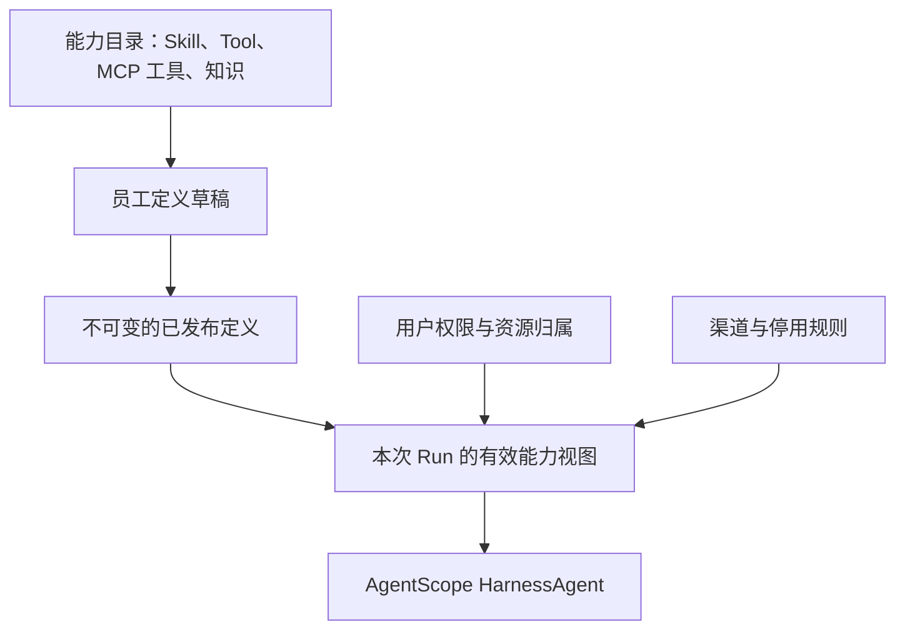

# 海卓智慧大脑：Agent 能力配置与发布架构

> **阅读边界（2026-09-28）**：本文混合长期架构与已退出的会议室首轮原型，后文“当前仅有 meeting-mock”等表述属于历史阶段。可信 MCP 边界以[统一配置及授权基线](工具与MCP统一配置及授权边界设计基线.md)为准；本机 MCP 模拟闭环已实现，真实 Server 尚未接入，现状见[项目说明](../../项目说明.md)。

| 项目 | 内容 |
| --- | --- |
| 版本 | 0.8，首轮动态装配实现 |
| 日期 | 2026-09-27 |
| 参照 | StaffDeck 本地参考代码提交 `7adc7c84f61bd6cca13ff0380a811cbb3ae3c544`；海卓现有产品设计与本地骨架 |
| 阶段 | 会议室首轮 API/数据库/AgentScope 动态装配已通过自动化测试、本地 MySQL 迁移和真实模型闭环验收 |
| 关联文档 | [Agent 定义版本与运行时能力动态装配详细设计](Agent定义版本与运行时能力动态装配详细设计.md)、[用户身份与跨系统 Token](../02-身份与会话/用户身份与跨系统Token设计.md)、[Agent 资源与动作权限设计](../02-身份与会话/Agent资源与动作权限设计.md)、[数字员工多渠道设计](../04-渠道与执行/数字员工多渠道接入与消息流转设计.md) |

本文描述平台长期目标和首轮实际落地边界。当前实现仅覆盖 meeting-mock 的一个预置员工、两项会议室能力及简化用户授权；不代表平台级 RBAC、管理员登录或所有能力形态已经完成。StaffDeck 的实现仅作固定提交上的设计参考；下文的接入准则是海卓自身需要落实的约束。

首轮实现已将 Run 到 Toolkit 的固定会议室清单改为 API + 数据库驱动的发布版本、EffectiveCapabilitySet 和 AgentScope 动态工具装配。仅查询工具与查询+预定工具两种 Toolkit 组合均已通过真实模型调用验证，Mock 预定结果也已写入并从 MySQL 核验。具体 API、表结构、权限简化点和已知边界见[Agent 定义版本与运行时能力动态装配详细设计](Agent定义版本与运行时能力动态装配详细设计.md)及[实现测试报告](../07-测试报告/Agent动态能力装配设计实现测试报告.md)。数据库配置只选择已注册的代码提供者，不执行任意代码。

## 1. 核心判断

我们需要的是一套**可管理、可发布、可解释的能力配置**：管理员知道预置数字员工用了什么模型、哪些 Skills、Tools 和知识，用户运行时知道能力来自哪一版，平台能在执行边界阻止越权。AgentScope Java 继续负责 Harness 内的 Skill 加载、工具循环与执行机制；平台掌握配置发布、用户权限和资源归属。

建议的主线是：

**能力目录回答“平台有什么”；绑定回答“这个版本的员工装了什么”；有效能力视图回答“当前用户在这次 Run 中能使用什么”；工具执行检查回答“这次具体调用能不能落地”。** 这四步不能合并成一个“给 Agent 加 Tool”的操作。

## 2. StaffDeck 实际如何组织能力

这部分描述所检查提交的代码，不推断所有版本的产品行为。

| StaffDeck 设计 | 源码中的实际形态 | 对我们的启发 |
| --- | --- | --- |
| 数字员工主体 | `AgentProfile` 保存名称、persona prompt、状态、总员工标记与行动预算 | 数字员工需要面向人的配置身份，和 Harness 执行实例分开 |
| 资源与员工关联 | `AgentResourceBinding` 按 `skill / general_skill / knowledge_base / tool` 绑定资源，含 active/inactive | 可复用资源应先登记，再给员工挑选，避免每个员工复制一份配置 |
| 模型关联 | `AgentModelBinding` 支持 default、router、step、response、general_skill 等角色 | 模型是员工配置的一部分；我们一期先用主模型，未来再按执行职责拆分 |
| MCP 接入 | `MCPServer` 管连接，发现工具后可选择同步为 `Tool`，再绑定到员工 | MCP 连接与 MCP 子工具是两层；接入服务器不等于开放服务器内所有动作 |
| 能力可用范围 | `capability_scope` 为 `general` 或 `sop_specific`，后者须由 SOP 节点显式引用 | “能否在普通对话中出现”是**使用场景可见性**，不是用户 RBAC 的 `Scope` |
| 运行时目录 | `CapabilityManifestBuilder` 汇总当前员工、SOP 步骤、工具和知识，生成可用及不可用清单 | 在进入模型前编译一次能力视图，展示明确的不可用原因 |
| 按需发现 | `project_capability_manifest` 先给模型精简目录；`capability_search/describe` 再按需展开 schema | 能力很多时可以压缩上下文，但目录发现不能成为授权入口 |
| 执行再检查 | `HarnessCapabilityInvoker` 校验冻结清单、当前可用性、工具配置摘要，再调用 ToolExecutor | Run 固定配置和紧急停用需要同时成立 |

StaffDeck 还支持总员工资源池、资源广场、创建员工时复制配置、员工私有 Skill/知识分支、SOP 状态机与能力成长。这些服务于**多个可创建、可演化的员工**。我们一期只有一个管理员维护的预置员工，暂不需要复制、市场、私有分支或单独的 SOP 引擎。

一个重要差异：在所读 StaffDeck 代码里，`AgentProfile` 和资源绑定主要是可修改配置，SOP/Skill 等另有版本和 Run 快照。海卓已经提出“一个员工指向一个已发布定义版本”；我建议坚持这个产品约束，让**版本成为运行的配置依据**。这是对 StaffDeck 的取舍，不是在复刻它的对象模型。

参考入口（固定到所读提交）：

- [员工、资源绑定、模型绑定与 MCP 模型](https://github.com/OpenBMB/StaffDeck/blob/7adc7c84f61bd6cca13ff0380a811cbb3ae3c544/backend/app/db/models.py#L720-L840)
- [MCP 工具发现及选择性同步](https://github.com/OpenBMB/StaffDeck/blob/7adc7c84f61bd6cca13ff0380a811cbb3ae3c544/backend/app/api/tools.py#L1110-L1260)
- [能力清单编译](https://github.com/OpenBMB/StaffDeck/blob/7adc7c84f61bd6cca13ff0380a811cbb3ae3c544/backend/app/core/capability_manifest.py#L56)
- [精简目录与按需发现](https://github.com/OpenBMB/StaffDeck/blob/7adc7c84f61bd6cca13ff0380a811cbb3ae3c544/backend/app/core/capability_discovery.py#L22)
- [执行入口的冻结清单与再检查](https://github.com/OpenBMB/StaffDeck/blob/7adc7c84f61bd6cca13ff0380a811cbb3ae3c544/backend/app/core/harness_capability_invoker.py#L80)

## 3. 海卓能力配置的对象边界

### 3.1 能力目录：可复用的来源

在 `platform` 内保留能力目录职责，初期可以是该模块下的概念分区，无需新增 Maven 模块。它登记平台批准使用的能力、功能说明、可用状态及修订。

| 类别 | 应由目录掌握 | 执行落点 |
| --- | --- | --- |
| Skill | 技能包内容及修订、适用场景、依赖的工具或知识 | 优先交给 AgentScope 的 Skill 仓库/Workspace 机制加载 |
| Tool | 业务动作含义、输入、目标资源识别、读写影响、必要确认；后端实现引用 | 平台工具入口做授权，具体适配执行；不绑定用户 Token |
| MCP | 服务器连接登记、待选择工具清单与已批准的具体工具修订 | 新工具由管理员选取后才绑定员工；连接密钥与外部用户 Token 分别管理 |
| Knowledge | 管理员开放的公司公共知识源及修订、索引状态、引用说明 | 绑定员工后供启用用户检索；个人资料另走 `UserId` 归属的 Workspace |
| Model | 可选择的模型配置与可用状态 | 管理员为员工定义挑选，平台统一接入 |

这不是要求平台重做一个 Skill 引擎或 Tool 循环。目录只保存平台需要管理的**来源、版本和发布事实**。AgentScope 的原生执行能力尽量复用。

**可执行能力的准入规则**：目录登记的 Tool 和 MCP 子工具必须有稳定身份、明确的操作影响、可审核的输入约束，以及能从实际调用参数确定业务动作和目标资源的受控适配。若一次调用可能产生多种影响，必须能完整识别并分别授权；识别不全时拒绝。通用命令、任意 HTTP 请求、可访问任意文件或网络的脚本等能力，不能仅凭一个宽泛的“工具可用”绑定进入普通用户 Run；先限制执行环境与可达资源，或改成影响范围确定的专用工具。Skill 的依赖声明用于发布校验，不构成对 Skill 内脚本或间接工具调用的授权。

### 3.2 员工与发布定义：选择和组合

- `DigitalEmployee`：给用户看的预置员工身份、启停状态、当前发布版本指针；不同 Web/消息渠道指向同一个员工。
- 定义草稿：管理员编辑角色指令、主模型、要使用的 Skills、Tools、MCP 子工具、知识源与少量运行约束。草稿不能被普通用户的 Run 直接采用。
- `AgentDefinitionVersion`：通过校验后发布的**不可变配置**，明确模型、指令、绑定能力的修订及必要运行规则。
- `CapabilityBinding`：员工发布版本对目录能力的引用。它决定“装配什么”，不表示“用户拥有什么业务权限”。

当前骨架的 `AgentDefinitionVersion` 保存员工 ID、版本号、指令、模型提供方和模型名等字段；能力修订由单独的 `CapabilityBinding` 记录，并由 `PublishedEmployee` 组合返回。它们目前只是契约对象，不等于不可变发布和存储已经实现。后续概念上还需覆盖 Workspace 和 Memory 的**策略**：比如允许哪些工作目录、是否有跨会话记忆；这不意味着一期要开发完整的记忆管理平台，也不必把所有策略塞进一个通用 `CapabilityBinding`。

**MCP 绑定粒度要明确**：连接本身作为基础设施资源管理，员工绑定具体已批准的 MCP Tool。现有枚举名是 `CapabilityBinding.CapabilityType.MCP`；其 `referenceId` 应指向受控子工具身份，并能追溯服务器连接及已审核的 schema / 操作语义。服务器后来新增工具，不能自动进入旧发布版本。

**能力修订规则已确认**：Skill 内容、Tool 实际行为或 MCP 子工具的 schema 改变时产生新修订，由管理员审核后供新员工发布版本引用；不能原地改写旧 Run 固定的内容。MCP 服务器发现新工具时，先把它列为候选；只有经过选择、登记、绑定到员工草稿并发布，它才进入员工配置。工具本身可见仍不授予用户业务权限。

一次发布应形成可验证的不可变配置单元：指令、模型选择、能力绑定及其修订、必要运行策略在发布时共同确定，发布指针原子切换。对于按需加载的 Skill、工具适配配置与 MCP schema，仅保存可变目录中的修订字符串还不够；需要保留对应内容或可验证的内容摘要和不可变来源。运行中和等待续接的 Run 必须取得原修订，取不到时明确失败，不得回退到“最新”。

### 3.3 有效能力视图：按用户、Run 和渠道收敛

每个 Run 在**创建事务中**固定发布版本，结合当时的 `UserId`、Session、渠道上下文、账号状态与权限规则，生成这一轮的模型可见有效能力视图。等待执行的 Run 已经拥有其版本；Worker 领取、等待恢复和重试均沿用这个固定版本。每次实际 Tool 调用仍按当前账号、资源与紧急停用规则重新授权。运行时给 Agent 的视图只包含：

- 已绑定且可用的能力及其修订；
- 仅供本次用户发现的能力说明；
- 需要由工具执行前再做的具体资源权限与用户确认。

“未绑定、已停用、用户无权、当前渠道限制或依赖缺失”等排除原因属于**受控诊断视图**，供管理员和授权的运行排障入口查看；不应连同隐藏能力名称直接交给模型或普通用户。这个视图是**运行时投影**，不是另一份可编辑的员工配置。它避免“一期同一个员工给所有人使用”演变成“所有人看见并执行相同的高风险工具”。如果某个 Tool 需要先知道订单 ID 才能判定，可以先提供不泄露目标信息的受限描述，调用时再做具体资源判断；不确定时拒绝或请求补全目标，不能按全量资源放行。

一期知识访问固定两条路径：管理员开放、员工已绑定的**公司公共知识源**可供启用用户检索；**个人 Workspace 资料**由平台按 `UserId` 检查后提供给 Agent。一个知识源里混放不同用户或部门权限的文档，暂不作为默认能力。外部只读动作也逐项确定默认权限：只有管理员明确加入普通用户权限的目标系统和业务动作，才默认可用。

### 3.4 凭证和能力配置的边界（已确认）

外部业务系统的**用户 Token** 由独立凭证管理职责按 `UserId + 目标系统` 维护。员工定义、Tool 定义、MCP 子工具以及 `CapabilityBinding` 都不绑定某个人的 Token。运行时对接层根据平台传入的已验证用户和目标系统取得有效 Token；它的刷新或撤销不要求修改员工发布版本。

MCP 连接若需要**服务/连接密钥**，由连接配置在执行时向凭证管理部分取得。这类密钥与外部业务系统的用户 Token 不是一个东西。仅轮换密钥值不产生能力新修订；若连接的目标、服务身份、授权范围或认证方式变化，则按会改变能力边界的配置变更审核。具体 MCP 连接能否把用户级身份传给目标系统，要按该连接及目标系统的协议验证，不能默认共享连接就能代表张三调用。

## 4. 配置、发布、运行的完整路径

| 阶段 | 管理动作与平台责任 | 关键检查 |
| --- | --- | --- |
| 登记 | 注册 Skill、Tool、MCP 连接及发现的子工具、知识源、模型 | 来源可信、是否可用、功能说明、依赖；可执行能力的动作和目标资源能否确定 |
| 编排草稿 | 管理员给预置员工选模型和能力，调整指令及运行策略 | 配置人员权限；Skill 引用的工具是否存在；MCP 是否只开放选中的子工具 |
| 发布校验 | 预览差异，固定配置单元并原子切换发布指针 | 能力修订可验证、依赖闭合；风险动作有确定的授权与确认规则；无受控检查路径的能力不得发布 |
| 创建 Run | 在事务中固定版本与能力修订，构建模型可见有效能力视图 | 用户账号和员工可用、Session 归属；等待执行不改选版本 |
| 准备执行 | 读取已冻结的版本和能力视图 | 重检账号、渠道、资料引用、资源授权与紧急停用；不得改选最新版本 |
| AgentScope 装配 | 把模型、指令、批准的 Skill 来源和受控工具映射为 Harness 配置 | 核对最终可调用工具集合与可信配置来源，不额外扫描未绑定能力；不把用户数据变成共享配置 |
| 实际调用 | 在统一执行入口检查具体业务动作、目标资源、确认与撤销；对接层按 `UserId + 目标系统` 向独立凭证管理职责取 Token | 停用或越权在执行前拒绝；凭证不来自 Tool/MCP 绑定，外部系统仍作最终判断 |
| 留痕 | 记录 Run 使用的定义版本、能力修订、授权结论、操作及真实结果 | 能解释“为什么当时可用/被拒”，也能定位外部系统失败 |

**发布是一个清晰的边界**：修改草稿不影响用户运行；发布新版本后，新开始的 Run 才使用它。旧 Run 保留原版本的引用，但“紧急停用、账号停用、授权撤销”等安全规则须在下一次工具调用前生效。已越过授权检查并发往外部系统的请求可能仍完成，不能把撤销或取消宣称为对在途副作用的回滚。若工具实现或 MCP schema 已改变到与冻结修订不兼容，应明确失败或要求新 Run，而不是静默替换。修订保留期限至少覆盖仍可能续接的 Run；历史审计需要保留的证据可与可执行内容分别确定保留策略。

### 4.1 一期发布生命周期（已确认）

| 操作或状态 | 确定的行为 |
| --- | --- |
| 草稿 | 管理员可编辑模型、指令和能力绑定；草稿不能被普通用户的 Run 使用 |
| 发布校验 | 核查模型、能力修订、依赖、MCP 子工具和权限说明；缺少必要规则不能发布 |
| 发布生效 | 产生可验证的不可变定义及能力修订，再原子切换预置员工当前发布指针；修改草稿不改变已经发布的版本 |
| 带受限写工具的发布 | 允许管理员绑定普通用户尚无权限的外部写工具；发布预览显著标明“已装配、当前普通用户不可用”，调用仍受平台授权拦截 |
| 新 Run | 在启动时固定当前发布定义和所引用的能力修订；同一 Session 的下一轮 Run 可采用届时的新版本 |
| 原 Run 的等待与恢复 | 等待确认、澄清或续接时仍使用该 Run 固定的版本，不在任务中途自动换版 |
| 常规调整 | 发布新版本后旧 Run 可按原版本完成；已完成的 Run 保留版本关联 |
| 紧急停用员工 | 不接受新 Run；未完成 Run 在下一可控执行边界停止并保留已形成的结果和记录 |
| 紧急停用单项能力 | 阻止尚未越过执行前检查的后续调用；在途请求按真实结果记录，Run 可按剩余安全能力及其状态规则处理 |
| 回滚 | 以历史定义内容生成并发布一个新版本；不恢复仍被紧急停用的能力，也不改变旧 Run |

已发生的外部写操作不能因为紧急停用或回滚就视为已撤回。平台需要记录真实结果；若存在补偿，作为另一次受控业务操作处理。旧版定义及所引用的必要能力内容，至少在相关 Run 仍可续接时可执行，在审计留存期内可追溯；具体留存期限与清理策略在详细设计时确定。

## 5. AgentScope Workspace、个人 Workspace 与配置目录

三个名字相近的空间要保持不同含义：

| 对象 | 所有者与用途 | 不应该承担的职责 |
| --- | --- | --- |
| 平台能力目录/发布版本 | 平台管理的 Skill、工具、知识与员工配置来源 | 不存每个用户的个人资料或用户外部 Token |
| AgentScope Harness Workspace | Run 使用的执行环境与经批准的 Skill、工作文件视图 | 不成为独立于发布定义之外、可随意修改的第二套正式配置 |
| 平台个人 Workspace | `UserId` 归属的资料、Session 和成果 | 不因为磁盘路径可达，就自动暴露给 AgentScope 或其他用户 |

可以用 AgentScope 的 Workspace/Skill 仓库加载批准的技能修订，但需要一个**从已发布版本到框架运行环境的映射**。它负责选出本版本的 Skill 内容和受控工具，不负责重新决定产品授权。对话历史与 Agent 状态继续按用户和 Session 隔离。当前阶段仅保留会话内摘要等必要能力，跨会话自动长期记忆、Agent 自行修改正式 Skill 暂不默认开启。

装配校验看的是**最终生效的 Harness 配置**，不能只核对平台传入的 Tool 列表：Profile、Workspace 指令、Skill 仓库、内置工具、中间件和子 Agent 可能引入额外能力。仅允许已发布修订的可信配置来源，逐一核对模型最终能看到与调用的工具，无法纳入统一检查的执行路径不对普通用户开放；个人上传文件不能自动变为指令或 Skill。具体实验和通过条件见[AgentScope 接入验证清单](../06-开发指南/智能体框架接入验证清单.md)。

StaffDeck 自己实现了能力 Manifest、`capability_search/describe` 和 SOP 运行机制。海卓基于 AgentScope，**不宜照搬另一套 AgentLoop 或重复实现 Skill 按需加载**。若一期能力数量很少，直接提供受限技能清单与工具即可；当数量增长、上下文负担可观察时，再考虑精简目录和按需展开。

## 6. 配置界面应先支持什么

建议从管理员视角设计三块界面，仍属于产品结构，不决定具体前端组件：

1. **能力目录**：查看已批准的 Skill、Tool、MCP 子工具、知识源；辨认状态、修订、调用影响及依赖。MCP 的“连接成功 / 已发现 / 已选择导入 / 已绑定员工”要分别呈现。
2. **员工配置与发布**：编辑员工指令和主模型；选择能力；预览依赖、写操作与新增权限影响；发布后能看到当前版本及上次差异。
3. **运行记录**：用户只看自己的运行结果和可解释的失败原因；管理员及获授权的排障角色可按权限查看版本、实际能力调用和拒绝来源。诊断界面不能把其他用户的私密内容或隐藏能力目录直接开放。

普通用户一期只有“使用预置员工”和查看自己的 Session/成果，不开放自建员工、复制员工、修改正式 Skill 或替员工加 Tool。管理员修改员工配置，也不因此获得查看他人私人资料的权限。

## 7. 与权限模型如何咬合

StaffDeck 的 `general / sop_specific` 是“能力在什么工作情境中暴露”，**不是**我们文档中限定用户资源范围的 `Scope`。建议概念上分开称呼，避免后来把 SOP 可见性误认为 RBAC 授权。

平台的一个外部工具调用仍需分别满足：

1. 该员工发布版本绑定对应能力；
2. 当前用户有对应业务动作权限，目标资源在其有效范围内；
3. 当前渠道和任务没有进一步限制；
4. 必要的用户确认有效，且权限撤销/停用规则仍通过；
5. 对接层按 `UserId + 目标系统` 从独立凭证管理职责取得该用户 Token，目标系统接受调用。

业务动作应独立于 HTTP 接口、MCP Tool 名称及 Skill 文本；同一个业务动作换了实现，权限仍然一致。外部凭证不进入 Prompt、能力绑定或平台权限数据。公司公共知识源由管理员开放，个人资料走 Workspace 归属检查；知识源“已绑定”不能让 Agent 越权读取他人的私人文档。

## 8. 一期与后续的分界

| 时段 | 保留的能力配置 | 暂缓的复杂度 |
| --- | --- | --- |
| 一期骨架 | 一个预置员工；管理员维护草稿与发布版本；模型/指令；少量 Skill、Tool 和知识；MCP 精选子工具；运行时用户权限收敛 | 员工市场、普通用户创建员工、资源私有分支、自动生成 SOP、跨会话自学习 |
| 首条功能闭环 | 会议室预定 Skill、受控查询与写入工具、Mock 房间/日程/监控及预定接口；展示版本、授权、调用、冲突与结果核查，详见[详细设计](../05-业务闭环/会议室预定首个业务闭环详细设计.md) | 资料处理、纪要生成和完整运营后台 |
| 多员工阶段 | 员工分配、配置复用、差异比较、专门子 Agent；需要时引入工作流专属能力范围 | 在只有一个员工时预先实现复杂复制与合并系统 |

**已明确的一期边界**：

- 外部只读动作按目标系统和业务动作逐项评估；管理员明确纳入普通用户默认权限的才默认开放，其余需要单独授权。具体清单随各系统接入确定。
- 知识分为公司公共知识源与个人 Workspace 资料；混合不同用户或部门权限的文档不作为一期默认知识源。
- 定义草稿与已发布版本分离；每个 Run 固定版本，同一 Session 的新 Run 可使用新版，原 Run 恢复沿用原版。
- 发布版本与能力修订在 Run 创建事务中固定；等待开始的请求不重选版本，实际 Tool 调用仍做实时授权。
- 管理员可发布绑定了普通用户无权使用的写工具的版本，但预览须标明实际可用人群；紧急停用即时限制未执行动作，回滚须发布新版本。
- Skill 内容、Tool 行为及 MCP 子工具 schema 变化生成新修订；新发现的 MCP 工具只进入候选清单，经管理员选择、登记、绑定和发布后才成为员工能力。
- 外部用户 Token 按 `UserId + 目标系统` 单独动态维护，不绑定员工、Tool 或 MCP；仅轮换连接密钥值不产生能力修订，改变服务身份或授权范围则另行审核。

**后续详细设计再确定**：

1. 旧版定义和能力内容的具体审计留存期限与清理策略；一期只确定相关 Run 留存期间必须可追溯。
2. 不同目标系统的外部写动作、确认与业务审批级别；由具体能力接入时确定。

## 9. 设计验收场景

- 管理员从 MCP 服务器发现十个工具，只选两个进入发布定义：本次 Run 只能发现和执行这两个，服务器后来新增的工具不会自动出现。
- 张三的外部系统 Token 更新：下次调用从独立凭证管理职责取得新 Token，员工定义和能力修订保持不变。
- MCP 子工具的 schema 更新：进入待审新修订，已发布版本不静默切到新 schema；新工具只出现在候选清单中。
- 管理员修改某个 Skill 草稿，但未发布：正在执行和新启动的 Run 都仍使用当前已发布版本；发布后新 Run 才改用新版本。
- 同一 Session 的旧 Run 正等待用户确认，管理员发布新版：确认后旧 Run 继续使用原版本；此 Session 随后创建的新 Run 才使用新版。
- 员工已绑定写工具，但普通用户没有该动作权限：能力准备与调用路径都不能使其成功执行；用户确认也不能补授权。
- 工具在 Run 开始后被紧急停用：后续调用即时拒绝，已完成的外部操作不被虚构为可回滚。
- 管理员从旧定义回滚：产生一个新发布版本；如果旧版依赖的工具仍被紧急停用，新 Run 不能因回滚而调用它。
- 请求等待执行期间管理员发布新版：该请求真正开始时使用届时的已发布版本；开始后即使进入等待或重试，仍使用固定的原版本。
- 受限用户的模型可见工具清单不包含无权或已停用工具；受控排障视图可以解释排除原因，但不能泄露给模型或普通用户。
- 一个工具无法从实际参数确定完整动作、资源或影响范围：不能进入普通用户的有效工具集合；更名或通过子 Agent 调用不改变结论。
- 同一预置员工由 Web 和可信消息渠道使用：渠道只改变身份核验、Session 和可能的附加限制，不复制员工配置或放宽用户权限。
- 公司公共知识源绑定到员工后可供启用用户检索；个人资料仍按 `UserId` 访问，不能因绑定员工而进入公共知识源。

一句话概括：**学 StaffDeck 的能力目录、显式绑定和运行时有效清单；保留海卓的发布版本与平台权限边界；用 AgentScope 的原生 Harness 执行这些已经收敛的能力。**

