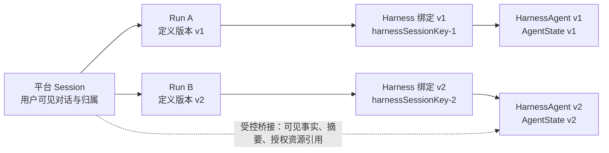
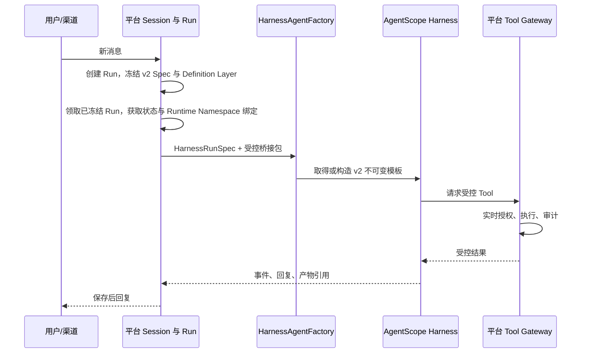

# 海卓智慧大脑：数字员工 Harness 运行时与版本状态切换详细设计

| 项目 | 内容 |
| --- | --- |
| 版本 | 0.2 |
| 日期 | 2026-09-27 |
| 状态 | 设计已收敛，待按本文分期实施与验证 |
| 目标 | 用 AgentScope `HarnessAgent` 承担主 Agent 循环、Workspace、Skills、Memory、Plan 和子 Agent；平台继续拥有身份、Session、Run、授权、资源、审计与渠道 |
| 上位设计 | [Agent 能力配置与发布架构](Agent能力配置与发布架构.md)、[数字员工多渠道接入与消息流转设计](../04-渠道与执行/数字员工多渠道接入与消息流转设计.md)、[Agent 资源与动作权限设计](../02-身份与会话/Agent资源与动作权限设计.md) |

## 1. 结论：切换的是 Harness 运行配置，不是平台 Session

数字员工是用户可选择、可被渠道路由到的产品身份；主 `HarnessAgent` 是某个已发布员工定义对应的、可复用的不可变运行模板；专业子 Agent 是主 Agent 在受控条件下可委派的内部能力。三者不是三套固定 Agent，也不是平台要自己实现三套循环。

需要同时满足两条看似冲突的要求：

1. 管理员发布新的数字员工定义后，**之后创建的 Run** 应使用新模型、指令、Workspace、Skill、工具和子 Agent 配置。
2. 用户仍在同一个业务 Session 中聊天时，不能把旧版本 Agent 的计划、权限上下文、工具调用痕迹或内部记忆混进新版本。

解法不是替换平台 Session，也不是清空一个共享的 AgentScope Session，而是建立**发布版本作用域的 Harness 状态绑定**：



平台 Session `S` 是稳定的业务会话；AgentScope 看到的 `sessionId` 则是平台持久化生成的 `harnessSessionKey`。这个键**只选择 AgentState 槽位**：同一平台 Session 的 v1 和 v2 因此拥有不同的消息、摘要、权限上下文、Plan Mode、任务和工具上下文。Workspace 的可写运行内容由独立的 `workspaceRuntimeKey` 选择，不能误以为换了 `harnessSessionKey` 就天然隔离文件和运行期 Memory。`clearContext` 只清理对话缓冲和摘要，不能作为版本切换手段。[AgentScope Context 文档](https://github.com/agentscope-ai/agentscope-java/blob/v2.0.3/docs/v2/en/docs/building-blocks/context.md)

一句话概括：**平台连续的是用户的业务对话；Harness 连续的是同一发布版本下的 Agent 工作状态。**

## 2. 为什么当前 ReAct 运行时不能承载这个目标

当前 `AgentScopeRuntime` 直接构造 `ReActAgent`，并将平台 `sessionId` 原样传给 `RuntimeContext`；`HarnessAgentFactory` 与 `RuntimeContextFactory` 还是空类。这个实现能完成一个基础 Tool 循环，却没有可发布的 Workspace、Skills、Memory、子 Agent、Plan 和框架状态的装配边界。

因此改造的重点不是把 `ReActAgent` 改一个类名，而是让 Run 创建时先得到不可变的 `HarnessRunSpec`，再由工厂按不可变部分取得或创建可复用的 `HarnessRuntimeTemplate`。平台绝不再自己模拟 Harness 循环，也不为每个 Run 新建一个 `HarnessAgent`。

| 层级 | 负责什么 | 不负责什么 |
| --- | --- | --- |
| 平台 | 数字员工选择、用户身份、平台 Session、Run、版本冻结、能力/资源最终授权、事件/产物/渠道回复 | ReAct 迭代、技能加载、上下文压缩、任务规划、子 Agent 编排 |
| `HarnessAgentFactory` | 把冻结定义的不可变部分转成可复用 `HarnessRuntimeTemplate`：模型、系统指令、Definition Workspace Layer、StateStore、静态 Tool Surface、子 Agent 定义和 Middleware | 查询“当前最新草稿”、缓存用户/Run 状态或绕过平台权限 |
| AgentScope Harness | 主 Agent 循环、Workspace、Skill、Memory、Context Compaction、Plan、Task、子 Agent 执行 | 平台业务 Session 的归属判断、外部资源的最终授权、渠道投递和平台审计真相 |
| Tool Gateway | 在每次实际动作前，按 Run 快照和实时规则授权并登记结果 | 把模型看到 Tool 当作永久授权 |

AgentScope 的 Workspace 用 `AGENTS.md`、Skills、子 Agent 与工具配置组织运行环境；Workspace 配置和 AgentState 是两种不同的状态。Workspace 中可变文件会在下一次推理时生效，因此生产运行不能把“管理员当前正在编辑的共享目录”直接作为已发布版本的 Workspace。[AgentScope Workspace 文档](https://github.com/agentscope-ai/agentscope-java/blob/v2.0.3/docs/v2/en/docs/harness/workspace.md)

## 3. 运行时对象与不变量

### 3.1 Run 创建时冻结的对象

`HarnessRunSpec` 是平台在**创建 Run 的同一事务**中编译并持久化的不可变执行说明。它不是可编辑的员工草稿，也不是让浏览器传入的 Agent 配置。Worker 只能读取该 Spec；即使其领取 Run 前管理员已发布 v2，也绝不把 v1 Run 改选成 v2。

| 内容 | 来源 | 冻结规则 |
| --- | --- | --- |
| `runId`、`userId`、`platformSessionId`、`definitionVersionId` | Run 创建事务 | 与 Run 一起提交，调用方不可覆盖 |
| 模型、系统指令、最大迭代/规划策略 | 已发布员工定义 | 任一有语义的修改发布为新定义版本 |
| Definition Workspace 投影 ID 与内容哈希 | 已发布定义引用的 Skill/Memory/子 Agent/工具策略 | Run 创建时固定，只读；不得读取管理端共享工作目录的最新内容 |
| 模型可见 Tool Surface 及哈希 | 发布绑定与创建时的用户/渠道规则交集 | 创建时冻结；每次 Tool 仍做实时资源授权、账号检查和紧急停用检查 |
| `harnessSessionKey` | AgentState 绑定 | 只用于 `(userId, sessionId)` 的 AgentState 隔离 |
| `workspaceRuntimeKey` | Workspace Runtime Namespace 绑定 | 独立于 AgentState；按用户、平台 Session、定义版本和世代隔离可写内容 |
| 受控桥接包 | 平台 Session 的可见历史、摘要与授权资源引用 | 有明确来源和大小限制；不包含旧 `AgentState` |

建议增加三类持久化事实：

| 表/契约 | 关键字段 | 用途 |
| --- | --- | --- |
| `definition_workspace_projection` | `id`、`definition_version_id`、`content_hash`、`storage_uri`、`created_at` | 不可变、只读的 Definition Layer：`AGENTS.md`、Skill 快照、子 Agent 清单和 Tool 声明 |
| `workspace_runtime_namespace` | `id`、`user_id`、`platform_session_id`、`definition_version_id`、`generation`、`workspace_runtime_key`、`definition_projection_id` | 可写 Runtime Layer；唯一约束 `(user_id, platform_session_id, definition_version_id, generation)`，不与其他版本或用户共享 |
| `session_harness_binding` / `run_harness_binding` | 前者含 `harness_session_key`、`workspace_runtime_namespace_id`；后者含 `run_id`、`definition_version_id`、`harness_spec_hash`、`effective_capability_hash`、`bridge_hash` | 前者将 AgentState 槽与 Runtime Namespace 显式关联，后者证明 Run 实际使用的版本、模板、状态绑定和桥接包 |

如未来确有“同一版本主动重置 Agent 工作状态”的产品能力，应同时创建新的 `harnessSessionKey`、新的 `workspaceRuntimeKey` 和不可回退的 `generation`。一期不需要泛化成所谓 `Context Epoch`；定义版本加世代已经是清晰的状态边界。

### 3.2 Workspace 的 Definition Layer 与 Runtime Layer

```text
Definition Workspace Layer（按 definitionVersionId，共享只读）
  ├── AGENTS.md、Skill 快照、子 Agent 定义、工具声明
  └── 内容哈希固定，发布后不可原地修改

Workspace Runtime Layer（按 userId + platformSessionId + definitionVersionId + generation，可写）
  ├── 本版本下的工作文件、运行期 Memory、Plan/Task 文件和缓存
  └── runId 临时区；正式产物须经平台登记后才进入用户 Workspace
```

`workspaceRuntimeKey` 是服务端生成并持久化的命名空间标识，不是由用户输入、员工 code 或 Run 名称拼接的路径。适配器把它映射到受控 filesystem/sandbox root。Definition Layer 可被同一发布版本的模板共享；Runtime Layer 绝不能跨用户、平台 Session、定义版本或世代共享。

### 3.3 必须始终成立的规则

1. `AgentDefinitionVersion`、Definition Workspace 投影和模板键在 Run 创建事务中冻结；Worker 不得重新选择最新发布版本。
2. `HarnessAgentFactory` 只读取已保存的 `HarnessRunSpec` 和不可变模板；不得执行时回查员工“最新草稿”。
3. 每个 `harnessSessionKey` 只能关联一个稳定的 `userId`、平台 Session、员工、定义版本和世代；它只隔离 AgentState。
4. 每个 `workspaceRuntimeKey` 只能关联一个稳定的 `userId`、平台 Session、定义版本和世代；它只隔离可写 Workspace Runtime Layer。
5. AgentScope `AgentState`、Plan、Task、工具上下文和 Harness Runtime Memory 不能跨 `harnessSessionKey` 复制或迁移；可写 Workspace 文件也不能跨 `workspaceRuntimeKey` 复制或迁移。
6. 回滚发布必须产生新的 `AgentDefinitionVersion`，即使内容恰好复制历史 v1；不能把当前版本指针直接指回 v1，否则可能复用旧状态或旧 Runtime Namespace。
7. 紧急停用、用户禁用、资源授权撤销在每次实际 Tool 调用前生效，但不修改历史 Run 快照和审计事实。
8. 仅轮换密钥值不改变定义版本；若服务身份、可访问目标或授权范围变化，则必须作为能力边界变化重新发布。

## 4. 一次请求如何执行

以“会议助手已从 v1 发布到 v2，用户仍在同一 Web 会话继续提问”为例：

1. 平台接收消息，确认用户、渠道、数字员工和平台 Session；在**创建 Run 的同一事务**中读取当前已发布定义 v2，冻结 `definitionVersionId`、Definition Workspace 投影、模型可见 Tool Surface 和 `HarnessRunSpec`。平台仍负责单 Session 活跃 Run 规则、去重、取消和渠道事件。
2. Worker 领取 Run 时只读取其已冻结的 v2 Spec，并复核账号、员工与渠道当前状态；若 Run 在 v1 时创建、在 v2 发布后才被领取，它仍执行 v1，绝不偷换版本。
3. 平台查找 `(userId, platformSessionId, v2)` 的状态与 Workspace 绑定。首次遇到 v2 时分别创建新的 `harnessSessionKey` 和新的 `workspaceRuntimeKey`；前者选择 AgentState，后者选择可写 Runtime Layer，二者都不会使用 v1 的键。
4. `SessionContextBridge` 从平台 Session 读取允许继承的事实：用户可见消息摘要、必要的任务事实、且仍被授权的产物/资源引用。它不读取 v1 的内部 Tool Result、Plan、Task、Permission Context 或 Memory 原文。
5. `HarnessAgentFactory` 按 v2 的 `HarnessTemplateKey` 取得或首次构建共享的 `HarnessRuntimeTemplate`，其中的 `HarnessAgent` 只含不可变配置。此次调用新建 `RuntimeContext`，传入平台稳定用户 ID、`harnessSessionKey`、`workspaceRuntimeKey` 和 Run 受控上下文；随后由 Harness 自己运行推理、Skill、Plan、子 Agent 与 Context Compaction。
6. Harness 尝试调用 Tool 时，统一 Tool Gateway 重新核验 Run 快照哈希、用户状态、能力停用、资源范围、确认状态和外部系统身份，再执行并保存平台事件/审计/产物。
7. 结果和面向用户的事件回到平台；平台保存后按 Web 或消息渠道回复。Harness 不直接拥有渠道投递权限。



当前的 `RunControlMiddleware` 已经在 AgentScope 推理边界接收取消和运行中引导。这条扩展缝应保留并先验证可在 Harness 上同样工作；不要因为引入 Harness 又在平台重写一个 ReAct 步进循环。Tool 进行中是否可中断仍由 Tool 协议和外部系统能力决定，不能把“下一次推理前已检查取消”说成强制取消。

## 5. 动态切换语义

### 5.1 同一数字员工发布 v2

| 时刻 | 旧 Run / v1 绑定 | 新 Run / v2 绑定 | 平台 Session |
| --- | --- | --- | --- |
| 管理员发布 v2 | 继续使用 v1 Spec、v1 Workspace、v1 `harnessSessionKey` | 尚未创建 | 不变 |
| v1 Run 正在执行或等待确认 | 仍按 v1 恢复；后续 Tool 仍受实时停用/撤权影响 | 不影响 | 不变 |
| 用户提交新工作 | 若 v1 活跃则遵守既有忙/排队策略 | 创建时冻结 v2 Spec，并建立新的 v2 `harnessSessionKey` 与 `workspaceRuntimeKey` | 对话历史仍归该 Session |
| v2 首次运行 | 无状态迁移 | 仅接收受控桥接包 | 不变 |

这解释了“Session 连续”与“Agent 状态不连续”如何同时成立：用户在 UI 里仍看到同一业务对话；v2 主 Agent 只知道平台明确传给它的有效事实，不继承 v1 的隐含工作状态。

### 5.2 切换到另一名数字员工

默认新建平台 Session。不同员工往往意味着不同角色、工具、权限语境和可见资源；把它们放进同一业务 Session 会让归属与审计混乱。现有 Session/Run 模型也以员工为归属。

若以后需要“转交给另一个数字员工”，它必须是显式产品动作：创建目标员工的新平台 Session，登记 `handoff` 事件，并只传递经用户可见性和资源授权检查后的摘要、产物引用和待办事实。绝不转移源 Harness 的 `AgentState`、Memory 文件、Plan、Task、工具凭据或子 Agent 状态。

### 5.3 紧急变更不是版本切换

| 变更 | 是否创建新发布版本 | 对进行中 Run |
| --- | --- | --- |
| 指令、模型、Skill、子 Agent、工具绑定、Workspace 策略变化 | 是 | 继续原 Spec；新 Run 用新 Spec |
| 工具紧急停用、用户/资源授权撤销、账号禁用 | 否，记录独立操作审计 | 下一次真实 Tool 授权拒绝；已发请求据实记录 |
| 外部凭证仅换值 | 否 | 下一次执行按受控凭证服务取得新值 |
| 服务身份/访问范围/目标系统变化 | 是 | 旧 Run 不得悄悄换到新边界 |

## 6. `HarnessAgentFactory` 的设计

工厂是平台和框架之间唯一的“翻译层”。它把已发布定义的不可变部分编译为可缓存模板，再以每次调用的 `RuntimeContext` 传入 Run、用户、状态键和 Workspace Runtime Namespace；它不是领域仓储，也不持有当前用户的可变授权事实。

```java
public interface HarnessAgentFactory {
    HarnessRuntimeTemplate getOrCreate(HarnessTemplateKey key);
}

public record HarnessRuntimeTemplate(
        HarnessAgent agent,
        DefinitionWorkspaceLayer definitionLayer,
        HarnessTemplateKey key) {}
```

上例只表达边界，具体 AgentScope 类型按锁定的 2.0.3 API 实现。关键装配规则如下：

1. **Template Key**：至少包含 `definitionVersionId`、Definition Layer 哈希、模型/系统指令哈希、静态 Tool Surface 哈希、子 Agent 清单哈希和 Harness 策略哈希；不包含 `userId`、`runId`、两个运行键、用户 Token 或实时授权结果。
2. **Model、system instruction 与 HarnessAgent**：只从不可变模板读取并可跨 Run 复用。AgentScope 官方说明 `HarnessAgent` 是无状态引擎，真正的会话可变状态在 StateStore 中；相同模板的并发调用由各自 `RuntimeContext` 隔离。[AgentScope Context 文档](https://github.com/agentscope-ai/agentscope-java/blob/v2.0.3/docs/v2/en/docs/building-blocks/context.md)
3. **Workspace**：模板只持有只读 Definition Layer；每次调用将 `workspaceRuntimeKey` 映射到独立 Runtime Layer。运行产生的临时文件落到 `runId` 临时区，不修改 Definition Layer；正式产物须通过平台登记。
4. **Tool**：Template 内只能缓存无用户/Run 状态的 Tool 壳。壳从调用级 `RuntimeContext` 读取 `AgentExecutionRequest`，经 Tool Gateway 决定实际授权和执行；持有用户 Token、Run 收据或可变业务状态的 Tool 实例不得缓存到模板。
5. **StateStore**：生产使用可跨实例恢复的存储实现；默认本地文件存储只允许开发验证。Store 的选择在 Harness 构建时绑定，不能依靠一次调用临时替换，因此 `harnessSessionKey` 是正确的 AgentState 槽选择点。
6. **RuntimeContext**：`userId = 平台 UserId`，`sessionId = harnessSessionKey`，并附加 `workspaceRuntimeKey` 和当前 Run 的受控上下文。平台原 `SessionId` 仍保存在请求对象、审计和事件中。
7. **Middleware**：保留 `RunControlMiddleware`，新增只读的 Run 事件映射和受控桥接注入；Middleware 不得给模型补出未授权 Tool，也不得读取其他用户/Session。
8. **缓存生命周期**：Template Cache 必须有最大容量和空闲淘汰；淘汰前等待引用计数归零再关闭模板资源。StateStore 和 Runtime Layer 不随模板淘汰删除，状态清理由独立保留策略处理。

## 7. Harness 内置能力的安全边界

Harness 能力不是“打开一个开关就自动安全”。下表规定一期默认策略；任何从禁用变成启用的能力，都要经过能力目录、发布、有效能力解析、最终授权和审计链路。

| Harness 能力 | 一期默认 | 允许后的平台约束 |
| --- | --- | --- |
| 主 Agent Loop、Context Compaction、Plan、Task | 启用 | AgentState 只在 `harnessSessionKey` 内持久化；Plan/Task 文件同时落入 `workspaceRuntimeKey`，二者均不跨版本迁移 |
| `session_search` | 禁用 | 该能力可能跨同一运行时检索其他 Session；如未来开放，必须由平台包装为仅当前平台 Session、当前用户、当前员工、已授权时间范围内的查询，且留审计 |
| Memory | 仅版本作用域/显式策略 | 个人 Memory 必须按 `UserId` 隔离；公司记忆走平台批准知识源；版本切换不自动搬运内部 Memory |
| filesystem / Workspace 文件 | 禁止任意宿主机访问 | 只允许已发布 Workspace 投影的只读根和 `runId` 临时写入根；路径穿越、隐藏宿主目录和跨用户文件一律拒绝 |
| shell | 默认禁用 | 不能把通用 shell 当普通 Tool；若有必要，以固定业务动作的受控执行服务替代，并限定镜像、命令、网络、输出、时限和审计 |
| web | 默认禁用 | 通过平台登记的检索/访问 Tool，限定域名、网络出口、数据脱敏、下载类型和成本；不开放任意 URL 或私网访问 |
| 子 Agent | 按发布清单受控启用 | 主 Agent 只能委派清单内的专业子 Agent；子 Agent 不具备渠道身份、平台管理员权限或父 Agent 原始凭据；每次委派记录父 Run、子配置版本与结果摘要 |

对子 Agent，推荐主 Agent 调用一个由平台包装的 `delegate_specialist` 能力，而不是直接暴露无边界的框架委派工具。包装器根据冻结的子 Agent 清单创建子 Harness：其状态键以 `runId + 子配置版本 + 委派序号` 唯一，Workspace/Tool 集合更小，结果经结构化摘要回到主 Agent。这样“按需委派”保留在 Harness 内，而权限和审计仍不离开平台。

## 8. 与开源平台实践的对应关系

本设计不是复制某个项目的对象模型，而是采用已经被验证过的责任划分：

| 参考 | 可借鉴的做法 | 海卓的取舍 |
| --- | --- | --- |
| AgentScope 2.0.3 | Harness 是框架执行层，`AgentState` 按用户和会话持久化；Workspace 与 State 独立 | 平台给 Harness 派生会话键，避免发布版本共用状态槽 |
| [Dify](https://github.com/langgenius/dify/blob/main/api/models/workflow.py) | `WorkflowRun` 保存版本与图快照，使运行不依赖后来编辑的工作流 | 将同一原则用于 `HarnessRunSpec` 与 Workspace 投影，而非只冻结 Tool 列表 |
| [FastGPT](https://doc.fastgpt.cn/en/guide/build/skill/version) | 调试修改与正式发布隔离，发布形成快照并可回滚 | 回滚重新发布为新定义版本，避免复用旧 Harness 状态 |
| [OpenCode Agent 配置](https://opencode.ai/docs/agents/) | 主 Agent/子 Agent 各自有模型、提示词和权限，且可限制可委派子 Agent | 子 Agent 是内部专业能力，不等同于用户可路由的数字员工 |

## 9. 实施分期与验收

### P0：先证明框架边界正确

1. 引入 AgentScope Harness 模块，建立最小 `HarnessAgentFactory`、`RuntimeContextFactory` 与 Run 创建时持久化的 `HarnessRunSpec` 契约。
2. 用一个共享 `HarnessRuntimeTemplate` 验证：同一 `userId` + 两个 `harnessSessionKey` 的消息、摘要、Plan/Task 不互见，且不同用户/会话调用可并行。
3. 验证 `RunControlMiddleware` 在 Harness 推理边界仍可取消/注入可信引导；不实现第二条平台 ReAct 循环。
4. 验证 Definition Layer v1/v2 不可变、Workspace Runtime Namespace v1/v2 不互见，且发布 v3 后活跃 v1/v2 Run 的两个 Layer 均不改变。

### P1：替换主运行时并固化版本状态绑定

1. `AgentScopeRuntime` 从直接构造 `ReActAgent` 改为从 Template Cache 取得 `HarnessAgent`。
2. 在 Run 创建事务中冻结定义版本、Definition Layer 投影和 Tool Surface；建立 AgentState 绑定与 Workspace Runtime Namespace 绑定，并使 `RuntimeContext.sessionId` 使用 `harnessSessionKey`。
3. 建立受控 `SessionContextBridge`；同一平台 Session v1→v2 时只带入桥接包。
4. 先把现有受控 Tool 接入 Harness；最终 Tool Gateway 授权逻辑不后退。

### P2：扩展 Harness 原生能力

1. 发布版本化的 Workspace、Skills、MemoryPolicy 和子 Agent 配置。
2. 实现受控子 Agent 委派、子 Run 事件和结构化结果回传。
3. 按本文件的逐项安全边界引入知识、Web 或文件能力；shell 与任意网络不作为默认能力。
4. 由数据库/API 驱动能力配置时，能力类型使用带 schema 的受控 payload 或类型化子表；现有 `capability_revision` 的 Tool 专用字段不能直接假装覆盖 Skill/MCP/Knowledge。

### 必过的验收场景

| 场景 | 必须观察到的结果 |
| --- | --- |
| Run 在 v1 时创建、v2 发布后才被 Worker 领取 | 该 Run 仍使用 v1 定义、v1 Definition Layer 与 v1 Template，绝不重选最新版本 |
| 同一用户、同一平台 Session，v1 后创建 v2 Run | v2 使用新的 `harnessSessionKey` 与 `workspaceRuntimeKey`；只收到桥接事实，不读取 v1 AgentState 或 v1 Runtime 文件 |
| v1 Run 等待确认时发布 v2 | 恢复 v1 Run 仍使用 v1 Spec；新 Run 才用 v2 |
| 回滚到历史内容 | 形成新的定义版本和新状态键，不复用旧状态 |
| 用户权限/工具被紧急撤销 | 已存在的 Toolkit 也在下一次实际调用被 Gateway 拒绝并留审计 |
| 多实例重启恢复 | 同一版本绑定的状态从持久 Store 恢复；不会串到另一版本/用户 |
| 子 Agent 委派 | 子 Agent 只能看到其更小的 Workspace/Tool 集，父 Run 能追溯委派与结果摘要 |
| Template 并发复用 | 一个相同 `HarnessTemplateKey` 的 HarnessAgent 服务多 Run；每个调用只见自己的 RuntimeContext、AgentState 与 Runtime Namespace |
| Workspace 管理端改动 | 不影响正在运行或已冻结 Run；只有新发布版本可以引用新的 Definition Layer |

## 10. 与现有文档的衔接

本文补足并细化既有设计，不改变其“平台掌握 Session/Run/授权、AgentScope 负责 Harness”的总体结论。以下表述以本文为准：

1. 任何将平台 `platformSessionId` 原样作为 AgentScope `RuntimeContext.sessionId` 的设计，改为传入持久化的 `harnessSessionKey`；平台 Session 仍是业务真相。
2. 任何建议平台为了运行中引导而自行拆分或重写 ReAct 循环的设计，改为优先复用和验证 Harness Middleware 扩展点。
3. “新 Run 使用当前发布版本”改为：**Run 创建时**冻结当时当前的发布版本，Worker 不可重选；新 Run 还必须获得该版本专属的 Definition Layer、Workspace Runtime Namespace 和 Harness 状态绑定，不能因为同一平台 Session 而继承旧版本 AgentState 或 Runtime 文件。

这份设计的边界也很明确：它解决数字员工动态发布、主 Harness 和专业子 Agent 的运行时归属问题；它不等于已经实现通用工具、完整 Memory 产品、全量 MCP、任意 shell、跨员工自动转交或数据库配置执行任意代码。
