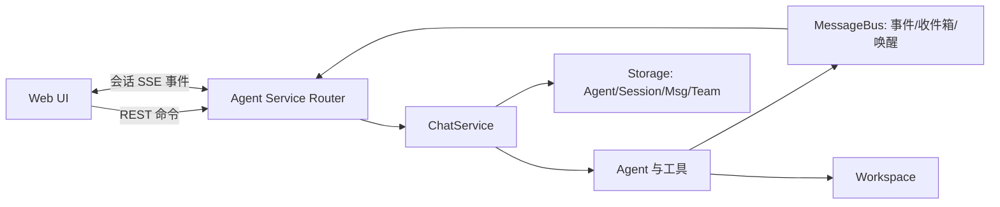
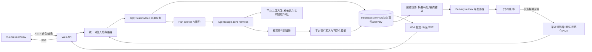

# AgentScope 服务示例与海卓实时交互改造方案

> 阶段方案：本文的“未实施”和 P0–P5 状态是编写当时的快照。当前 Web SSE/持久补读、计划事件和渠道模拟底座已有实现；真实 IM 与受控团队仍未交付。当前边界见[项目说明](../../项目说明.md)，验证证据见[文档索引](../文档索引.md)的阶段报告。

| 项目 | 内容 |
| --- | --- |
| 日期 | 2026-09-28 |
| 状态 | 设计方案；5.2 的交互契约、工具审批弹窗切片和多模态渲染器注册接口已实施，真实文档预览及通用 Agent 选项生产仍未实施 |
| 参考范围 | AgentScope **Python 2.0.8** 的 Agent Service「快速上手」、计划、权限、团队、消息事件、Channel 概览/路由/自定义渠道文档及对应版本示例源码 |
| 本项目基线 | Spring Boot WebFlux + AgentScope **Java 2.0.3** + Vue 3；以本次仓库源码为准，不把 Python 示例 API 视为 Java 已有能力 |
| 上位约束 | [Agent 资源与动作权限设计](../02-身份与会话/Agent资源与动作权限设计.md)、[数字员工 Harness 运行时与版本状态切换详细设计](../03-Agent与能力/数字员工Harness运行时与版本状态切换详细设计.md)、[数字员工多渠道接入与消息流转设计](数字员工多渠道接入与消息流转设计.md)、[前端 v0 实现说明](../08-前端/前端v0实现说明.md) |

## 1. 结论与适用范围

**可以借鉴服务外围的设计，并优先复用 AgentScope Java 2.0.3 已有的 Channel/Gateway 能力。** 目标链路是「可信渠道入站 → Session/Run 执行与持久事件 → 按渠道能力投影和投递」。Web 用 HTTP 命令、SSE、游标补读实现实时渲染；飞书等消息渠道以长连接或回调收取消息，并按平台能力发送完整回复或更新消息。任务规划与团队协作逐步接入现有数字员工、Session、Run 和权限边界；Python FastAPI/React 示例不能直接替换项目的 Java/Vue 链路。

优先次序是：先冻结与渠道无关的执行/事件契约，并做 Java Channel/Gateway 适配验证；能满足平台身份、Session/Run 和可靠性要求时接入框架扩展，只有不满足的边界才做薄适配。再补 Web 实时投递及重连、渠道投递，逐步接入规划与受控子 Agent。**不采用 BYPASS 作为普通用户业务动作的授权方案。** 框架的权限模式决定工具是否需要框架层确认；平台仍须在真正执行外部动作前检查用户、发布能力、业务动作、目标资源与必要确认。

此处的「任务规划」是一次 Agent 工作内的 Task 清单；Agent Service 的 cron `Schedule` 是另一种按时间启动运行的能力，不能混为同一个状态机。

## 2. 官方 demo 的架构与运行链

示例由 `examples/agent_service/main.py` 构造 FastAPI `create_app`，传入 `RedisStorage`、`InMemoryMessageBus`、`LocalWorkspaceManager` 等组件；配套 `examples/web_ui` 为 React 前端。官方架构页用于多进程部署的嵌入示例则选择 `RedisMessageBus`，所以示例 `main.py` 的进程内总线**不能直接作为多实例可靠投递结论**。服务管理资源、会话状态和消息总线；Agent 自身负责模型循环、计划和工具使用。示例默认的 `X-User-ID` 只是身份占位输入，没有真实鉴权。[架构与快速上手](https://docs.agentscope.io/zh/versions/2.0.8/deploy/agent-service)、[v2.0.8 示例入口](https://github.com/agentscope-ai/agentscope/blob/v2.0.8/examples/agent_service/main.py)



一次普通交互的控制与数据流如下：

1. 前端创建 Agent、凭证、Session 后，先订阅 `GET /sessions/{sessionId}/stream?agent_id=...`，再向 `POST /chat` 提交 `Msg`。订阅也可以晚于触发；服务先回放缓冲事件再接实时事件。
2. `/chat` 只返回 `status=started` 和 `session_id`；它不是生成答案的长请求。执行期间 `ChatService` 组装工作区、工具及中间件，驱动 Agent 的 `reply_stream`，把事件写到消息总线。
3. SSE 是按 Session 保持的长连接，跨多轮运行开放；订阅者可以有多个。团队消息、定时触发、后台工具完成都能经收件箱与唤醒机制重新驱动对应 Session。
4. 前端按事件类型增量渲染；历史消息另可分页读取。取消用 `POST /sessions/{id}/interrupt`，会话状态可用 `GET /sessions/{id}/status` 查询。确认或外部执行结果作为输入再送到 `/chat`，恢复被暂停的执行。[接口与状态说明](https://docs.agentscope.io/zh/versions/2.0.8/deploy/agent-service)、[v2.0.8 聊天路由](https://github.com/agentscope-ai/agentscope/blob/v2.0.8/src/agentscope/app/_router/_chat.py)、[v2.0.8 会话流](https://github.com/agentscope-ai/agentscope/blob/v2.0.8/src/agentscope/app/_router/_session.py)

### 2.1 任务规划：清单是 Agent 状态，不是平台作业队列

Python 2.0.8 提供 `TaskCreate / TaskGet / TaskList / TaskUpdate`。模型调用这些工具创建任务、查询清单、认领并更新状态。Task 有 `id / subject / description / state / owner / blocks / blocked_by / metadata / created_at`，存在 `AgentState.tasks_context`，随 Agent 状态保存；典型状态是 `pending → in_progress → completed`，`deleted` 是删除操作，不是持久状态。`TaskUpdate` 同步维护依赖边，并在前置任务完成时解除后继阻塞。依赖图提示模型选择下一步，**执行层不强制阻止模型越过未完成依赖**。[计划模式](https://docs.agentscope.io/zh/versions/2.0.8/building-blocks/plan)

因此 demo 的计划属于「模型通过受控工具维护的可观察工作清单」，不等于确定性工作流引擎。计划状态按 Agent 作用域隔离；多 Agent 默认并不共享同一份清单。海卓若展示计划，先映射为某个 Run/Harness 状态下的计划投影，不能把 Task ID 当作跨版本、跨员工的全局业务 ID。

### 2.2 BYPASS：跳过的是默认确认，不是所有检查

官方权限决策按顺序评估：显式 `DENY` 规则 → 显式 `ASK` 规则 → 动态只读判定 → 工具的 `check_permissions` → 显式 `ALLOW` 规则 → 模式兜底。`BYPASS` 的兜底为 `ALLOW`，并跳过工具内置的安全 `ASK`；但显式拒绝仍拒绝、显式询问规则仍可询问，工具返回的 `DENY` 也仍有效。它让无人值守任务少停在框架确认环节，**并不证明某用户有权访问某业务资源**。[权限决策矩阵](https://docs.agentscope.io/zh/versions/2.0.8/building-blocks/permission-system/overview)

海卓的适用边界：仅可在经过隔离、能力白名单、无外部副作用且已预授权的内部任务中单独评估；普通用户的外部业务工具、文件写入、知识检索及子 Agent 调用继续由平台工具入口实时判权。即使使用框架 `EXPLORE`/`DEFAULT` 等模式，也不能用框架判定替代平台授权、外部目标系统授权或审计。

### 2.3 团队：Leader 和 Worker 是独立会话

Leader 是用户对话的 Session，负责组队、派工、收集和汇总；Worker 是具有自身状态、工作区绑定和事件流的 Session，执行自己的 Agent 循环。Leader 可用 `TeamCreate`、`AgentCreate`、`TeamSay`、`TeamDelete`；满足条件时还可 `AgentInvite`，Worker 主要通过 `TeamSay` 回报。`SubAgentTemplate` 可固定角色提示词、权限上下文和初始任务。发送者把消息写入接收者收件箱并发出 wakeup，dispatcher 驱动目标 Session，`InboxMiddleware` 再把消息交给模型；Worker 不只是 Leader 调用栈里的一段同步函数。[智能体团队](https://docs.agentscope.io/zh/versions/2.0.8/deploy/agent-team)

对海卓，这一机制可借鉴「明确角色、独立状态、结构化委派与结果回传」，但团队成员应先视为**数字员工内部执行者**，而非用户能直接寻址的新数字员工。公开任意 `AgentCreate/AgentInvite` 会绕过已发布子 Agent 清单、能力收敛与版本冻结，应由平台受控委派入口包装。

### 2.4 消息、事件和实时渲染

`Msg` 是完整消息与持久化上下文单元；`AgentEvent` 是前端和人工介入使用的增量单元。文本、思考、工具调用、工具结果等以 `start → delta → end` 形成有序流，`reply_id` 关联一条回复，`block_id` 或 `tool_call_id` 关联其中的内容块；前端按 ID 把多个 delta 合并进同一个消息块。任务/权限上下文改变时，服务的 `StateChangeMiddleware` 可产生 `CustomEvent`，前端据此更新计划和权限视图。模型中间结果、工具进度与最终答复因而可以在不同组件中实时展示。[消息与事件](https://docs.agentscope.io/zh/versions/2.0.8/building-blocks/message-and-event)、[服务中间件](https://docs.agentscope.io/zh/versions/2.0.8/deploy/agent-service)

异常与中断分开处理：运行失败由运行事件/状态反馈；HTTP 409 表示同一 Session 运行冲突；`interrupt` 是取消请求，最终是否终止仍看后续状态/事件；HITL 暂停时必须保存待确认调用并用专门输入恢复。SSE 断开只说明**观看连接断开**，不代表 Run 失败。服务的重放是缓冲回放，不能把它当作无限期完整审计日志。

### 2.5 Channel：同一执行流由不同渠道决定呈现方式

官方 Python 2.0.8 Channel 将 IM 报文转成 `ChannelEvent(channel_id, channel_user_id, chat_id, content, metadata)`，路由规则决定目标 Agent 和会话；规则按顺序匹配，支持 `per_chat` 与 `per_chat_user` 两种会话范围。自定义渠道通过 `start_listening(emit)` 接入消息，通过 `send_response(event, events)` 消费**一次运行的 AgentEvent 流**并向 IM 回送：可积累后一次发送，也可在平台支持时更新同一条消息。`ChannelCapability` 声明文本、Markdown、图片/文件、交互、流式更新和长度上限。工具确认作为独立结果事件回传，权威待确认调用仍从服务状态读取。[Channel 概览](https://docs.agentscope.io/zh/versions/2.0.8/deploy/channel/overview)、[会话路由](https://docs.agentscope.io/zh/versions/2.0.8/deploy/channel/routing)、[自定义渠道](https://docs.agentscope.io/zh/versions/2.0.8/deploy/channel/custom)

官方渠道实例可由 `create_app(channels=[...])` 开启，并用 `/channels` 管理配置和连接状态；文档所述内置类型为飞书、钉钉、Discord，企业微信在该版本页面标为 *Coming soon*。官方分布式示例把渠道配置、会话、消息总线放入 Redis，并处理多节点收到同一消息的情况。这说明**渠道适配器和回复渲染是可借鉴的抽象**，不说明本项目 Java 2.0.3 已有同样的 Python API、去重/持久化语义或某个消息平台当前可用。[Channel 概览](https://docs.agentscope.io/zh/versions/2.0.8/deploy/channel/overview)

本项目已有的[多渠道设计](数字员工多渠道接入与消息流转设计.md)要求平台验证外部身份、选择员工与 Session/Run、记录入站与出站事实。Python 2.0.8 的 API 形态仅作参考；具体复用应先查项目锁定的 **Java 2.0.3 Channel**。该版本文档已有 `ChatUiChannel`、`GatewayBootstrap`、`sendStream()`、自定义 `Channel`，并列出飞书、钉钉、企业微信等扩展模块；当前项目 POM 尚未引入这些渠道扩展依赖。[Java 2.0.3 Channel 文档](https://github.com/agentscope-ai/agentscope-java/blob/v2.0.3/docs/v2/zh/docs/harness/channel.md)

**复用优先的判断门槛。** 做一个小范围集成验证：框架扩展负责提供方连接、报文解析与回复发送；平台把外部身份映射成可信 `UserId`，并验证员工路由、发布版本、业务授权。再验证 Gateway 的会话、排队、流式事件是否能与平台 `SessionId/RunId`、取消/审批、持久事件和 Delivery 状态建立稳定映射。Java 2.0.3 Gateway 会覆盖 caller `RuntimeContext` 的 `sessionId`（生成 `gw-…`）、`userId` 等字段，所以**不能在未经映射验证时直接把它接入当前 Run Worker**；否则平台和 Gateway 会各自拥有会话与排队状态。若验证通过，应选定唯一会话/并发协调者并删去重复职责；若不能通过，则保留平台 Session/Run 协调，只复用框架可独立使用的渠道协议组件或采用最薄的适配层。[Java 2.0.3 Channel 的 RuntimeContext 合并规则](https://github.com/agentscope-ai/agentscope-java/blob/v2.0.3/docs/v2/zh/docs/harness/channel.md#runtimecontext-%E5%90%88%E5%B9%B6)、[现有接入选择分析](数字员工多渠道接入与消息流转设计.md#5-agentscope-203-的接入选择)

## 3. 与当前仓库的逐项对比

以下是本次读取仓库源码得到的**静态实现事实**，并非真实部署或多浏览器端到端验证。现有前端代码和架构说明已经在仓库中；后文列出仍需你补充的运行环境信息。

| 主题 | 当前实现 | 可借鉴点与改造 | 成本 / 风险 |
| --- | --- | --- | --- |
| 身份与启动 | 登录后 Cookie + Redis WebSession；`POST /api/v1/sessions/{id}/runs` 带 `clientRequestId` 创建有版本快照的 Run | 保留可信 `UserId`、幂等键和版本冻结；不接入示例 `X-User-ID` | 低；新流接口必须继承当前身份和所有权检查 |
| 实时传输 | `GET .../runs/{runId}/events?after=sequenceNo`、Run 状态和时间线约 800ms 轮询 | 沿用 RunEvent 作为持久事实源，增加 SSE 投递与断线补读 | 中；连接数、缓冲、慢客户端与反向代理需要验收 |
| 多渠道入口 | `platform.channel` 有入站/投递契约，但未见可运行的外部渠道适配器、收件箱/投递表和连接管理；POM 尚未引入 Java Channel 扩展 | 优先验证 Java 2.0.3 内置飞书/钉钉/企微扩展和 Gateway；能复用的连接、报文、路由、发送不再自研 | 集成成本中到高，取决于 Gateway 与平台 Session/Run 是否可统一；身份绑定、业务授权、持久事实与送达核查仍需平台完成 |
| 事件模型 | `RunEvent(runId, sequenceNo, type, content, createdAt)`；`sequenceNo` **仅在 Run 内递增** | 增加版本化类型与 JSON 载荷；跨 Run 的 Session 流需独立单调 `sessionCursor` | 中；现有时间线仅按时间排序，不能充当无歧义续传游标 |
| 文本增量 | 运行时翻译 `TextBlockDeltaEvent`，但 `RunExecutionService` 不落该增量，只持久化最终 `RUN_COMPLETED` 文本 | 增量走有界实时通道；最终答复与语义状态持久化，重连以快照校准 | 中；不能声称当前已支持逐字恢复；需要防止最终文本与 delta 重复显示 |
| 运行控制 | 有 `QUEUED/RUNNING/WAITING_TOOL/WAITING_CONFIRMATION/CANCELLING/...`、取消、引导、工具审批与 Worker 租约/fence | 推送这些持久状态；SSE 只负责展示，不改变执行控制事务 | 中；等待与取消的终态必须与数据库一致 |
| 规划 | 设计文档已有 Harness Plan 目标；当前运行时事件翻译不包含计划事件，前端无计划投影 | 先验证 Java 2.0.3 的 Plan/Task 能力和状态 API，再做受控投影 | 中到高；Python 2.0.8 的 Task 工具不能直接当作 Java API |
| 团队 | 设计文档有专业子 Agent 与 `delegate_specialist` 边界；当前运行时和前端未见团队事件路径 | 借鉴委派、角色、独立状态与结果归集；平台限制子 Agent 清单和授权 | 高；增加子执行并发、归属、取消传播和审计链 |
| BYPASS | 平台已有发布能力视图、持久化工具执行与人工审批 | 只借鉴权限分层概念；业务动作执行仍由平台 Tool Gateway 审核 | 高风险若误用；不能让模式切换放宽业务权限 |

**现有文档与代码差异。** 既有多渠道文档把忙时普通新任务定义为“一期拒绝”，而当前 Web `SessionApplicationService` 已有 `QUEUED` Run，`ChannelTurnStore` 注释也描述排队。编码前须明确按渠道的忙时策略并使文档、接口和真实实现一致；不能因接入 IM 就默认沿用 Web 排队，也不能根据旧文档声称当前 Web 忙时拒绝。

当前基线的直接代码证据：[SessionController](../../haizhuo-brain-api/src/main/java/com/haizhuo/brain/api/session/SessionController.java)、[SessionApplicationService](../../haizhuo-brain-platform/src/main/java/com/haizhuo/brain/platform/session/SessionApplicationService.java)、[RunExecutionService](../../haizhuo-brain-platform/src/main/java/com/haizhuo/brain/platform/run/RunExecutionService.java)、[AgentScopeEventTranslator](../../haizhuo-brain-runtime-agentscope/src/main/java/com/haizhuo/brain/runtime/agentscope/event/AgentScopeEventTranslator.java)、[前端 SessionView](../../haizhuo-brain-web/src/views/app/SessionView.vue)、[前端 API](../../haizhuo-brain-web/src/api/app.ts)。此外，当前 `SessionView` 重进时选取活跃 Run 只检查 `RUNNING/CANCELLING/QUEUED`，未包含 `WAITING_TOOL/WAITING_CONFIRMATION`；实时改造时需统一用后端状态机判断活跃 Run。`runEventPresenter` 当前按事件生成气泡，接入 delta 前必须改为按 `messageId/blockId` 合并。

## 4. 目标架构和职责边界



上图表示**平台保有 Session/Run 时的保底拓扑**，不是要求先自研所有渠道组件。实际编码前先评估 Java 2.0.3 的内置 Channel/Gateway：若它能承接同一套可信身份、唯一会话/并发控制、Run 关联与恢复规则，就用框架组件替换图中的渠道适配器及可合并的路由/执行部分；图中 `Inbox/Delivery`、业务授权和可审计事实仍按平台要求验收。不能同时运行两套独立排队与会话路由。必要时修订[既有多渠道设计](数字员工多渠道接入与消息流转设计.md)中固定的平台主导接入选择，以验证结果为准。

| 模块 | 责任 | 不承担的责任 |
| --- | --- | --- |
| Vue Transport/Presenter | 建立流连接、重连、去重、按消息块合并 delta；用 Run/Plan/Tool/Team 投影分别渲染 | 从页面状态判权、决定 Run 是否真正完成 |
| Web API | 可信主体和 Session 归属检查；命令、快照、游标补读、SSE 输出 | 直接执行模型或业务工具 |
| 渠道适配器 | 优先采用 AgentScope Java 现有 Channel 扩展完成连接或回调、报文规范化与发送；缺口用薄适配补齐 | 直接信任外部 `userId`、决定业务权限、与平台重复维护会话和排队 |
| 统一入站与路由 | 幂等收件箱、外部身份绑定、渠道会话映射、授权员工路由、忙时/控制输入分类 | 把外部聊天 ID 当平台 SessionId，默认合并 Web/IM 对话 |
| Session/Run 服务 | Run 队列、版本快照、租约、持久状态、取消/审批事务 | 依赖某个浏览器在线才能推进执行 |
| Runtime Adapter | 把 Java AgentScope 事件映射成平台事件；过滤秘密和不适合用户展示的内容 | 将 Python 2.0.8 原生事件原样透出；授权业务资源 |
| 平台事件与渠道投影 | 事务内记录事实，按受众过滤后生成 Web 增量或 IM 可发送内容；按渠道能力决定最终发送/节流更新 | 把内存广播当唯一事实源，向 IM 透出思考链和工具原始入参 |
| 渠道 Delivery outbox | 保存不可变回执目标和投递意图，提交后发送、查重/核查、记录送达或不确定状态 | 以 Run 完成代替第三方送达，失败时盲目重发 |
| Tool Gateway / Delegate Gateway | 调用前实时判权、确认、幂等、审计；约束子 Agent 可见能力 | 把 BYPASS、Prompt 或子 Agent 身份当作授权凭据 |

沿用已设计的「平台 Session 连续、Harness 状态按发布版本绑定」：同一平台 Session 的新 Run 可以使用新发布版，但旧 Run 恢复仍按原版本；计划、权限上下文、子 Agent 状态不可悄悄跨版本继承。[Harness 版本状态设计](../03-Agent与能力/数字员工Harness运行时与版本状态切换详细设计.md)

### 4.1 多渠道会话与交付边界

入站只接受适配器产生的已验证消息；按 `(渠道绑定, 提供方事件 ID)` 去重，将 `(渠道绑定, 外部会话, 外部用户, 员工)` 映射到平台 Session，并由平台分配 Run。Web 与 IM 即使绑定同一 `UserId`，默认仍是不同 Session；群聊 `per_chat` 会共享上下文，本项目在参与者资源授权模型确定前**不开放共享群会话**。后续若支持群聊，先评审 `per_chat_user`、旁观者可见性和会话变更迁移规则。路由从管理员配置的可用员工集合中选择，子 Agent 只归属于 Run 内部，不自动成为可被渠道直接寻址的员工。

渠道入站 ACK 只表示平台已持久接受或明确拒绝该报文，不表示 Run 完成。Run 终态与 `channel_delivery` 送达状态相互独立：**最终事件与对应 Delivery 意图须在同一事务提交**（或用可恢复的持久投影待处理事实保证意图最终生成），然后才能释放 Run；发送器复核原用户绑定和不可变回执目标，成功记提供方消息 ID，结果不明时进入 `UNCERTAIN` 并核查，只有提供方支持幂等或可查询结果才安全重试。解绑/重绑必须抑制旧目标投递。[多渠道接入与消息流转设计](数字员工多渠道接入与消息流转设计.md)

官方 Python Channel 的 `send_response(event, events)` 可直接消费一次运行的流。本项目先以平台持久事件和受控瞬时事件为输入做渠道投影，再交给发送器，确保进程重启后仍能恢复最终回复；如某渠道支持更新同一消息，可增加节流的临时进度更新，但不能让临时 token 发送决定 Run 或 Delivery 的最终状态。渠道连接状态（连接中、已连接、重试、失败）另作运维状态，不能等同于 Run 状态。[自定义渠道及能力声明](https://docs.agentscope.io/zh/versions/2.0.8/deploy/channel/custom)

## 5. 跨渠道接口与事件约定（目标协议草案）

现有 Web REST 命令保留，新增 Web 接口采用 `/api/v1` 命名：

| 用途 | 接口 | 关键语义 |
| --- | --- | --- |
| 提交用户消息 | `POST /sessions/{sessionId}/runs` | 保留 `clientRequestId` 幂等；响应立即给 `runId/state`，不等待模型结束 |
| 会话快照 | `GET /sessions/{sessionId}/timeline?limit=...` 与 Run/Tool/Plan 快照接口 | 页面首次打开、游标失效或投影校准时使用；历史分页须有稳定排序游标 |
| 增量补读 | `GET /sessions/{sessionId}/events?after={sessionCursor}&limit=...` | 返回**持久化**事件，按 `sessionCursor` 严格递增；超过保留窗口给明确的 `CURSOR_EXPIRED`，转快照恢复 |
| 实时订阅 | `GET /sessions/{sessionId}/stream?after={sessionCursor}` | `text/event-stream`；SSE `id` 为会话游标；支持浏览器 `Last-Event-ID`；首次/重连先补读后接实时，消除二者间空窗 |
| 运行控制 | 保留 `GET .../runs/{runId}`、`POST .../cancel`、`POST .../guidance`、工具决定接口 | 命令成功仅表示请求被接收；最终状态由持久事件/快照确认 |

**游标选择。** 现有 `sequenceNo` 只保证单 Run 有序。第一阶段可以先提供 `GET /runs/{runId}/stream?after={sequenceNo}` 与现有事件查询配对，低成本替换轮询；目标会话流需要新建单调的 `sessionCursor`，在同一 Session 的 Run、审批、计划和子 Agent 汇总事件之间提供确定顺序。不要用 `createdAt` 或 `runId + sequenceNo` 假装全局游标。游标分配、事件入库和状态改变必须具有一致的事务边界；若采用 outbox，必须在提交后投递。

建议统一事件信封（字段名及类型在编码前冻结，并为旧 `RunEvent` 提供映射）：

```json
{
  "schemaVersion": 1,
  "eventId": "uuid",
  "sessionId": "session-id",
  "sessionCursor": null,
  "runId": "run-id",
  "runSequence": null,
  "streamOffset": 37,
  "attemptId": "attempt-id-or-null",
  "type": "message.text.delta",
  "visibility": "user",
  "occurredAt": "2026-09-28T10:00:00Z",
  "durability": "transient",
  "payload": {
    "messageId": "reply-id",
    "blockId": "text-block-id",
    "delta": "增量文本"
  }
}
```

上例 `sessionCursor` 和 `runSequence` 只适用于**持久**事件；实时 `message.text.delta` 若不落库，应使用 `streamOffset`（本次 Run 的临时顺序），并把两个持久序号设为 `null`。否则客户端会误以为增量可按持久游标重放。`visibility` 由平台在事件生成时标注，并在每个出口再次按当前主体和渠道策略过滤，不能由模型或渠道原文指定。持久事件至少有 `run.queued/started/waiting_tool/waiting_confirmation/completed/failed/cancelled`、`message.final`、`tool.requested/approval_required/completed`、`plan.snapshot`、`delegate.started/completed/failed`；高频的 `message.text.delta`、工具进度、可公开的模型阶段事件可先作为瞬时事件。`plan.snapshot` 包含 `planId`、`revision`、任务 `taskId/subject/state/owner/blockedBy`；改变时发布完整可重建快照，避免丢单个 patch 后前端计划失真。Worker 事件带 `parentRunId/delegationId/memberId`，前端先按父 Run 展示安全摘要，详细内容必须另经权限校验。

瞬时 delta 丢失时，前端不能把不完整的气泡当成最终答案；收到持久 `message.final` 时整体替换，若连接中途重建且最终事件尚未产生，则显示“内容同步中”并等待下一次快照。`streamOffset` 只用于本次连接中的去重和排序，不进入 SSE `id`；SSE `id` 仅绑定已持久化的 `sessionCursor`。这样自动重连只要求重放语义事件，不要求保存每个 token。

前端重建规则：`USER_INPUT` 是用户消息；`message.text.delta` 按 `messageId + blockId` 追加到同一助手气泡；`message.final` 以最终文本**替换校准**该气泡；Run/Tool/Plan/Delegate 状态进入独立卡片与 Inspector，不为每个 delta 建气泡。对同一 `eventId` 或持久游标去重；未知 `type` 忽略展示但保留诊断。禁止把思考链、原始工具输入、密钥、其他用户资源名原样发送到普通用户流。

连接与失败约定：SSE 使用同源 Cookie 登录态，GET 不携带 CSRF 修改动作；所有 POST 沿用现有 CSRF。连接前与每次重连均校验 `UserId`、账号状态、Session 归属；401 跳登录、403/404 不重试该资源。网络断开时显示“连接中断，正在同步”，保留 Run 状态为未知而非擅自置为失败；退避重连后按游标补读并拉取快照校准。HTTP 命令错误返回稳定 `code/message/traceId`，例如 `RUN_CONFLICT`、`CURSOR_EXPIRED`、`APPROVAL_STALE`；流内运行失败产生持久 `run.failed`，取消先 `run.cancelling` 后终态，超时或租约回收按事实发布 `run.requeued`。心跳只保活，不推进游标。运行完成、失败和取消仅以平台持久化终态为准。

### 5.1 渠道入站、投影与审批约定

**入站契约。** 适配器完成连接认证或回调验签后，提交 `bindingId/provider/providerEventId/externalConversationId/externalUserId/content/replyTarget/metadata`。其中 `providerEventId` 参与去重，`replyTarget` 作为受保护的不可变发送目标或引用；外部用户 ID、聊天 ID、路由 `metadata` 都不能直接变成平台 `UserId/SessionId/employeeId`。平台经身份绑定和员工路由生成 `inboxId/sessionId/runId`，ACK 在入站事实提交后按渠道协议返回。媒体块、群聊及渠道主动推送需要独立权限和内容处理，不由纯文本字段隐式支持。

**事件到渠道消息的映射。** 平台事件不包含外部发送目标、密钥或提供方凭据；这些只存在渠道入站/投递记录。`ChannelCapability` 可作为本项目能力模型的参考，但每个能力须实测目标平台的接口、限流、长度和消息编辑规则后启用。

| 平台事件 | Web 呈现 | 消息渠道默认投影 |
| --- | --- | --- |
| `message.text.delta` | 即时合并到同一气泡 | 默认不逐 token 发送；支持更新消息的平台可节流编辑同一条进度消息，失败后以持久最终答复校准 |
| `plan.snapshot`、`delegate.*`、工具进度 | 授权后显示任务/成员/工具摘要 | 按渠道策略生成可公开的阶段摘要或省略；不暴露内部 Worker 对话、思考链、原始工具参数 |
| `tool.approval_required` | 关联 `runId/approvalId` 的审批卡片 | 有交互能力时发绑定审批请求的卡片；无可靠交互时给受控 Web 审批入口或保持等待/超时，不能把普通聊天文本自动当批准 |
| `message.final`、`run.completed` | 最终文本替换增量并更新状态 | 生成一个确定的最终投递意图；按长度分段且保持顺序，完成 Run 与送达回执分别记录 |
| `run.failed/cancelled` | 事件加快照呈现终态 | 生成用户可理解的失败/取消通知投递意图；若发送失败，Run 终态仍保持原事实 |

**审批往返。** 渠道审批输入只携带 `bindingId/providerEventId/externalUserId/approvalId/runId/decision` 等定位字段；平台重新验证消息签名、原用户绑定、Session/Run 归属、待确认调用与有效期，再从持久等待点读取权威工具参数。按钮数据或文本不作为工具参数和授权依据。官方的 `ChannelConfirmationResultEvent` 及从服务状态读取待确认调用的做法可借鉴，但本项目须沿用平台 `approvalId` 和 Tool Gateway 的权限检查。[自定义渠道的工具确认](https://docs.agentscope.io/zh/versions/2.0.8/deploy/channel/custom#工具确认)

**投递契约。** `channel_delivery` 至少记录 `deliveryId/inboxId/runId?/sourceEventId?/bindingId/bindingGeneration/originalUserId/replyTarget/purpose/idempotencyKey/payload/state/attempts/providerMessageId?`。状态至少区分 `PENDING/SENDING/DELIVERED/FAILED/UNCERTAIN/SUPPRESSED`；`DELIVERED` 指提供方确认接收，不保证用户已读。一次 Run 可产生受控进度、审批和最终投递，但每种投递的去重键须稳定，例如 `(bindingId, runId, purpose, sourceEventId)`；`message.final` 重放不能再次向用户发同一条答复。渠道侧发送失败、连接重试和消息编辑失败写入 Delivery/连接状态，不能回写成 `run.failed`。对方成功但本地回执丢失时按 4.1 的核查/不确定规则处理。

### 5.2 运行时工具交互与多模态内容块（本轮实施边界）

本轮将“工具选择框”定义为 Agent 运行时产生的**持久化交互请求**，不等同于后台能力配置。交互请求至少区分 `TOOL_APPROVAL`（批准/拒绝）与 `USER_SELECTION`（从 Agent 给出的有限选项中选择），以 `interactionId` 作为幂等提交和恢复依据，并关联 `runId`、`toolExecutionId/toolUseId`、有效期和安全展示摘要。按钮或普通聊天文本不能直接成为业务授权或工具参数；提交时平台必须重新校验当前用户、Run、等待点、版本快照和有效期。

交互状态由平台持久化并作为 Run 的等待点：`PENDING → SUBMITTED → APPLIED/REJECTED/EXPIRED`。页面刷新、SSE 断线、Worker 重启后，前端先读取 Run/Interaction 快照，再接收实时事件；重复提交返回已处理结果而不是重复执行。视觉上采用“阻塞时展开的选择卡/弹窗 + 决定后可折叠的工具卡片”，事件事实与视觉形态分离。工具卡片按同一 `toolExecutionId` 合并 `REQUESTED/APPROVAL_REQUIRED/EXECUTING/SUCCEEDED/FAILED/DENIED`，不得为每个状态生成重复气泡。

多模态只冻结内容块和渲染扩展边界，不在本轮实现文档预览。事件 payload 采用可扩展的 `ContentBlock` 联合类型，保留 `text/image/audio/video/document/tool/artifact/interaction` 类型；前端通过 `type → renderer` 注册表选择渲染器，未知类型必须安全降级。普通助手 Markdown 已采用 `markdown-it + DOMPurify` 解析和清洗，支持表格、图片、链接、列表、引用和代码块；图片仅允许安全资源协议，并限制尺寸与懒加载。`document` 和 `artifact` 只携带受权限保护的文件引用及元数据（媒体类型、文件名、大小、预览/下载能力、来源事件），不把二进制内容直接放入 SSE 或普通事件文本。PDF/Office 解析、OCR、转换、浏览器预览、上传存储和供应商格式适配延期，不把“预留接口”写成已具备真实预览能力。

本轮代码范围限定为：事件信封/运行时交互契约、持久化恢复所需的 API 与状态投影、Vue 工具交互卡片和内容块渲染器注册接口。后台 Agent 能力绑定界面、真实文件解析与预览、外部 IM 交互卡片、多实例共享广播均不在本轮交付。

**管理接口。** 官方 `/channels/types` 返回渠道类型和凭据表单 Schema，`/channels` 管理实例、路由、启停、状态和会话；本项目可借鉴“类型自描述 + 实例配置”的接口形态，但管理员接口应由平台提供、按平台角色授权，凭据加密保存并在读取时脱敏。管理面只配置渠道绑定和允许的员工范围，不能赋予用户新的业务 Capability；主动推送也走独立的授权、目标选择与 Delivery 记录，不能借用对话回复的 `replyTarget`。[Channel 概览与 HTTP 接口](https://docs.agentscope.io/zh/versions/2.0.8/deploy/channel/overview)

## 6. 分阶段落地与可验证交付物

| 阶段 | 工作与模块 | 可验证交付物 / 通过条件 |
| --- | --- | --- |
| P0 合同与框架复用验证 | 冻结渠道无关事件字典、可见性、Run/Session 游标、入站/投递字段和忙时策略；用 Java 2.0.3 做一个内置 Channel/Gateway 小验证，核对可信身份注入、`gw-…` Session 映射、Run 归属、排队、取消/审批、事件持久化及连接恢复；同时核对计划与子 Agent 能力 | 可运行的最小渠道验证与差异记录、复用/薄适配/保底方案的选择依据、Web 与首个 IM 时序图；明确唯一 Session/路由所有者，并估算实际剩余开发量 |
| P1 Run 实时流 | 先以现有 Run sequence 实现 Run SSE 和断线补读，保留轮询为降级路径；修复页面活跃状态与消息合并逻辑；最终答复与状态仍持久化 | 双浏览器订阅、断线/重连、取消/审批、Worker 重启、慢客户端、401/403 测试；无重复消息、无丢终态；对比轮询请求量与延迟 |
| P2 会话事件底座与规划投影 | 建立会话级持久游标、渠道无关事件投影、历史分页；接入 Java Harness 计划状态并推送 `plan.snapshot`；设计 Delivery outbox 与可见性规则 | 多 Run 排队后同一 Session 续传、计划创建/更新/恢复一致；跨版本切换时旧计划不混入新运行；渠道投影可从持久事件重建而不依赖 Web 连接 |
| P3 首个外部渠道试点 | 选定一个提供方与文字私聊场景，优先接入 P0 验证通过的 Java Channel 扩展；补可信身份绑定、入站去重、平台 Run 关联、出站投影与 Delivery，审批按已验证能力开启 | 重投只创建一个 Run，ACK 后崩溃可恢复，Web/IM Session 隔离，Run 终态与 Delivery 状态分离，解绑/重绑抑制旧投递，失败/结果不明可核查；记录框架复用率与仍需自研的模块 |
| P4 受控团队 | 发布版本内定义可委派角色/能力；Delegate Gateway 建立父子关联、独立状态和最小工具集；Web 显示成员与进度，渠道只接收安全摘要 | 子 Agent 不能越权、并发结果不串会话、父 Run 取消/失败传播可追踪、每次委派和回报可审计；IM 不泄露 Worker 内部消息 |
| P5 多实例验收（按部署需要） | 若真实部署跨进程，引入共享事件通知和出站消费协调；验证 sessionCursor、渠道连接、入站去重、Delivery 与授权边界 | API/Worker/渠道连接分开及重启时仍能重放、去重、正常取消和审批；多节点收到同一外部消息只建一个 Run，最终回复不重复发送；任何实例故障不把未提交事件展示为已完成 |

P0–P2 已为后续消息渠道留出入站、事件与投递边界；P3 才引入真实外部渠道连接。第一阶段不要求一次性复制官方的完整 React UI、Channel 管理界面、MCP/Skill Hub、cron、RAG 或 Python MessageBus。当前 Java 运行时的真实可用特性和本项目已设计的发布/权限边界决定后续实施范围。

## 7. 仍需补充的信息与编码前决策

仓库已经给出 `SessionView.vue`、`app.ts`、`SessionController` 和设计说明，足以完成**当前静态对比**。为定量估计成本并锁定接口，还需要你提供或确认：

1. 目标环境的实际拓扑：单进程还是 API/Worker 分离、是否多实例、反向代理及 SSE 超时/缓冲配置、预计同时在线会话数。
2. 一次真实运行的脱敏请求/响应与事件样本：普通成功、工具审批、取消、Worker 重启；尤其前端目前是否还有仓库外的 Web/移动端消费者。
3. 产品展示边界：是否向普通用户展示计划步骤、工具摘要、Worker 的详细过程；哪些中间结果只能管理员或排障角色看到。
4. 团队首个业务场景与最大并发/预算、是否需要跨员工协作。未确定前只设计内部受控子 Agent，不开放任意组队。
5. AgentScope Java 版本策略：继续固定 2.0.3 做适配验证，还是另行评审升级。Python 2.0.8 文档只能证明参考实现，不证明 Java 2.0.3 方法名、事件种类或持久化行为相同。
6. 首个消息渠道及接入形态（例如飞书长连接、钉钉 Stream 或其他回调）、提供方事件 ID/发送幂等/查询回执/消息编辑能力、长度与限流；企业微信在官方 Python 2.0.8 Channel 页面尚非内置可用类型，若选它需单独设计适配器。
7. 渠道用户与平台 `UserId` 的绑定流程、解绑/重绑策略、员工路由规则、是否只做私聊；同一人跨渠道是否明确需要会话迁移，以及可审计的迁移条件。
8. 渠道是否展示进度与计划、是否允许消息内审批；若允许，需给出提供方按钮回调验签和绑定原审批请求的能力。普通文字确认不纳入自动批准。
9. 忙时新消息的产品规则：当前 Web 已排队，旧多渠道设计要求 IM 拒绝；需选定每个渠道的策略、顺序保证与用户提示，再统一代码和文档。

## 8. 参考资料

- [AgentScope 2.0.8 Agent Service 架构与快速上手](https://docs.agentscope.io/zh/versions/2.0.8/deploy/agent-service)
- [AgentScope 2.0.8 计划模式](https://docs.agentscope.io/zh/versions/2.0.8/building-blocks/plan)
- [AgentScope 2.0.8 权限决策矩阵](https://docs.agentscope.io/zh/versions/2.0.8/building-blocks/permission-system/overview)
- [AgentScope 2.0.8 智能体团队](https://docs.agentscope.io/zh/versions/2.0.8/deploy/agent-team)
- [AgentScope 2.0.8 消息与事件](https://docs.agentscope.io/zh/versions/2.0.8/building-blocks/message-and-event)
- [AgentScope 2.0.8 Channel 概览](https://docs.agentscope.io/zh/versions/2.0.8/deploy/channel/overview)、[会话路由](https://docs.agentscope.io/zh/versions/2.0.8/deploy/channel/routing)、[自定义渠道](https://docs.agentscope.io/zh/versions/2.0.8/deploy/channel/custom)
- [AgentScope Java 2.0.3 Channel/Gateway 文档](https://github.com/agentscope-ai/agentscope-java/blob/v2.0.3/docs/v2/zh/docs/harness/channel.md)
- [v2.0.8 示例后端](https://github.com/agentscope-ai/agentscope/blob/v2.0.8/examples/agent_service/main.py)、[聊天路由](https://github.com/agentscope-ai/agentscope/blob/v2.0.8/src/agentscope/app/_router/_chat.py)、[会话 SSE 路由](https://github.com/agentscope-ai/agentscope/blob/v2.0.8/src/agentscope/app/_router/_session.py)
