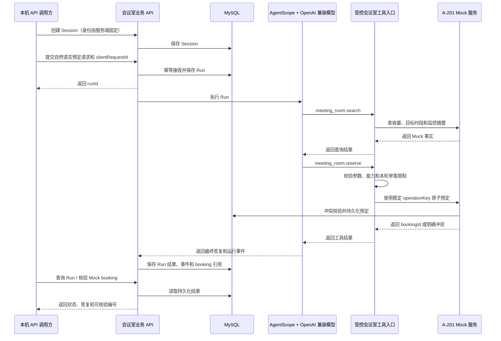

> **历史记录（2026-09-27）**：原会议室 Mock 及未认证业务/管理 API 已退出。本文中的原型实现和测试结果只反映当时状态；当前开发与运行边界请见 [Mock 退出与真实开发基线设计](../04-渠道与执行/Mock退出与真实开发基线设计.md)。

# 海卓智慧大脑：会议室预定闭环实现方案与验收清单

| 项目 | 内容 |
| --- | --- |
| 版本 | 0.2 |
| 日期 | 2026-09-27 |
| 状态 | 用户已确认并完成实施；验收通过 |
| 依据 | [会议室预定首个业务闭环详细设计](会议室预定首个业务闭环详细设计.md)、当前代码与本轮明确要求 |
| 交付物 | 可运行代码、自动化测试结果、真实模型闭环记录和测试报告 |

## 1. 文档用途

本文最初作为编码前实施范围和验收标准。用户确认后已按本文完成本机 Mock 会议室闭环；本次实测结果与限制见[测试报告](../07-测试报告/会议室预定闭环测试报告.md)。第 2 节记录实现前基线，其余章节是本轮边界与实现依据。

用户本轮明确给出的边界是：完成会议室预定闭环；不开发前端登录页面；用户身份尽量简单；会议室系统可由可用的 Mock 服务代替；提供的 LLM 地址、密钥和本地数据库连接用于本地开发；不要求通过环境变量注入配置。

## 2. 实现前代码基线（2026-09-26）

当前仓库已经有一条原型链路，但还不是可持久运行的完整闭环：

| 已存在 | 当前限制 |
| --- | --- |
| `POST /api/v1/sessions`、提交 Run、查询 Run 和预定核验 API | 测试身份固定在代码中；没有正式登录，也没有用户管理 |
| AgentScope Java 的查询/预定工具和统一工具入口 | 当前模型实现固定使用 `DashScopeChatModel`；请求里的 provider 也写为 `dashscope` |
| A-201 容量、冲突检查、操作键幂等的会议室 Mock | Session、Run、请求去重及预定数据都在 JVM 内存，重启后丢失 |
| 外置 YAML 配置模板和本地启动脚本 | `meeting-mock` 当前排除了数据源和 Redis 自动配置，不能使用 MySQL 持久化 |
| MySQL、MyBatis-Plus、Redis 的项目依赖及本地配置模板 | 当前会议室闭环尚未接入这些持久化能力 |

现有 `MeetingRoomMockLoopTest` 使用假 AgentRuntime 验证工具流程，不能代替真实模型的端到端验收。实施后仍保留这类快速测试，并另外运行真实模型闭环验收。

## 3. 建议本轮范围

### 3.1 本轮包含

1. 用 AgentScope Java 调用用户提供的 OpenAI 兼容模型服务。模型负责识别预定需求，并通过已注册的会议室工具查询和预定。
2. 提供可运行的 A-201 Mock 会议室服务，包含房间资料、时段空闲、模拟监控、预定写入、冲突判断和按编号核验。
3. 使用 MySQL 保存 Session、Run、请求幂等信息、必要的 Run 事件、Mock 预定和操作键；服务重启后可查询已有结果。
4. 提供无前端的 HTTP API，供 Postman、curl 或自动化测试完成 Session 创建、自然语言请求提交、结果查询和 Mock 结果核验。
5. 使用本地独立 YAML 配置连接 LLM 和数据库，不读取或注入操作系统环境变量；敏感值仅放在被 Git 忽略的实际配置文件中。
6. 增加有边界的异步 Run 执行、同一 Session 单活动 Run、请求去重、同房间时段冲突控制及启动时对遗留 Run 的安全处理。

### 3.2 本轮不包含

- 前端页面、手机号密码登录、正式账号管理、用户注册或多用户权限后台。
- 真实会议室、真实门禁或监控设备接入；A-201 及监控信息都明确标记为 Mock。
- 多会议室推荐、复杂自然语言相对时间、会议取消/改期、审批与通知。
- 多租户、多实例高可用、完整的通用 Agent 配置/发布后台、通用事件订阅和 SSE。
- 生产环境部署或把无登录测试身份开放到局域网/公网。

## 4. 用户身份与网络边界

首轮采用唯一的服务端测试用户 `UserId=1001`。Session 创建时由服务端写入该身份；请求体不提供 `userId` 字段，服务端不得信任客户端传来的身份。所有 API 仅用于本机联调，建议 `meeting-mock` 配置绑定 `127.0.0.1`。没有登录认证意味着本轮不能把服务暴露给其他机器或生产网络。

Session、Run 和预定记录仍写入用户归属字段，以免把这一轮的简化身份设计固化成未来的数据模型限制。后续增加正式登录时，用认证上下文替换固定测试身份，不改变业务记录的归属语义。

## 5. 目标运行链路

成功答复必须能用 `bookingId` 查到 MySQL 中同一笔 Mock 预定。模型没有调用查询/预定工具，或工具没有返回成功时，不得由 API 层拼装成功结果。

## 6. 模型接入设计

用户提供的服务地址按 OpenAI 兼容 Chat Completions 接口使用，配置到独立的本地 Mock YAML。API Key 不进入源代码、示例配置、设计文档、日志或 Git 提交。

当前项目只引入 AgentScope DashScope 模型扩展。实施方案改用 AgentScope 的 OpenAI 模型扩展，并设置自定义 `base-url`。AgentScope 官方模型文档列出 OpenAI 兼容服务与工具调用支持；最终仍以本项目锁定的 AgentScope 2.0.3 和用户服务的实测结果为准：[AgentScope Java 模型接入文档](https://doc.agentscope.io/tutorial/task_model.html)。

用户补充了两个可用模型服务。已读取模型清单，并分别向 Wishub X6 的 `Qwen3-32B`、CT AIGW 的 `qwen3.7-max` 发送不含业务数据的合成函数调用；两者均返回标准 `tool_calls`。本轮主配置选用 CT AIGW 的 `qwen3.7-max`，Wishub X6 的 `Qwen3-32B` 作为已验证备用。最终仍须由本项目锁定的 AgentScope 2.0.3 实际完成一次会议室工具调用和预定。

AgentScope 的 provider、model、base URL 和 key 均从配置对象读取。错误信息不得包含完整 Key；健康检查只报告配置是否齐全，不回显密钥。

## 7. 会议室 Mock 服务

### 7.1 固定数据与规则

| 字段 | 首轮值/规则 |
| --- | --- |
| 房间 | `A-201`，一间固定 Mock 房间 |
| 容量 | 8 人 |
| 设备 | 投屏可用；状态和采集时间标记为模拟数据 |
| 可预定时段 | 查询目标完整时段；当前监控状态不代替未来日程 |
| 时间 | 要求明确未来日期、开始和结束时间，按 `Asia/Shanghai` 处理 |
| 参会人数 | 必须为 1 至 8 的整数 |
| 幂等 | `operationKey` 唯一；同键同参数返回原预定，同键异参数拒绝 |
| 冲突 | 以半开区间 `[start,end)` 原子检查同一房间的重叠预定 |

AgentScope 只能获得 `meeting_room.search` 和 `meeting_room.reserve` 两个业务工具。Mock 的管理/核验 HTTP API 不注册成模型工具。工具入口固定房间 ID，并复核时间、人数及本地能力授权；模型不能通过普通对话请求修改房间目录或伪造用户身份。

### 7.2 面向联调的 Mock HTTP API

建议在同一应用中提供独立的 Mock Controller 和服务接口，外部系统由此被 Mock，但业务 Tool 仍经受控适配器调用服务层：

| 方法与路径 | 用途 | 规则 |
| --- | --- | --- |
| `GET /mock/api/v1/rooms/A-201/availability?startAt=...&endAt=...&attendees=...` | 检查容量、设备、目标时段空闲及模拟监控 | 只读；响应包含 `observedAt` 和 `dataSource=MOCK` |
| `POST /mock/api/v1/bookings` | 联调或测试 Mock 预定接口 | 只允许本机访问；要求稳定 `Idempotency-Key`；写入同一 Mock 服务和数据库 |
| `GET /mock/api/v1/bookings/{bookingId}` | 核验 Mock 预定 | 作为 Run 成功后的可核验来源 |

`POST /mock/api/v1/bookings` 是本机开发用模拟系统接口，不是绕过业务权限的用户预定入口。正常闭环中只有受控 Tool Gateway 调用预定服务。接口错误统一返回清楚的 4xx/5xx 和机器可读错误码，不回显凭据。

## 8. Run API 与业务语义

| 方法与路径 | 用途 | 约束 |
| --- | --- | --- |
| `POST /api/v1/sessions` | 创建当前测试用户的 Session | 服务端赋予固定测试用户；客户端无权指定用户 ID |
| `POST /api/v1/sessions/{sessionId}/runs` | 提交一个自然语言预定需求 | 请求含 `clientRequestId` 和 `message`；相同用户和请求键、相同内容返回原 Run；相同键不同内容返回 `409` |
| `GET /api/v1/runs/{runId}` | 查询状态、结果、答复和 booking 摘要 | 仅本机测试边界；读取数据库中的当前状态 |
| `GET /mock/api/v1/bookings/{bookingId}` | 从 Mock 服务核验预定 | 必须与 Run 中返回的 booking ID 一致 |

本轮允许一个 Session 同时运行一个 Run，一个 Run 最多创建一笔预定。请求信息不足、时间不明确或人数不合法时，不写入预定，返回明确的需补充/不支持答复。房间冲突返回“未预定成功”及原因。Run 状态和业务结果分别记录；Agent 正常结束不等于预定成功。

建议 Run 状态：`ACCEPTED → RUNNING → SUCCEEDED / FAILED`；业务结果至少区分 `BOOKED`、`NEEDS_INFO`、`UNAVAILABLE`、`DENIED`、`UNKNOWN`。如果应用重启时存在遗留 Run，通过固定 `operationKey` 查询本地 Mock：找到成功预定就补齐 Run 结果；没有预定则安全结束为失败/未预定。不能盲目发起第二次预定。

## 9. 数据保存与并发规则

MySQL 是持久事实来源。物理表在实现时通过版本化数据库迁移创建，建议最少包括：

| 表 | 关键数据与约束 |
| --- | --- |
| `agent_session` | Session ID、测试用户、状态、当前活动 Run；Session 所有者创建后不可改 |
| `agent_run` | Run ID、Session、用户、请求文本/摘要、`clientRequestId`、状态、业务结果、答复、时间；`(user_id, client_request_id)` 唯一 |
| `agent_run_event` | 连续序号、事件类型、用户可见摘要和时间；不保存模型内部推理或密钥 |
| `mock_meeting_room` | 固定 A-201 的容量、设备和模拟监控数据；应用初始化保证只种入一次 |
| `mock_meeting_booking` | booking ID、房间、用户、时段、人数、operationKey、参数摘要；operationKey 唯一 |

同 Session 活动 Run 由数据库事务/行锁保证，不能依赖单 JVM 锁。Mock 对同房间预定使用房间记录锁后检查区间冲突并插入，避免并发请求同时看到空闲而双重预定。请求去重和 Mock 操作幂等都在数据库唯一约束上兜底。

本轮是一台本地应用的开发闭环；MySQL 持久化预定与 Run，不承诺多实例部署、自动扩容或生产级故障恢复。Redis 已在本机 Docker 中运行，但首轮正确性不依赖 Redis；Run、预定和幂等事实只保存在 MySQL，避免 Redis/MySQL 双写成为业务成功条件。若实现时证实单机异步执行确实需要 Redis 队列，再提交设计变更并单独说明。

## 10. 配置与本地运行

配置继续遵循项目现有约定：从项目根目录启动，直接编辑 `config/` 下被 Git 忽略的实际 YAML，不使用环境变量注入。

| 文件 | 本轮配置 |
| --- | --- |
| `config/application-local.yml` | MySQL 本机地址、数据库名、用户和用户提供的本地密码；Redis 地址保留为本机 Docker Redis |
| `config/application-meeting-mock.yml` | Mock Profile、OpenAI 兼容 provider、给定 base URL、从模型清单确认的模型 ID、API Key、loopback 监听和测试用户 |
| `scripts/run-meeting-mock.ps1` | 激活 `local,meeting-mock`，启动应用；遇到缺少配置时清楚提示如何补齐 |

实际配置值只写入 Git 忽略的 `config/application-local.yml` / `config/application-meeting-mock.yml`。模板保留无效占位值；不得把用户提供的 Key 或数据库密码复制到文档、源代码或模板。部署配置文件的 Profile 合并顺序在实现后通过启动日志和连接测试核验。

本轮验证时 MySQL 目标开发库由驱动自动创建，Flyway V1 成功迁移。Redis 未作为业务依赖；本机 Redis 要求认证，Mock Profile 关闭 Redis 健康检查，不重启或改动 Redis 数据。

## 11. 验收清单

### 11.1 端到端成功

- [x] 应用以 `local,meeting-mock` 配置启动；启动脚本检查本机模型配置，不输出密钥。
- [x] Flyway V1 完成；MySQL 保存 Session、Run、工具事件和 Mock 预定。
- [x] 创建 Session 不需要登录页面或客户端身份字段；服务端固定用户 1001。
- [x] 真实 AgentScope 调用 OpenAI 兼容模型完成明确未来时段预定。
- [x] AgentScope 仅注册会议室查询/预定工具；工作事件记录动作结果，不存模型内部推理或凭据。
- [x] Run 返回的 booking ID 由 Mock 查询 API 核验一致。
- [x] 服务重启后 Run 和预定仍可查询；遗留操作按 operationKey 核对，不盲目重试。

### 11.2 边界和失败

- [x] 真实模型遇到缺少日期、时间和人数的请求，返回 `NEEDS_INFO` 且无 booking。
- [x] 已占用时段由真实模型返回 `UNAVAILABLE`；直接 Mock 重叠写入返回 `409`；容量上限与冲突规则有 JDBC 测试。
- [x] 同 `clientRequestId` 同内容重放返回原 Run；同键异内容返回 `409`。
- [x] JDBC 测试覆盖同一操作键幂等、同键异参拒绝和重叠并发写入只有一个成功。
- [x] Run Store 测试覆盖 Session 有活动 Run 时拒绝再接收新 Run；未执行独立负载压测。
- [x] AgentRuntime 故障测试确认 Run 失败且无 booking；虚报 booking 的测试结果被拦截。
- [x] 应用配置绑定 loopback；Run API 不接受客户端 `userId`。
- [x] Maven 多模块测试共 12 项通过；真实模型和本机 API 闭环验收通过。
- [x] 测试报告记录运行环境、非敏感配置方式、测试结果、真实模型 Run 与 booking 核验、已知限制。

## 12. 实施顺序

1. 检查本地配置文件、MySQL 连接、Docker Redis 状态；查询 LLM 模型列表并验证工具调用接口。
2. 实现模型 Provider 配置读取和 AgentScope OpenAI-compatible 模型适配；补充不泄密的启动诊断。
3. 设计并添加数据库迁移和 Mapper/Repository，先持久化 Session、Run、幂等请求、事件和 Mock booking。
4. 把当前内存 Run 服务与内存 Mock 替换为数据库实现；实现同 Session 并发控制、同房间冲突和操作键幂等。
5. 增加 Mock 联调 API，保持 Agent 只能走受控工具入口。
6. 调整本地 Profile 与启动脚本，运行单元、集成和完整真实模型闭环验收。
7. 更新会议室详细设计、文档索引和运行指南，逐项记录实现状态与已知边界；生成测试报告并确保报告结论与实际执行证据一致。

本轮先在默认沙箱中遇到外部网络拦截，随后在获准联网的本机运行进程中完成真实模型调用。测试报告记录最终通过证据；本机 Maven `settings.xml` 的格式告警不影响构建或测试成功。

## 13. 用户确认与实施记录

用户确认按以下范围实施，随后授权独立完成编码、测试和交付：

1. 仅开发本机可运行的会议室 Mock 闭环，不做前端、正式登录或真实会议室接入。
2. 身份固定为服务端测试用户 `1001`，API 限制本机访问，客户端不能传 `userId`。
3. LLM 走提供的 OpenAI 兼容地址，由 AgentScope 真实调用并完成工具调用；模型 ID 先从服务查询。
4. A-201 Mock、Session、Run、幂等和预定都由 MySQL 持久化；Redis 本轮不作为成功链路的必需组件。
5. 保持 YAML 文件配置，不支持环境变量注入；敏感值仅写入 Git 忽略的本地配置文件。
6. 验收至少覆盖成功预定、结果核验、缺参、冲突、幂等、并发、服务重启和 LLM 故障场景。

实现与测试已完成。固定测试身份、单机 Mock、MySQL 持久化、YAML 配置与无需 Redis 的成功路径均按用户确认落地；后续真实系统接入、正式身份、前端和多实例部署需另做设计评审。

