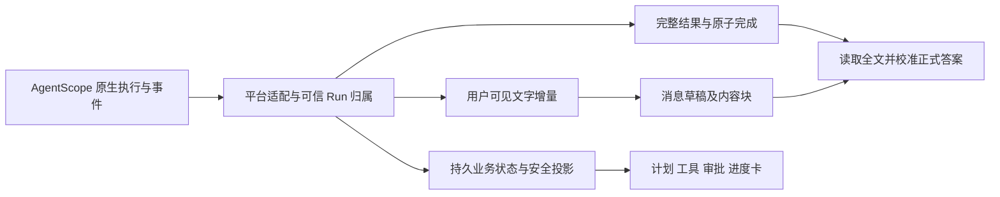

# 功能与界面闭环详细设计

版本：1.0。日期：2026-10-09。状态：**需求范围已确认，详细设计完成，实施与业务验收尚未开始。**
代码基线：`refactor/session-runtime-identity` / `eda9c79bd438df9f84f4b2c86c320dc8a0f078ba`。依赖：Java 17、AgentScope Java 2.0.3、Vue 3。
本文件规定跨专题边界；操作步骤、字段契约和验收分别见[实施总览](功能闭环实施/实施总览与验收矩阵.md)与各 SPEC。

## 1. 输入、结论与范围

用户已认可[全部功能盘点](功能闭环实施/2026-10-09功能覆盖基线.md)以及事件和实时消息的补齐目标。本次设计覆盖盘点中的 42 个功能组，另将每轮运行模式、完整 RAG 等相关限制列入开放登记。

四类条目的处理规则：

| 类别 | 本次设计处理 | 完成的判定 |
| --- | --- | --- |
| 已有覆盖 | 保留现有操作，纳入回归矩阵 | 原有可用流程继续通过 |
| A/B：接口已有但页面缺失或不完整 | 对接现有接口，补状态、失败和恢复 | 普通用户/管理员可完成对应业务 |
| C：内部事实已有，查询不足 | 新增受保护读契约和必要投影，再补页面 | 后端过滤、查询和页面一起通过 |
| D：骨架、未开放或真实接入未完成 | 明确独立前置、可实施接入切片和开放门槛 | 对应门槛通过后单独开放；不预先显示可操作假入口 |

确认页面覆盖不等于授权默认开放新 profile、生产 IM、长期记忆、完整 RAG 或会议室业务。后者按[FE-12](功能闭环实施/SPEC-12-开放门槛与生产接入.md)的范围和门槛执行，不扩大为未定义的业务系统。

## 2. 产品目标和信息架构

普通用户：账号激活、强制/日常改密、员工与会话入口、完整回答、稳定实时过程、历史运行与结果引用、轻量反馈。
管理员：原有能力/授权/MCP/定义/用户管理，加渠道与投递、异常运行核查、版本与资产修订、审计、连接和脱敏运行配置。

沿用现有 AppLayout、AdminView 和相邻表单组件。管理页面仍共用受保护的管理入口；新增 panel 使用白名单键并支持 URL 深链接，版本区属于员工定义专题。不得为了导航重写整套身份或布局。

| 区域 | 展示对象 | 操作边界 |
| --- | --- | --- |
| 会话正文 | 用户输入、回答草稿、完整正式答案 | 按属主和消息身份归并 |
| 过程区 | 计划、工具、审批、安全专家/工作项进度 | 白名单状态；可折叠；不直接展示 INTERNAL |
| 运行详情 | 用户主动选择的历史 Run | 与当前可控制 Run 分离 |
| 管理中心 | 配置、版本、绑定、异常和审计 | 服务端 PLATFORM_ADMIN 校验，保留既有租户约束 |
| 运维连接 | 脱敏连接引用、验证结果、生效范围 | 凭据经专用边界；Worker 参数先只读 |

运行方式使用业务名称，技术枚举保留在详情。未开放项显示原因或只读配置，不给出能绕过服务端门槛的按钮。

## 3. 唯一状态所有者

| 对象 | 所有者/事实源 | UI 可以维护的派生状态 |
| --- | --- | --- |
| 推理循环、原生计划、子 Agent、Team 内部任务与消息 | AgentScope 2.0.3 | 经过平台授权的展示投影 |
| Session/Run、排队、取消、引导、冻结执行者 | platform + 既有持久表 | 当前控制目标、历史查看目标 |
| 正式完整结果 | platform_agent_result，ROOT_FINAL | 正文缓存、加载/错误/复制状态 |
| 持久事件 | Run 事实与 Session 游标投影 | 已应用游标、待合并事实 |
| 用户可见生成草稿 | 运行事件的展示投影 | 临时正文、内容块和渲染状态 |
| 业务工具批准 | 既有工具执行与审批事实 | 提交中、提交失败、已处理 |
| 泛化用户选择 | 经原生契约验证的等待点及平台决定记录 | 表单选择；不替代工具授权 |
| 外部送达 | 既有 Delivery/Outbox + 提供方证据 | 管理查询和核查操作 |
| 管理配置与审计 | 对应领域仓库和不可变修订 | 编辑副本、冲突提示、只读详情 |

生成草稿投影是可重建的展示资料，不能用于恢复 Agent 推理、授予权限或判定 Run 成功。新查询服务不得创建第二套 Run 队列、计划管理器、协作派发器或发送队列。

## 4. 事件、消息与完整结果

事件表达“发生了什么”，消息表达“界面持续显示什么”，结果表达“正式交付的完整正文”。不以一条事件创建一条气泡。

先交付 FE-02：继续消费 v2 与现有全文 API，明确完整结果优先级、来源和终态收尾。数据库事件是摘要，但当前部分读取已关联结果回填全文，不能将所有路径判定为必然截断；新增显式校准消除摘要fallback及竞态风险。
随后交付 FE-03：增加 v3 展示协议、原生回复/内容块映射、生成快照与有界暂存批次，支持生成中刷新、跨实例订阅及稳定长内容渲染。v1/v2 端点和编号保留。

原生 TextBlockDelta 是正文来源；思考增量、未知来源和子 Agent 私有文本继续过滤。原生 AgentResultEvent 在 2.0.3 中只有 result，不提供 replyId，因此正式答案固定为每 Run 的 ROOT_FINAL，不靠“最后一个原生回复 ID”推断。直接专家执行仍是该 Run 的 ROOT，执行者标签由冻结目标读取。

## 5. 消息与业务状态分离

前端派生模型至少包含：sessionId、runId、稳定 messageId、kind、executorRoleId、blocks、phase、bodySource、resultId、lastAppliedOffset、generation。
`bodySource` 为 draft / event-summary / canonical-result / legacy-summary；只有 canonical-result 才标识本轮正常完成后的完整正文。

| 业务情况 | 消息展示状态 | 必须处理的细节 |
| --- | --- | --- |
| QUEUED | queued | 保留已受理用户输入和队列位置 |
| RUNNING | generating | 合并属于同 Run/attempt/内容块的增量 |
| WAITING_TOOL | waiting-tool | 暂停打字动画；展示对应工具状态 |
| WAITING_CONFIRMATION | waiting-confirmation | 绑定持久审批，不将普通文字“同意”当决定 |
| WAITING_INPUT（FE-11 C探针通过后新增） | waiting-input | 占槽且无执行租约；决定持久后按既有恢复claim进入新attempt |
| SUCCEEDED，全文未读完 | finalizing | 保留已有正文，显示完整结果读取状态 |
| SUCCEEDED，全文已读完 | final | 正文以不可变结果校准，拒绝迟到增量覆盖 |
| FAILED/CANCELLED/EXPIRED/TERMINATED | partial-stopped 或 final | 结束动画；部分正文明确标记，已交付正式结果不降级 |
| RECOVERY_REQUIRED | recovery-pending | 保留可用资料，禁止未经核查继续；管理员按 FE-06 处置 |

`activeRunId` 仅控制发送、取消、引导和当前审批；`inspectedRunId` 仅决定历史详情。历史选择、晚到查询或旧消息全文加载均不得改变当前控制目标。

## 6. 恢复等级与实现选择

| 等级 | 保证 | 实施方式 |
| --- | --- | --- |
| R1 最终一致 | 实时完成、刷新、补读、快照后得到同一完整答案 | FE-02 读取完整结果，消息终态收尾 |
| R2 生成连续 | 同一活动执行期间重连恢复已提交草稿，并续接后续文字 | FE-03 一致性视图 + 有界批次日志，双位置续传 |
| R3 故障可说明 | Worker 停止、租约失效时显示已提交部分及核查状态 | 复用既有执行/恢复事实；不自动重启有副作用的旧运行 |
| R4 多实例展示 | 生成实例与 SSE 接收实例不同时仍可读取提交的批次 | FE-03 JDBC 暂存批次查询；通知仅降低延迟 |

sessionCursor 只表示持久事实，attemptId + streamOffset 只表示当次文字顺序。v3 的 renderCursor 仅定位有界展示批次，不是 Run 成功或审计事实。窗口过期读新视图，不能假装每个 token 永久可回放。

本地源码确认 HarnessAgent.streamEvents 委托原生执行，ReActAgent.streamEvents 进入 buildAgentStream；浏览器重连不得再次调用执行入口。新增的是传输/展示恢复层，不复制框架执行机制。仍需 FE-03 的无网络原生事件探针确认映射和关闭行为。

## 7. 公共接口和权限

通用约定由[FE-00](功能闭环实施/SPEC-00-公共契约与实施约定.md)统一。现有接口标“复用”，新增路径/字段标“待新增”。旧数组、offset、v1/v2 形状不得因新页面直接改变。

普通用户查询先验证可信属主，再访问结果、消息、文件、工作项安全视图。管理员查询沿用 PLATFORM_ADMIN，内部诊断只返回允许字段。外部用户 ID 不充当平台身份。

分页资源使用稳定时间字段 + 唯一 ID；无 createdAt 的资产使用 reviewedAt。cursor 绑定查询条件和调用者，不接受任意 SQL 排序。
新增副作用命令有显式reason、幂等requestId或已有revision/fence守卫；重复幂等请求重放相同结果，不重复外部动作。旧改密、布尔批准、授权PUT及渠道客户端兼容窗口保留其已定义契约，不能泛称所有旧接口已有幂等/理由；渠道新UI采用FE-05控制字段增强，其余非幂等旧写遇未知结果先核对事实。

## 8. 数据、迁移与回退

| 专题 | 既有事实复用 | 可能新增的数据 |
| --- | --- | --- |
| 全文与基础页面 | 结果、Session/Run、用户和能力资产 | 基础接入不需要修改历史迁移 |
| v3 展示恢复 | 当前事件与结果 | 草稿消息/内容块投影、有界展示批次 |
| 员工生命周期/版本 | digital_employee、草稿、不可变发布版本 | 并发安全 ID 分配及操作溯源 |
| 渠道/恢复 | 账号、身份、Delivery、恢复动作 | 管理读模型；发送 claim 世代/CAS；核查审计 |
| 协作安全进度 | 工作项、修订、调用、Team 事实 | 必要白名单公开摘要，不重建调度 |
| 审计/连接/反馈 | 原有领域审计及连接端口 | 查询投影、渠道审计、连接修订/冻结引用、本地反馈历史 |
| 泛化内容与交互 | Renderer 类型和运行结果 | 受保护制品索引、等待点/决定记录，需独立门槛 |

Flyway 版本号在每个切片开始时按当前最新号分配，SPEC 不提前占用 V35 或改写 V1–V34。新表/字段先兼容部署，再切换页面；停用 v3 恢复 v2 展示时，完整结果接入继续保留。
回退应用不删除已产生的完整结果、审批、审计或投递意图；新等待点尚未结束时不得回退到不识别该状态的旧运行程序。

## 9. 切片与验收

以实施总览的依赖图为准。首批同时完成 FE-01 和 FE-02；后续按 API 可用性分别交付配置、渠道、恢复和操作补齐；协作/内容/生产连接按独立 gate 开放。

每个切片必须提供可启动的纵向链路、失败路径、权限验证和证据。源码/构建/单元/真实 MySQL/浏览器契约/真实服务 E2E 分开记录。旧报告中的测试数字不复用为新切片通过。

关键场景：超过 4,000 字符全文；接收完成与结果读取竞态；取消/失败后部分消息收尾；断线和过期窗口；工具恢复新 attempt；跨 Session 越权；不同实例订阅；冲突配置不覆盖；不确定 Delivery 不盲重发。

## 10. 现状证据与历史校准

当前证据见归档基线的源码链接。重点入口：
- [全文保存与原子完成](../../haizhuo-brain-infrastructure/src/main/java/com/haizhuo/brain/infrastructure/run/JdbcRunExecutionStore.java)
- [持久事件摘要](../../haizhuo-brain-infrastructure/src/main/java/com/haizhuo/brain/infrastructure/run/JdbcRunEventAppender.java)
- [现有结果/快照 API](../../haizhuo-brain-api/src/main/java/com/haizhuo/brain/api/session/SessionRecoveryController.java)
- [现有实时消息合并](../../haizhuo-brain-web/src/presenters/runEventPresenter.ts)
- [会话页面](../../haizhuo-brain-web/src/views/app/SessionView.vue)
- [既有协作 SPEC-14](../03-Agent与能力/数字员工技能知识与协作实施/SPEC-14-管理页面与会话展示.md)

原 SPEC-14 中配置编辑、全文校准和安全协作展示是目标，不能用“基础 API/UI 已接入”推断全部完成。该专题本轮补充日期校准及指向新 SPEC，原历史验收报告保留原结论。

本轮只核对源码、接口、迁移和固定版本依赖源码；没有运行模型、数据库业务流程或浏览器 E2E。
