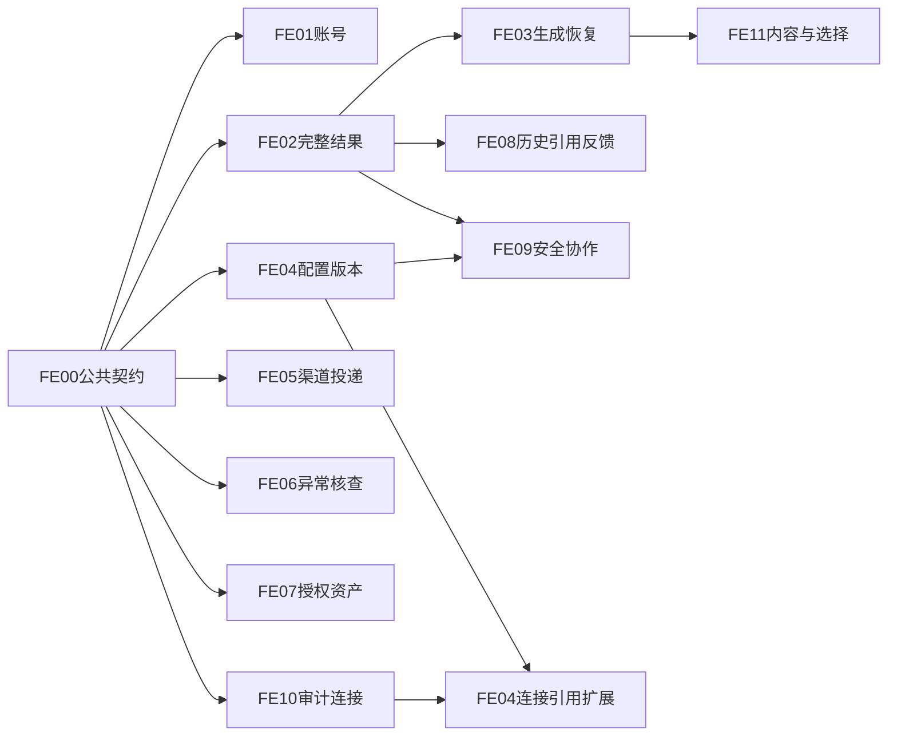

# 功能闭环实施总览与验收矩阵

日期：2026-10-09。状态：**W0–W3 与可独立交付的 W4 子切片已编码并完成本轮定向验收；FE-03 的多实例/真实服务 DoD 未完成且 v3 保持关闭；FE-11 仅受控 Markdown 成果物子集开放实现；真实渠道、身份源、Vault、业务资源授权及通用选择仍按独立门槛关闭**。
代码基线：开始时为 `refactor/session-runtime-identity` / `eda9c79bd438df9f84f4b2c86c320dc8a0f078ba`。本轮保留基线前已有用户修改，未提交。
设计入口：[详细设计](../功能与界面闭环详细设计.md)。输入：[用户已认可的完整盘点](2026-10-09功能覆盖基线.md)。

## 1. 怎样进入实施

每个切片先核对当前工作树与接口，再按 SPEC 的未勾选清单执行；不要把本文“设计完成”改读成“已实现”。
范围分为：复用现有接口补页面、新增安全查询与页面、补必要持久化/命令，以及独立生产接入门槛。
SPEC-12 的真实提供方/身份源未指定不阻断账号、全文和管理查询；对应生产写能力保持关闭。
第一批 FE-01 + FE-02 已完成前端实现。账号安全后端和 V4 迁移已有能力被复用；长回答接入既有全文 API，FE-03 的生成恢复仍是后续独立切片。
现状校准：数据库事件摘要上限不等于全部现有读取上限，部分查询已回填完整结果；FE-02建立显式正文来源/legacy和竞态规则，不能把未复现的全部路径截断写成确定缺陷。

本轮代码级验证：JDK 17 下从 bootstrap reactor 执行的 71 个定向测试类共 265 项，264 通过、1 跳过、0 失败/错误，`BUILD SUCCESS`；另 `AgentScopeRuntimeTest` 独立复验 10/10 通过。跳过项是当前环境不能安全创建符号链接的路径安全测试。前端 `type-check` 通过、Node 单元 35/35 通过；Vite 6.4.3 生产构建经仅作用于验证进程的 `realpathSync.native` EPERM 兼容处理通过（1790 modules）。仍有 router 动态/静态混合导入和主 JS chunk 超过 500 KB 的警告。HTTP 真服务、真实 MySQL/Flyway、人工/自动浏览器 E2E 和真实模型/渠道/身份提供方均未执行，分层证据见[实施测试报告](../../07-测试报告/2026-10-09功能闭环实施报告.md)。

## 2. SPEC 清单与职责

| ID | 文档 | 主要实施产物 | 直接依赖/限制 |
| --- | --- | --- | --- |
| FE-00 | [公共契约](SPEC-00-公共契约与实施约定.md) | 错误、分页、身份、异步、迁移、验证约定 | 全部切片共用，不强改所有旧接口 |
| FE-01 | [账号激活与密码管理](SPEC-01-账号激活与密码管理.md) | 激活入口、强制/日常改密、认证状态同步 | 复用现有身份接口 |
| FE-02 | [会话事件与完整结果](SPEC-02-会话事件与完整结果.md) | 全文校准、终态收尾、历史/当前运行隔离 | FE-00；已有 v2+结果 API |
| FE-03 | [实时消息恢复与渲染](SPEC-03-实时消息恢复与渲染.md) | v3、消息/块投影、双位置续传、多实例补读、滚动 | FE-02；先原生映射/清理契约探针 |
| FE-04 | [员工运行配置与版本](SPEC-04-员工运行配置与版本管理.md) | 完整配置、成员精确版本、历史复制、创建/启停 | 基础依赖 FE-00；连接扩展后置 FE-10 |
| FE-05 | [渠道管理与投递核查](SPEC-05-渠道管理与投递核查.md) | 账号/身份/装载页、投递查询、claim保护与证据核查 | 基础读独立；核查写需 claim升级/提供方证据 |
| FE-06 | [异常运行核查与终止](SPEC-06-异常运行核查与终止.md) | 管理查询、停止证据、显式终止及冲突处理 | FE-00；配合FE-02用户消息校准 |
| FE-07 | [工具授权与资产修订](SPEC-07-工具授权与资产修订.md) | 用户完整选择、停用后撤权、已发布正文/历史 | FE-00；复用目录/资产，历史列表待新增 |
| FE-08 | [历史会话结果与反馈](SPEC-08-历史会话结果与反馈.md) | 历史分页、Run详情、独立引用区、评分/本地历史 | FE-02；初期评分队列不等于远端保存 |
| FE-09 | [协作工作项与安全进度](SPEC-09-协作工作项与安全进度.md) | 白名单progress、修订、预算/成员状态、安全通知 | FE-04冻结配置+FE-02结果；不必等待v3才提供读卡 |
| FE-10 | [审计观测与运维连接](SPEC-10-审计观测与运维连接.md) | 安全审计/导出、只读运维、连接修订与冻结引用 | 审计/只读独立；冻结扩展接现有定义链/FE-04 |
| FE-11 | [交互内容块与成果物](SPEC-11-交互内容块与成果物.md) | 安全块、真实制品、通用选择等待 | FE-02/03；选择先原生暂停恢复探针 |
| FE-12 | [开放门槛与生产接入](SPEC-12-开放门槛与生产接入.md) | 只读readiness、严格资源策略、真实IM/MCP接入 | 分gate验证；不是全部功能必须等齐才能上线 |

每份文档均规定：当前证据、已有/新增 API、字段、状态、权限、失败、模块入口、实施步骤、迁移/回退、Given/When/Then 与 DoD。
默认负责人按职责分配到 web/api/platform/infrastructure/runtime/测试；开始切片时填具体负责人和环境，不用无人负责的“大前端补齐”任务。

## 3. 实施波次与出口

| 波次 | 可并行工作 | 出口证据 |
| --- | --- | --- |
| W0 公共基线 | FE-00 前端单测入口、游标/安全公共约定及 AgentScope 2.0.3 文本身份探针 | 文本块身份探针 1/1 通过；FE-03 外部工具挂起/恢复运行测试另 10/10 通过；泛化用户选择、浏览器和生产回放仍未验证 |
| W1 首批用户闭环 | FE-01 账号激活/改密与 FE-02 正式结果、状态收尾、发送幂等 | 前端 35/35、类型检查与生产构建通过；身份服务定向用例包含在 Maven 264 项通过中；HTTP、MySQL、浏览器 E2E 未执行 |
| W2 管理与历史补齐 | FE-04/05/06/07/08 的配置版本、渠道投递、异常核查、授权资产、历史引用/反馈实现主体已落地 | 后端 71 类定向套件通过（1 项环境跳过）；H2/服务单测不代替真实 MySQL、HTTP 权限及浏览器验收 |
| W3 持久展示及治理 | FE-03 安全渲染/恢复投影、FE-09 安全协作进度、FE-10 审计/运维与连接冻结代码已落地 | FE-03 AgentScope 外部工具等待/恢复 10/10；H2 持久展示测试 6/6（过期窗口、有界续读、独立 store 对象、旧 fence）；真实 MySQL、多进程提交顺序、HTTP/SSE、慢网络消费者、浏览器验收、Vault/真实冻结部署仍未完成，v3 和连接写入保持关闭 |
| W4 内容与生产准入 | FE-11 B-MD 受控 Markdown 成果物实现；FE-11 内容块 A、泛化等待 C 与 FE-12 外部生产接入按 gate 隔离 | B-MD API/H2/BlobStore 定向测试通过（BlobStore 1 项符号链接测试因环境限制跳过）；真实工作区生产者、通用选择原生恢复契约、真实提供方均未验收 |

波次是风险排序，不是强制等待全部同波完成。员工生命周期、资产修订、只读审计可独立纵向交付。
FE-05 渠道审计在本域事务写入；FE-10聚合查询后接适配器，不要求先上线全域审计平台。
FE-04 基础配置不依赖 FE-10；可选 modelConnectionRef 扩展在 FE-10就绪后实施，防止循环依赖。
FE-12 gate 是运行准入/验收清单；被门槛保护的功能可以先完成 IMPLEMENTED_CLOSED。

## 4. 42项覆盖映射

F编号按认可报告“全功能对照清单”原顺序分配，新增/回归/关闭均计入，不能只统计缺页。
报告的62项既有业务HTTP明细保留在[覆盖基线](2026-10-09功能覆盖基线.md)；每个新增端点在对应SPEC明确标注，不能算成基线已有接口。

| 编号 | 功能 | SPEC与交付口径 |
| --- | --- | --- |
| F01 | 登录、退出、当前用户、CSRF | FE-01：既有链路回归 |
| F02 | 新用户激活 | FE-01：新增用户入口，复用接口 |
| F03 | 初始密码/日常改密 | FE-01：同组件区分模式与认证错误 |
| F04 | 用户管理 | FE-01回归；FE-07目录选择补齐 |
| F05 | 员工列表/开始工作 | FE-04可用性回归；FE-02会话接入 |
| F06 | 最近会话/历史消息 | FE-08分页；FE-02正式正文 |
| F07 | 发送/排队/取消/引导 | FE-02提交幂等与状态回归；FE-03跨Run展示 |
| F08 | 实时/补读/快照 | FE-02最终一致；FE-03生成一致性视图 |
| F09 | 历史Run/详情 | FE-08，与当前控制目标分离 |
| F10 | 计划展示 | FE-03结构化只读卡+兼容fallback |
| F11 | 工具记录/批准拒绝 | FE-02/03回归；FE-11不替代布尔授权 |
| F12 | 完整回答读取 | FE-02：实时/首屏/补读/历史全部校准 |
| F13 | 引用历史结果 | FE-08：独立引用区，单角色也可使用 |
| F14 | 能力目录/启停 | FE-07回归，保留能力级授权边界 |
| F15 | 用户工具授权 | FE-07：目录完整查询，停用后允许撤权 |
| F16 | 技能知识草稿/发布 | FE-07回归，知识资产仍非完整RAG |
| F17 | 已发布资产正文/修订历史 | FE-07：复用正文，新增稳定历史列表 |
| F18 | 员工草稿/基础模型/能力/发布 | FE-04完整回读与发布键/冲突回归 |
| F19 | 运行方式/预算 | FE-04表单/runtime-options；FE-12开放准入 |
| F20 | 固定成员/版本/角色/委派 | FE-04精确版本及关系编辑；FE-12不默认开放 |
| F21 | MCP连接登记/启停 | FE-12既有管理回归；FE-10专用秘密边界 |
| F22 | MCP发现/差异/批准 | FE-12回归发现→批准→绑定→发布→用户授权 |
| F23 | 真实MCP身份/凭证 | FE-12真实身份适配；FE-10秘密引用前提 |
| F24 | 会话直接选择专家 | FE-04冻结可选角色、FE-08选择回归，FE-12gate |
| F25 | 只读专家委派 | FE-09安全进度；FE-12原生/预算/权限验收 |
| F26 | 自治只读Team | FE-09安全成员状态；FE-12独立Team门槛 |
| F27 | 工作项/依赖/验收/修订 | FE-09安全投影，根内部验收不变成用户审批 |
| F28 | 渠道账号/默认员工/隔离 | FE-05账号页/CAS；FE-12真实协议 |
| F29 | 外部身份绑定/撤销 | FE-05管理入口与入站撤权回归 |
| F30 | 渠道装载状态 | FE-05持久配置与实际started分开 |
| F31 | 入站验签/去重/提升 | FE-05回归；FE-12指定提供方薄适配，不另造调度 |
| F32 | 可靠投递/不确定核查 | FE-05只读→claim升级→证据处置；FE-12真实发送 |
| F33 | 异常Run恢复处置 | FE-06查询/停止证据/显式终止；FE-02用户收尾 |
| F34 | 运行结果评分 | FE-08现有队列提交与本地历史分切片；FE-10观测未知态 |
| F35 | 多领域审计 | FE-10安全聚合；FE-05补渠道事务审计 |
| F36 | 健康/指标/追踪 | FE-10只读总览与受保护外部定位 |
| F37 | 新员工/版本历史比较恢复 | FE-04生命周期+复制草稿后重新发布，旧Session不变 |
| F38 | 模型连接/凭证/Worker参数 | FE-10连接精确修订、秘密引用、Worker只读；FE-12提供方门槛 |
| F39 | 目标资源权限 | FE-12 STRICT/resolver/真实授权事实，不做虚假授权后台 |
| F40 | 通用选择/多媒体/成果物 | FE-11 A/B/C完整纵向及原生等待探针 |
| F41 | 可写长期记忆 | FE-12保持关闭，独立需求与隔离/删除设计后才推进 |
| F42 | 会议室业务 | FE-12保留现有边界，真实业务源未确定不新增生产页 |

附加登记：每轮 COLLABORATIVE/AUTONOMOUS 仍不开放，不能用员工Team profile替代；完整RAG仍需独立导入/检索/ACL/评测需求。两者在FE-12，不悄悄扩成新业务。

## 5. 跨专题验收与证据

具体 Given/When/Then 编号以每份SPEC为准；下面只规定联合验收入口，不替代其全部场景。

| 联合场景 | 对应验收 | 需要的证据 |
| --- | --- | --- |
| 管理创建→用户激活→日常改密→旧身份处理 | FE-01全表 | HTTP身份/CSRF+浏览器，密码/凭据不入日志 |
| 长回答8k以上→实时完成→刷新→历史复制 | FE-02-A01/A02/A03/A11 | 全文与body一致；摘要不覆盖；正式气泡唯一 |
| 取消/失败/等待/核查时消息收尾 | FE-02-A04–A06，FE-06 | 状态真实，部分明确，无持续光标或重执行 |
| 创建响应丢失后重试 | FE-02-A12，FE-08 | 同clientRequestId只有一个Run；引用内容不变 |
| 首屏交接/断线/过期/新attempt | FE-03-A03–A08 | C/R各自恢复，无漏段/重复/串写 |
| 跨实例/旧fence/慢消费者/投影失败 | FE-03-A09–A12 | 实例B补读，旧写拒绝，业务与展示故障分开 |
| 长Markdown/上翻/历史分页 | FE-03-A14，FE-08 | 净化、锚点、复制、更新频率实际记录 |
| 配置/版本恢复/发布重试 | FE-04-A01/A05–A09，FE-10-A06 | 完整回读、CAS、唯一版本、旧Session冻结 |
| 停用用户/能力仍可撤权 | FE-07 | 查询完整、事务规则、执行边界重新判权 |
| 资产已发布正文/历史对比 | FE-07 | 不编辑旧修订，分页稳定 |
| 单角色引用/引用体积 | FE-08 | 独立入口，最多8项/512KiB，后端最终校验 |
| 评分队列接受与远端未知 | FE-08，FE-10-A04 | 不把202/accepted标为远端保存 |
| 渠道绑定撤销/隔离/装载失败 | FE-05-A01–A04 | 配置与装载分开，撤权后新入站拒绝 |
| 投递未知/旧sender迟到/确定核查 | FE-05-A05–A09 | claim/CAS、证据适配、不无证据重发 |
| 管理核查终止 | FE-06 | 可信停止证据、状态守卫、审计与槽位释放 |
| 协作修订/预算/成员/秘密样本 | FE-09全表 | 安全白名单，UNKNOWN准确，根验收不是用户批准 |
| 审计分页/导出/观测未知 | FE-10-A01–A05/A09 | 稳定全局页，安全CSV，无假健康 |
| 连接修订/Vault撤销/旧Session迁移 | FE-10-A06–A10 | 精确版本解析，未映射不切换，缓存隔离 |
| 真实制品/泛化决定/取消竞态 | FE-11全表 | 授权下载、真实生产者、唯一恢复、不泄露私有文件 |
| 严格资源策略/真实IM/MCP/profile | FE-12全表 | 本部署版本及环境的真实提供方证据，逐gate开放 |

## 6. 实施记录模板与完成边界

每次切片报告记录：SPEC/子切片、commit或工作树、环境、迁移版本、实际命令、场景ID、期望/实际、PASS/FAIL/未执行、证据文件及未覆盖门槛。
同一个场景可以有静态/单元/HTTP/MySQL/浏览器/提供方多个结果，不能以一个PASS覆盖所有层级。

当前实施状态（代码交付与环境验收分开）：
- [x] FE-00–FE-02、FE-04–FE-10 的实现主体已落地；FE-03 的 v3 投影代码默认关闭并保留真实恢复验收门槛。
- [x] FE-05-S1/S2/S3：账号命令保护/审计/CAS/装载观察、只读投递查询、V46 claim 围栏与尝试历史代码已落地；真实 MySQL 升级、真实 sender 和证据处置写入口仍关闭。
- [x] FE-08 历史分页、结果/引用及本地反馈事实代码已接线；V40/V41 尚未在真实 MySQL 执行。
- [x] FE-09 安全协作投影及 FE-10 审计/运维/精确模型连接绑定代码已落地；V47、Vault、真实模型与部署灰度未做生产验证，连接写 gate 关闭。
- [x] FE-11 B-MD：受控 ROOT_FINAL Markdown 制品可创建/查询/下载，V45 有界孤立 blob 清理与安全存储实现；真实工作区制品生产者、通用内容块及泛化选择 C 未开放。
- [x] FE-12 readiness、profile 准入和模拟资源策略 fail-closed 配置单测通过；无企业身份源、真实 IM、资源 resolver 或 Vault，相关 gate 保持关闭。
- [ ] FE-03 真实多实例/旧 fence/慢消费者及浏览器恢复 DoD、全项目 HTTP/MySQL/浏览器和真实提供方验收。H2 已验证同一数据库上独立 store 对象补读、有界分页续读、旧 fence 拒写和过期窗口提示，不等同生产双实例验收。

本轮更新了本总览、各 SPEC 与测试报告。所有 42 项 F 编号仍逐项映射，测试报告按静态、构建、单元、HTTP、MySQL、浏览器和提供方分别记录；未把构建/H2/旧历史数字当作未执行层级的通过证据。`git diff --check` 和更新后相对链接检查在最终收尾执行；原有工作树修改及根 `package-lock.json` 均保留。
