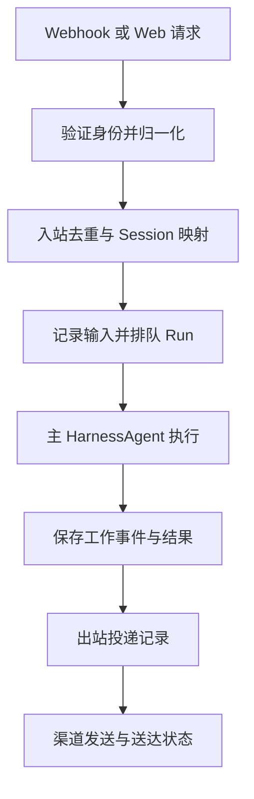

# 数字员工多渠道接入与消息流转设计

| 项目 | 内容 |
| --- | --- |
| 版本 | 0.1 |
| 日期 | 2026-09-25 |
| 状态 | 架构设计；通用 Java 契约已加入仓库，数据库、渠道适配器和真实执行尚待实现 |
| 基线 | 模块化单体、JDK 17、Spring Boot 3.5.16、AgentScope Java 2.0.3 |

本文承接[概要设计](overview.md)、[整体架构](architecture.md)和[请求生命周期](request-lifecycle.md)。原文以网页为首个交互面；本文把渠道接入扩展成同一套 Session / Run 入口。这里的 **渠道** 指 Web、飞书、企业微信等用户交互来源，**能力** 指 Skill、工具、MCP 和知识资源，两者不是同一层概念。

## 1. 先确定不变的主线

一期只发布一个预置数字员工，所有渠道都把已认证的用户消息交给它。一次 Run 使用这个员工开始执行时的已发布定义，再由 `runtime-agentscope` 装配主 `HarnessAgent`：

```text
ChannelAccountBinding → DigitalEmployee → AgentDefinitionVersion
                                      → CapabilityBinding（多个）→ 主 HarnessAgent
```

`DigitalEmployee` 是可管理、可展示、可分配渠道的产品身份。`AgentDefinitionVersion` 是一次发布的配置，包括主 Agent 指令、模型和能力引用；`CapabilityBinding` 指向确定的 Skill / Tool / MCP / Knowledge 及修订。专业子 Agent 属于主 Agent 的执行机制，不因为被委派就自动成为一个可由渠道寻址的数字员工。

**核心规则：渠道只把消息送进平台；平台决定员工、用户、Session 和 Run；AgentScope 负责 Agent 执行。** 渠道层既不自己创建 `HarnessAgent`，也不把外部会话 ID 当作平台 Session ID。

## 2. 模块职责

一期在 `haizhuo-brain-platform` 内按包组织，不为每个渠道新增 Maven 模块。渠道特有的 HTTP/Webhook 协议放 `api`，向第三方发消息和数据落库放 `infrastructure`。是否为某渠道单独拆 Maven 模块，等第二个真实外部渠道接入并出现独立依赖或部署需求后再决定。

| 工程位置 | 入口或核心职责 | 禁止越过的边界 |
| --- | --- | --- |
| `api` | Web 鉴权、Webhook 验签/解密、速率限制和提供方协议 ACK；构造已验证入站消息 | 不能信任请求体里声明的 `tenantId`、`userId`、`employeeId`，不能直接调用 Agent |
| `platform.employee` | 预置 `DigitalEmployee`、发布版本、`CapabilityBinding` 和发布目录 | 不持有 AgentScope 对象或外部渠道密钥 |
| `platform.channel` | 统一入站、渠道账号路由、身份解析、消息接收和出站投递契约 | 不解析第三方原始 JSON，不直接发送 HTTP 回包 |
| `platform` 的 Session / Run 分区 | 会话归属、单会话执行顺序、Run 创建与执行协调、工作事件和结果保存 | 不把网页连接或第三方消息回调作为 Run 生命周期 |
| `runtime-api` / `runtime-agentscope` | 接收已确定的员工定义、用户、Session 和 Run；装配并调用 AgentScope，转换执行事件 | 不自行推导第三方身份、路由和外部回复地址 |
| `infrastructure` | MySQL 持久化、渠道凭据安全存取、outbox worker 和第三方发送适配 | 不决定用户授权、员工发布和 Session 所有权 |
| `bootstrap` | 注入具体实现、设置有并发上限的后台 worker | 不含渠道业务分支 |

仓库已添加 `platform.employee` 的定义对象、`platform.channel.ChannelIngressService` 与存储/身份/发送端口；目前它们是**边界代码**，还没有 MyBatis 实现、Webhook Controller 或运行时编排。`meeting` 占位模块和状态接口已从构建中移除；会议纪要仍可作为 Skill 验证场景。

### 2.1 为什么把 Channel 与 Capability 分开

渠道决定**消息来自谁、应回到哪里**；能力绑定决定**主 Agent 被允许使用什么**。例如同一个员工从 Web 与飞书收到消息，运行时定义可以相同，但来源身份、消息去重、会话边界和回执地址不同。渠道的凭据不进入 Prompt 或 `CapabilityBinding`，能力授权也不能由某条渠道消息自行扩大。

## 3. 入站消息契约与标识

接入层验签后形成 `VerifiedChannelMessage`。一期先处理文字；图片、文件和语音以后作为附件引用引入，由受控下载与资源存储承接，不能直接把第三方 URL 提供给 Agent 访问。

| 字段 | 含义 | 来源和边界 |
| --- | --- | --- |
| `bindingId` | 平台保存的渠道账号绑定 | 从验签凭据或已登录 Web 端服务端配置查得，不从消息体照单接收 |
| `provider` | `web` / `feishu` / `wecom` 等 | 校验其与绑定的渠道类型一致 |
| `providerEventId` | 外部消息的稳定事件号；Web 使用服务端接受的客户端请求键 | 与 `bindingId` 组成唯一入站键；缺失稳定键的外部渠道需在适配器构造可复现键 |
| `externalConversationId` | 外部私聊/群聊会话 ID | 仅用于查找平台 Session；不能直接放进 AgentScope `RuntimeContext.sessionId` |
| `externalUserId` | 渠道侧发言人 ID | 通过 `(tenantId, bindingId, externalUserId)` 解析平台用户；不得自行冒充已登录用户 |
| `text` | 用户提交的内容 | 保留原始语义，进入平台输入记录后才可供执行使用 |
| `replyTarget` | 渠道侧回复目标快照 | 入站时固定，供异步投递；可能含短期有效的 token，须加密或限时保存 |

对外不要混用以下 ID：`providerEventId` 用于入站去重，`externalConversationId` 是第三方上下文，`platformSessionId` 管理对话，`runId` 管理一次执行，`deliveryId` 管理一次外发，`employeeId` 定义用户面对的员工。一次接收成功不等于执行完成，一次 Run 完成不等于回复已送达。

同一用户分别在 Web 和飞书发言时，初版创建**两个平台 Session**。允许两个会话指向同一 `userId` 和员工，但不合并上下文；跨渠道共享资料仍通过平台 Workspace 权限读取。以后如果产品要求“接着刚才网页的对话继续”，必须设计显式的会话转移/关联和访问校验，不能只靠相同手机号自动合并。

### 3.1 一期建议的持久化记录

| 记录 | 关键字段 / 约束 | 生命周期拥有方 |
| --- | --- | --- |
| `channel_account_binding` | `binding_id`、`tenant_id`、`provider`、外部账号键、状态、`default_employee_id`、凭据引用 | 平台渠道配置；密钥由基础设施保存 |
| `channel_identity` | 唯一 `(tenant_id, binding_id, external_user_id)` → `user_id`；绑定需经过身份核验 | 平台身份关联 |
| `channel_inbox` | 唯一 `(binding_id, provider_event_id)`；内容、`reply_target` 快照、接收状态、`session_id`、可空 `run_id` | 平台入站；回调收到后先落库 |
| `channel_conversation` | 唯一 `(binding_id, external_conversation_id, user_id, employee_id)` → `platform_session_id` | 平台 Session 映射 |
| `session` / `run` | Session 有用户与员工归属；同一 Session 最多一个**执行中** Run；Run 记录实际使用的定义版本 | 平台会话与执行协调 |
| `work_event` | `run_id`、事件序号、面向用户的状态与内容 | 平台工作记录，Web 重连按游标恢复 |
| `channel_delivery` | `delivery_id`、`run_id`、不可变目标、消息内容、幂等键、发送状态、次数 | 平台出站；worker 调渠道适配器投递 |

入站唯一键、Session 映射键和单会话活动 Run 限制必须靠数据库约束或事务中的行锁保障，不能只依赖 JVM 内存锁。身份解绑或重绑后，新的 `user_id` 不能沿用原用户的 Session；旧对话记录仍归原用户，待发送的旧回复按业务规则核查，不能投递到已经重绑的目标。群聊暂不开放：群成员身份、共享上下文、是否仅响应 @ 和工作资料访问边界都需单独决定。

## 4. 一条消息怎么走

以飞书私聊“帮我整理会议记录”为例，假设这个飞书账号已经绑定到企业账号，并完成用户身份关联：

1. `api` 的飞书入口校验回调签名与租户账号，解密并解析消息，识别 `providerEventId`、发言人、外部会话和本次 `replyTarget`；拒绝未验证或无法定位渠道账号的消息。
2. `ChannelIngressService` 校验渠道账号启用、provider 匹配、外部身份已绑定到平台用户、预置员工可用且有已发布定义。这里检查发布是否存在；**实际使用的定义版本在 Run 开始时冻结**，与现有请求生命周期一致。
3. `ChannelTurnStore.accept` 在事务中按 `(bindingId, providerEventId)` 去重，记录 inbox 与回执地址；找到或创建属于该用户与员工的 Session。若 Session 空闲，创建待运行 Run；若已有活动 Run，消息留在 inbox 顺序等待，返回结果的 `runId` 为 `Optional.empty()`。重复投递返回同一事件的当前 `sessionId` 和 `runId`，不再创建 Run。
4. HTTP 回调在持久化成功后尽快 ACK。内部 worker 扫描待执行记录，取得单会话执行权，解析当时的发布定义、记录版本和能力修订，通过 `runtime-api` 调用 `runtime-agentscope`。
5. 适配层以**平台 `userId`、`platformSessionId`** 构造 AgentScope `RuntimeContext`，运行主 `HarnessAgent`；框架 `AgentEvent` 转成平台 `work_event`，保存结果与 Run 状态。能力调用依照平台授权执行。
6. 生成一次出站 `channel_delivery`，保存该入站事件捕获的 `replyTarget`；发送 worker 按渠道选择 `ChannelOutboundSender`，送达后记录第三方消息 ID。连续下一条 inbox 消息随后才能启动新的 Run。



Web 渠道使用同一套 `Session / Run / work_event`。提交接口返回接收结果和 Run 信息；浏览器以 SSE 或查询订阅已保存事件，断线不取消 Run。飞书、企微等异步消息渠道只需要先 ACK 入站，最后由出站 worker 投递；接入端 HTTP 超时不能重新启动已接受的 Run。

### 4.1 一个关键的事务边界

“收到消息”和“准备执行”要有同一个持久化事实：`channel_inbox` 与对应的 Session / 待运行 Run 在事务中登记，随后由 worker 从数据库领取。数据库提交后进程崩溃，worker 还能找到待执行消息；ACK 丢失导致重投时，唯一键返回原记录。运行中的崩溃不意味着能安全重跑所有工具，按既有 Run 恢复规则判断已产生的外部副作用。

出站也遵守“先记后发”：Run 结果与 `channel_delivery` 意图入库后再请求第三方。如果对方返回成功但本地确认丢失，只有提供方支持可靠幂等键或可查证结果时才重试；否则标记**送达状态不确定**，交由查询或人工处理，不能无条件再次发送。

## 5. AgentScope 2.0.3 的接入选择

锁定版本已经有 `Channel`、`Gateway`、`ChatUiChannel` 与 `sendStream`；它们自带会话映射、同会话串行与 Agent 路由。[官方 2.0.3 Channel 文档](https://github.com/agentscope-ai/agentscope-java/blob/v2.0.3/docs/v2/zh/docs/harness/channel.md)及[该版本 HarnessGateway 源码](https://github.com/agentscope-ai/agentscope-java/blob/v2.0.3/agentscope-harness/src/main/java/io/agentscope/harness/agent/gateway/HarnessGateway.java)显示，Gateway 会生成 `gw-…` 会话 ID，覆盖传入 `RuntimeContext` 的 `sessionId`，并从其消息路由上下文确定 `userId`。如果直接让外部 Webhook 调 `agent.channel(...)`，平台 Session / Run 的身份与状态会与 Gateway 自己的会话管理重叠。

因此第一条完整链路采用 **平台拥有入站与 Run，`runtime-agentscope` 直接调用 `HarnessAgent.streamEvents(..., RuntimeContext)`**。2.0.3 的 `HarnessAgent` 源码提供带显式 `RuntimeContext` 的调用/流式方法；适配层用平台已验证的 `userId` 和 `platformSessionId` 保持状态隔离。[HarnessAgent 源码](https://github.com/agentscope-ai/agentscope-java/blob/v2.0.3/agentscope-harness/src/main/java/io/agentscope/harness/agent/HarnessAgent.java)。AgentScope 自身的 Skill、工具、状态存储与委派机制继续复用，平台不实现第二个 Agent 循环。

未来如要改用原生 Gateway 承接某个渠道，先做局部验证：平台 Session ↔ Gateway session 的持久映射、授权身份、不重复排队、Run 与 Gateway 事件归属、Web 断线、等待/取消、跨进程恢复和 outbox 送达是否一致。通过验证后只能保留**一个**对 Session 并发与 Agent 路由负责的协调点，不能同时由平台和 Gateway 各自排队。

## 6. 后续扩展点与当前边界

| 场景 | 一期 | 后续演进 |
| --- | --- | --- |
| 一个渠道账号关联的员工 | `defaultEmployeeId` 指向唯一预置员工 | `ChannelBindingEmployee` 管理可选员工，`ConversationRoute` 保存当前员工、路由修订和人工固定；切换员工新建/切换平台 Session |
| 路由方式 | 账号默认路由，不做 LLM 意图分发 | 显式命令或管理员规则优先；自动路由只能在授权的员工集合内，CAS 防止覆盖人工切换 |
| 专业子 Agent | 主 Agent 内部委派，结果回主 Agent | 如允许用户直达子 Agent，需要另行定义产品身份和访问授权，不沿用内部句柄 |
| 用户绑定 | 已验证的 Web 登录或渠道身份绑定；未绑定的外部用户不进入员工的企业资源上下文 | 独立的绑定流程、解绑/重绑审计与更细的访客权限 |
| 媒体与群聊 | 先实现文字私聊 | 附件受控下载、资源引用；群聊单独决定参与者隔离与资料权限 |
| 人工接管 | Run 失败时提供状态；暂不自动转人工 | 显式 handoff 状态、负责人、通知、回复归属和恢复机器人服务的操作 |

参考 StaffDeck 的[渠道入站结构与适配器](https://github.com/OpenBMB/StaffDeck/blob/7adc7c84f61bd6cca13ff0380a811cbb3ae3c544/backend/app/channels/adapters/base.py)、[入站处理](https://github.com/OpenBMB/StaffDeck/blob/7adc7c84f61bd6cca13ff0380a811cbb3ae3c544/backend/app/channels/service_intake.py)和[渠道状态记录](https://github.com/OpenBMB/StaffDeck/blob/7adc7c84f61bd6cca13ff0380a811cbb3ae3c544/backend/app/db/models.py)。其中身份作用域、去重、会话锚定、不可变回执目标与 outbox 值得借鉴；它的多员工自动分流、完整交接和渠道特殊状态无需一起搬到一期。

## 7. 本轮代码与下一步验收

本轮代码已经把 `meeting` 业务模板移出 Maven 构建，并增加 `haizhuo-brain-platform`。`ChannelIngressService` 目前做到绑定、身份和发布前置校验；`ChannelTurnStore` 定义原子接收、排队和去重语义；`ChannelOutboundSender` 定义出站适配边界。运行请求和事件已改为 `SessionId` / `RunId`，尚未配置的 AgentScope 适配器会明确报错。没有实际的渠道认证入口、持久化表与迁移、worker、AgentScope 执行集成或可用的对话 API；因此**不能把契约代码当成可运行的多渠道功能**。

建议下一步按依赖顺序完成并验收：

1. 预置一个 `DigitalEmployee`，发布一版定义与几个确定修订的 `CapabilityBinding`；完成数据库约束与 `EmployeeCatalog`、账号/身份目录及 `ChannelTurnStore` 实现。
2. 打通已有登录态的 Web 接入；同一用户连发两条消息时只创建一个活动 Run，重复 `providerEventId` 不新建消息、Run 或投递。
3. 用第二个受控的渠道适配器验证相同员工在不同渠道下使用不同 Session；再接入一个真实外部消息渠道并验证回调验签、ACK、进程重启与回复目标。
4. 接通 `runtime-agentscope`，验证显式 `RuntimeContext` 的用户/会话隔离、Agent 事件存储、断线后继续、出站送达状态及重试边界。

文档内的字段名和表名是建模建议。当前仓库没有迁移文件和数据库实体，真实持久化实现需要按现有项目的迁移策略确认后提交。
