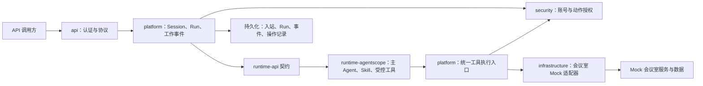

# 海卓智慧大脑：会议室预定首个业务闭环详细设计

| 项目 | 内容 |
| --- | --- |
| 版本 | 0.6 |
| 日期 | 2026-09-26 |
| 状态 | 首个业务闭环原型实现；内存态单进程，不用于生产 |
| 已确认范围 | 首个闭环不实现手机号密码登录；仅以受限测试环境的可信身份运行 Web API |
| 已确认写入规则 | 用户明确要求单笔预定且拥有 Mock 预定权限时，不增加二次用户确认；真实系统接入时重新评估 |
| 已确认澄清规则 | 关键条件缺失或有歧义时，本 Run 说明缺口后结束；用户补充后在同一 Session 发起新 Run，不做原 Run 等待续接 |
| 本轮最小场景 | 固定一间 Mock 会议室、明确的绝对时间与人数、一次查询和一次预定；先验证 API 到 AgentScope 再到 Mock 的完整链路 |
| 目标 | 通过一次真实的数字员工执行，完成“提出需求 → 查询会议室 → 受控预定 → 返回可核验结果” |
| 依据 | [当前设计总览](设计文档总览.md)、[请求执行链路](请求执行链路与控制.md)、[资源与动作权限](Agent资源与动作权限设计.md)、[能力配置与发布](Agent能力配置与发布架构.md) |

本文把**会议室预定**作为第一个业务闭环。首轮只放一间固定会议室，不实现多房间推荐或复杂业务策略。0.6 版已补入可启动的本地原型：服务端固定测试身份、Session/Run API、AgentScope 工具入口、A-201 内存 Mock 和预定核验 API。它以进程内适配器实现目标 Mock 契约，尚未单独提供 Mock HTTP 写接口或持久化；进程重启会清空 Session、Run 与预定。正式账号、数据库、并发多实例、外部会议系统均未实现。下文仍区分已实现行为与后续目标，不把原型称为生产能力。

## 1. 范围与完成标准

### 1.1 首条链路

一个具有可信身份的测试用户在 Web API 创建或使用自己的 Session，发送“预定 2026-09-27 14:00 到 15:00 的会议室，6 人”之类的完整请求。平台创建 Run；预置数字员工使用已发布的会议室 Skill 和受控工具读取固定房间 A-201 的 Mock 资料、日程与监控摘要；经平台授权后调用 Mock 预定接口；平台保存返回的预定编号和最终答复。调用方用 API 查询同一 Run 的结果，并可在 Mock 中按预定编号核对。示例日期仅用于说明，实际测试要选测试时钟之后的时段。

本闭环必须经过 `AgentScope Java` 的实际模型与工具调用。仅由控制器直接调用 Mock 并拼一段成功文案，不算验证数字员工链路。Mock 负责可验证的业务结果，不代替平台的身份、权限、Run 和工具调用边界。

### 1.2 纳入与暂缓

| 首条链路纳入 | 后续阶段再做 |
| --- | --- |
| 一个预置员工、一个已发布版本、会议室 Skill 与受控查询/预定工具 | 员工配置后台、Skill 市场、多员工路由 |
| Web API 和仅测试环境可用的可信身份；Session/Run、结果查询及必要工作记录 | 手机号密码登录、前端页面、消息渠道、事件订阅接口 |
| 固定房间 A-201 的 Mock 资料、日程和监控摘要；一次原子预定 | 多房间检索、排序、跨楼宇选房、真实系统与实时监控 |
| 明确的查询/预定权限、单笔操作键、重复请求去重和同房间时段冲突 | 自动核查与重试、服务重启恢复、改期、取消、通知及审批 |
| 明确日期、起止时间和人数的一次预定；缺参数时说明所需信息并结束本 Run | 相对时间解析、原 Run 挂起等待、补充输入和抢占 |

不上传会议资料，不生成纪要或 Artifact，不要求独立 `meeting` Maven 模块。预定结果是 Run 的业务结果与外部预定引用；以后需要形成日程卡片或通知时再设计正式产物及版本关系。平台通用的取消、等待、补充、确认等目标设计不因首条链路暂缓而废弃。

### 1.3 可验收的完成定义

用固定 Mock 数据和已发布能力，首轮至少证明：完整请求只建一个 Run；Agent 确实经过受控查询与预定工具；Mock 中生成一笔预定，平台结果可查询到同一编号；重复提交、无权限或同房间时段冲突时不会生成第二笔成功预定。超时只报告结果未知，不自动重试。第 10 节区分首轮验收与后续加固。

## 2. 业务语义和输入规则

### 2.1 预定需求

| 信息 | 本闭环规则 |
| --- | --- |
| 开始和结束时间 | 必填；首轮只接受明确日期及起止时间，统一按 `Asia/Shanghai` 解释并转为带偏移的时间；开始早于结束且在未来。相对时间或歧义时间请用户改用明确日期。 |
| 参会人数 | 必填正整数；A-201 的容量不得低于人数。 |
| 会议主题 | Mock 固定使用“会议室预定”；首轮不处理自定义主题。 |
| 位置、设备、指定房间 | 首轮固定房间 A-201，不做位置选择、设备筛选或指定其他房间。用户明确提出与 A-201 不符的条件时说明当前 Mock 不支持，不静默忽略。 |
| 身份 | 只能由已验证的请求上下文获得 `UserId`；请求正文、模型回复和 Mock 返回值不能自报或改写操作主体。 |

首条链路限制**一次 Run 最多形成一笔预定**。若用户要求多个时段、多个房间或批量预定，明确说明暂不支持，不拆成若干外部写操作。**已确认：**开始或结束时间、参会人数缺失，或时间解释存在歧义时，本 Run 以“需补充信息”的答复正常结束，不发起预定；用户补充后在同一 Session 发起新 Run。首条链路不实现原 Run 的等待与续接，也不把澄清误报成预定成功。

### 2.2 选择与结果口径

首轮**只有 A-201 一间 Mock 房间**：不做多候选排序，也不要求用户选房。Agent 查询并判断该房间是否容纳人数、是否满足用户明确提出且 Mock 可验证的要求，以及目标**整个时段**是否空闲；不满足就答复“未预定”及原因。受控预定工具仍复核房间 ID 和实际参数，不能把模型选择当作业务授权或空闲证明。多房间时的推荐或用户选择规则留到第二阶段。

房间资料、预定日程和当前监控是三类事实：**日程空闲用于判断目标时段，预定接口的原子冲突检查决定能否写入；监控的当前占用或设备状态不证明未来时段可预定。** 首轮查询返回 Mock 监控摘要和采集时间，但不做复杂有效期策略；监控缺失时明确显示“未知”，不能推断为“空闲”或“设备正常”。若用户明确要求某项设备可用，而 Mock 无法验证，该请求不预定。

成功只表示 Mock 返回、且可按 `bookingId` 查到的预定已成立；不表示真实会议系统或现实会议室已经预定。答复需包含房间、时段、人数、Mock 预定编号及数据为模拟的提示。Mock 拒绝、平台拒绝和结果待核查应分别表达。**Run 执行结束与业务预定成功是两种状态**：即使 Agent 完成了澄清答复，业务结果仍是“未预定”。

## 3. 组件与边界



| 边界 | 首条链路职责 |
| --- | --- |
| `api` | 首轮提供 Session 创建、Run 提交与结果查询；从受限测试环境的服务端可信身份上下文取得用户，不承载预定规则。测试身份适配器不得在生产环境启用，也不能让客户端任填 `userId`。事件查询与正式登录在后续阶段接入。 |
| `platform` | 校验 Session 归属、接收去重、单 Session 活跃 Run、实际启动时冻结员工版本、组织工具入口、保存工作事件及最终结果。Web 直接读已保存事件，不创建第三方渠道 outbox。 |
| `security` | 复核账号状态、员工使用权与 `meeting_room.search` / `meeting_room.reserve` 的明确授权；写入前再次判定。 |
| `runtime-agentscope` | 装配已发布的主 Agent 和会议室 Skill，让模型理解需求并通过仅暴露的受控工具工作；不直接持有任意 HTTP 能力或 Mock 凭据。 |
| `infrastructure` | 实现受控会议室客户端、Mock 服务访问及持久化；不自行决定用户是否有权预定。 |
| Mock 服务 | 提供确定性目录、日程、监控和预定；原子校验冲突、支持幂等键和操作键查询。它模拟目标系统的最终业务判断。 |

本原型把 Session/Run 临时保存在 JVM 内存中；不使用已有 `RunExecutionStore`，也未接入数据库。Mock 通过 `MeetingRoomSystem` 接口在进程内调用；仅提供按编号核验结果的本地 API，没有独立 Mock HTTP 服务。AgentScope 执行使用已注册的查询/预定工具；完整的员工发布存储、通用 Run worker、事件日志和可恢复外部操作仍待实现。

## 4. 配置、能力和授权

管理员为预置员工发布固定定义，绑定会议室预定 Skill 及确定修订的两个业务工具：

| 产品动作 | Tool 能力 | 数据/副作用 | 首条链路授权建议 |
| --- | --- | --- | --- |
| `meeting_room.search` | 查询固定房间 A-201 的资料、目标时段空闲及监控摘要 | 只读 Mock 范围 | 显式列入本测试用户或测试角色的 Mock 目标系统只读授权，不推导为所有外部查询默认开放。 |
| `meeting_room.reserve` | 预定一个明确房间和完整时段 | 向 Mock 写入一条预定 | 为本测试用户或测试角色**单独授权** Mock 目标系统该动作；员工绑定本身不授权。 |

**已确认：首条 Mock 预定不增加第二次用户确认。** 前提是用户已明确提出单笔预定，且当前用户拥有该 Mock 目标系统的 `meeting_room.reserve` 单独授权。Mock 不影响真实会议资源；若改为真实系统，必须重新评估本次确认或业务审批，不能沿用“Mock 可免确认”。缺少明确授权时默认拒绝，用户请求本身也不提升权限。

工具调用链先核对已发布能力和修订、当前账号/员工状态、用户动作与目标范围，再核对参数、单 Run 一笔限制和必要确认，最后进入适配器。外部系统最终拒绝也必须如实返回。管理员紧急停用能力或撤销授权后，尚未发出的新调用应被挡住；已发出的预定请求不能虚构为自动撤销。Mock 接口使用平台受限服务凭据即可，但要记录真实 `UserId` 作为业务发起人；真实系统的用户 Token 仍按身份专题另行接入。

## 5. 请求和执行流程


### 5.1 入站与认领

1. `api` 校验可信身份、账号启用及 Session 所有者。客户端提供的 `clientRequestId` 在当前 `UserId` 下唯一；相同键且规范化请求内容相同，返回原接收结果；相同键、内容不同，返回冲突，不创建新 Run。
2. 在同一事务中保存入站事实并检查该 Session 是否已有活跃 Run；有则记录忙时拒绝并返回冲突。数据库约束或行锁保证该规则，多实例或并发请求不能只靠 JVM 锁。
3. 有界 worker 认领 Run 时重检账号、员工与渠道状态，**此时**固定已发布定义及其能力修订，记录本 Run 使用的版本。执行资源不足时保持待调度状态，不让一个 Session 再启动新 Run。
4. AgentScope 只接收授权后的必要上下文与工具集合。能力清单过滤不能替代每次真实工具调用时的检查。无法完成运行时装配或模型调用时，Run 明确失败；不可用 Mock 直连伪装 Agent 成功。

### 5.2 查询与预定

1. Agent 从请求提取明确日期、起止时间和人数；缺关键值、使用相对时间、请求多个时段或其他超出固定房间范围的条件时，返回所需补充或范围说明，本 Run 不调用写工具。
2. 受控查询只读取 A-201 的容量、设备、目标时段空闲和当前监控摘要。结果带采集时间；查询失败不编造“空闲”。
3. 符合要求时 Agent 调用 `meeting_room.reserve`。工具入口将房间 ID 限定为 A-201，并复核时段、人数、账号和授权；发出写请求前保存稳定操作键与参数摘要。
4. Mock 在同一原子操作中检查 A-201 的容量、设备、时段冲突和操作键；成功写入并返回 `bookingId`，冲突就明确返回失败。查询时的空闲只是快照，以写入结果为准。
5. 平台保存 Mock 结果、Run 业务结果和必要工作记录，再结束 Run。写请求结果未知时只标记待核查，不自动重新发起预定。

### 5.3 失败分层

| 结果 | 用户可见反馈 | Run / 操作处理 |
| --- | --- | --- |
| 参数不足或歧义 | 明确需补充哪些信息；未预定 | Run 正常结束，记录“未产生预定” |
| 平台无权限、能力停用 | 说明当前没有预定权限或能力不可用 | 不发 Mock 写请求；保留拒绝事件和来源 |
| 查询失败、监控关键事实不可用 | 说明无法验证 A-201 的空闲或指定设备状态 | 不把未知当空闲；不写入 |
| Mock 时段冲突或业务拒绝 | 说明目标房间未预定成功及可用的原因 | 记录外部明确拒绝；不伪造 `bookingId` |
| 写请求超时、连接中断或响应保存失败 | “预定结果待核查”，不提示重新提交 | 首轮保留原操作键与未知状态，不自动重试；按操作键核查与恢复作为下一阶段加固 |
| 框架/模型失败 | 说明本次工作未完成及已知外部操作状态 | 未写入则失败；写入结果未知时保持待核查，不虚构终态 |

## 6. API 契约草案

以下路径仅为后续开发的候选协议，统一版本、字段命名和错误码在实现前可作小范围校准。首个闭环的 Web API 依赖仅在受限测试环境启用的服务端可信身份上下文；不会接受请求体内的 `userId`，也不实现手机号密码登录。无前端阶段可用 API 调试工具或自动化用例调用。

| 方法与路径 | 用途 | 关键规则 |
| --- | --- | --- |
| `POST /api/v1/sessions` | 为当前用户和预置员工创建 Session | 返回 `sessionId`；所有者从认证上下文确定。 |
| `POST /api/v1/sessions/{sessionId}/runs` | 提交自然语言需求 | 请求含 `clientRequestId`、`message`；成功 `202` 返回 `runId`；重复同内容返回原 Run；不同内容或活跃 Run 返回 `409` 并区分原因。 |
| `GET /api/v1/runs/{runId}` | 查询执行状态、业务结果、最终答复和预定摘要 | 只允许所属用户；不返回内部推理、Mock 凭据或其他人的信息。 |

首轮只用 `GET /api/v1/runs/{runId}` 查询整体结果；工作事件的查询接口与 SSE 留待需要前端进度时设计。

提交示例：

```json
{
  "clientRequestId": "9adf88d8-57a1-48cc-b608-f178a71901de",
  "message": "预定2026-09-27 14:00到15:00的会议室，6人"
}
```

成功查询示例（字段为草案）：

```json
{
  "runId": "run-example-001",
  "state": "SUCCEEDED",
  "businessOutcome": "BOOKED",
  "answer": "已通过模拟会议室系统预定：A-201，2026-09-27 14:00–15:00，6人。模拟预定编号 BK-0001。",
  "booking": {
    "source": "MOCK_MEETING_ROOM",
    "bookingId": "BK-0001",
    "roomId": "A-201",
    "startAt": "2026-09-27T14:00:00+08:00",
    "endAt": "2026-09-27T15:00:00+08:00"
  }
}
```

上例日期仅为固定示意，测试时需使用明确的未来日期；首轮不解析“明天”等相对时间。目标设计中的 `businessOutcome` 至少区分 `BOOKED`、`NEEDS_INFO`、`UNAVAILABLE`、`DENIED` 与 `UNKNOWN`。当前原型只返回 `BOOKED`、`NOT_BOOKED`、`UNKNOWN`，没有结构化澄清/不可用/拒绝状态；未核实预定时 `booking` 为空。

## 7. Mock 目标系统契约与种子数据

Mock 必须通过受控适配器访问；不能让 Agent 看到通用 HTTP Tool。建议把 Mock 服务与平台协议分开，以便将来换成真实会议系统适配器时保持产品动作和权限语义稳定。

| Mock 目标契约（原型中由进程内适配器实现） | 首轮用途 | 输出与规则 |
| --- | --- | --- |
| `GET /mock/rooms/A-201/availability?startAt=...&endAt=...` | 一次读取固定房间 | 返回容量、投屏、启用状态、完整时段空闲、当前占用/设备监控及 `observedAt`；监控不代替未来日程。 |
| `POST /mock/bookings` | 预定 A-201 | 请求带 `Idempotency-Key`、用户引用、时段、人数；原子检查半开区间 `[start,end)` 的冲突及键的参数摘要，成功返回唯一 `bookingId`。 |
| `GET /mock/bookings/{bookingId}` | 验收时核对预定结果 | 返回已保存的 Mock 预定，不开放给 Agent 作为通用查询能力。 |

原型对外仅暴露 `GET /mock/bookings/{bookingId}` 核验预定；空闲查询和写入通过受控进程内适配器完成，没有可独立调用的 `GET availability` / `POST bookings` HTTP 路由。按操作键核查写入结果的接口和自动恢复流程留到后续加固。

Mock 首轮只需要一间固定会议室，测试时通过受控种子重置得到可重复结果：

| 房间 | 容量 | 投屏 | 已有预定 | 当前监控样例 |
| --- | ---: | --- | --- | --- |
| A-201 | 8 | 有 | 初始无预定 | 空闲，设备正常，附采集时间 |

这样首次请求“6 人、14:00–15:00”可预定 A-201；相同时段再次请求应被 Mock 原子冲突检查拒绝。测试日期由固定测试时钟或测试输入控制，不写死到生产逻辑。多房间选房、监控过期策略和系统化故障注入放到后续阶段。

## 8. 记录、状态与一致性

本节定义**逻辑记录和约束**，不直接宣布物理表名、数据库类型或 DDL 已定稿。表结构设计应以此为输入。

| 逻辑记录 | 至少保存 | 核心约束 |
| --- | --- | --- |
| 入站请求 | `userId`、`clientRequestId`、请求摘要、Session、可空 Run、接收结果 | `(userId, clientRequestId)` 唯一；同键异内容冲突。 |
| Session / Run | 所有者、员工、请求、执行状态、业务结果、固定发布版本、开始/结束时间、最终答复 | Session 属主不变；同一 Session 最多一个活跃 Run；执行完成不自动等于预定成功。 |
| 工作事件 | `runId`、连续序号、事件类型、可见摘要、发生时间 | `(runId, seq)` 唯一；先持久化，再供查询。 |
| 外部操作 | `operationKey`、`runId`、动作、目标、规范化参数摘要、状态、`bookingId`、错误与核查记录 | `operationKey` 唯一；同键异参拒绝；一个 Run 至多一笔 `reserve`。 |

目标 Run 状态语义为：`ACCEPTED → WAITING_RESOURCE → RUNNING → SUCCEEDED / FAILED`。若 Mock 写入结果不确定，目标为进入 `RECONCILING`，仍占用该 Session 的活动 Run 位置；这套恢复状态当前尚未实现。自动按操作键核查、长期未决时的人工处理留到后续加固。最终状态名可与平台通用设计统一，关键是“结果未知”和“明确失败”分开。当前原型只使用 `ACCEPTED`、`RUNNING`、`SUCCEEDED`、`FAILED`。

首轮工作记录至少能追踪：请求已接收、查询/预定工具的实际结果、最终答复。事件只记录用户可理解的动作与结果，不写模型内部推理、服务凭据或完整敏感请求体。事件订阅和前端过程展示后续再做；技术追踪可以关联 `runId` 与 `operationKey`，但不能代替这些业务记录。

### 8.1 首轮幂等与后续恢复

平台在**发出写请求前**保存稳定的 `operationKey`（建议由 `runId + 单笔预定步骤` 派生）及规范化参数摘要。Mock 对同键同参返回同一预定，对同键异参报冲突。模型重复调用不能因重新生成键而创建第二笔预定。

目标设计遇到写请求超时或响应丢失时，只记录 `RECONCILING` 和原操作键，不自动重试或宣称预定失败。当前原型仅在内存 Mock 的同步调用中执行写入，没有跨系统超时恢复。后续再设计按原操作键查询、确认不存在后以**原键、原参数**安全重试及重启恢复。平台存储与 Mock 写入无法组成一个本地事务，不声称跨系统恰好一次。

Mock 必须以原子约束防止不同操作键对同一房间重叠时段同时成功。半开区间 `[start,end)` 允许一场会议在另一场结束时立即开始。若日程读取后被别的请求占用，以 `POST /mock/bookings` 的结果为准。任何直接修改 Mock 数据绕开原子预定逻辑的测试接口不得暴露为普通业务工具。

## 9. 原型运行与后续开发落点

在项目根目录运行服务：

```powershell
$env:SPRING_PROFILES_ACTIVE = "meeting-mock"
$env:DASHSCOPE_API_KEY = "你的 DashScope API Key"
mvn -pl haizhuo-brain-bootstrap -am spring-boot:run
```

DashScope Key 只从环境变量读取，不提交到配置文件。创建 Session：`POST /api/v1/sessions`；提交 Run：`POST /api/v1/sessions/{sessionId}/runs`，JSON 为 `{"clientRequestId":"唯一请求键","message":"预定 2026-10-01 14:00 到 15:00 的会议室，6 人"}`；查询结果：`GET /api/v1/runs/{runId}`。按结果中的 `booking.bookingId` 调用 `GET /mock/bookings/{bookingId}` 核验。示例日期需要按运行当天调整为未来时间。`meeting-mock` 配置固定服务端用户 1001，仅供隔离的本地演示；不接受客户端传入身份。无 Key 时服务仍可启动，Run 会返回清楚的缺少 Key 错误。

当前代码使用内存记录，重启即清空。API 的临时异步执行、进程内 Mock 与测试身份只用于单进程原型；不可部署到共享或生产环境。

后续实施顺序：

1. 固定一间 A-201 的 Mock 数据与三个最小接口：查询空闲及监控摘要、提交预定、按预定编号核对。Mock 对同房间重叠时段做原子冲突检查。
2. 建立可信测试身份、Session/Run 入站和必要工作记录；提供创建 Session、提交 Run、查询 Run 三类 API，保证请求去重与同 Session 活跃 Run 约束。
3. 预置发布定义及会议室 Skill/Tool 修订，接通真实 AgentScope 执行和统一受控工具入口；为测试用户显式授予查询与预定权限。
4. 完成一条成功链路，再验收重复请求、无预定权限和时段冲突；模拟写入超时时只报告未知，不自动重试。

多房间选房、事件订阅、自动核查/重启恢复、完整监控策略、前端和正式登录均在这条最小链路之后安排。

实施时应先做[AgentScope 接入验证清单](../../guides/智能体框架接入验证清单.md)中与工具拦截、主 Agent 装配、事件转换及执行资源直接相关的验证。等待、续接、抢占等完整平台能力仍按原验证清单后续推进，不能因为首条链路未涉及就声称已经验证。

## 10. 验收场景

首轮只以以下场景判断 Mock 链路是否跑通：

| 场景 | 预期结果 |
| --- | --- |
| 明确未来日期、14:00–15:00、6 人，A-201 空闲 | 经真实 AgentScope 查询与预定工具调用，Mock 生成一笔预定；平台 Run 与 Mock 查询返回同一 `bookingId`。 |
| 缺结束时间或人数，或使用无法确定的时间 | 答复所需补充信息，本 Run 结束且 Mock 没有新预定；补齐后可在同一 Session 建新 Run。 |
| 同一 `clientRequestId` 重放 | 同内容返回原 Run；异内容拒绝；Mock 不新增预定。 |
| 无 `reserve` 权限 | 不调用 Mock 写接口；模型提出预定也不能越权。 |
| 同一时段再次预定 A-201 | Mock 原子返回冲突；平台答复未预定成功，没有第二个 `bookingId`。 |
| 写请求结果未知 | 只显示待核查和原操作键，不自动重试或虚构成功/失败。 |

同 Session 并发、多房间选择、自动核查、监控过期、事件重连、版本切换与真实渠道接入属于后续加固验收；平台专题中这些原则仍然有效。以上均为**后续实现的验收目标**，不是本次文档修改已完成的测试结果。

## 11. 仍需在实现前确认的细节

1. 测试身份适配器的具体接入机制和环境隔离措施；已确认首个闭环不实现手机号密码登录，且任何机制都不能允许客户端自填 `UserId`。
2. 写入结果未知时按操作键核查、长期未决处理和重启恢复的实现；首轮只禁止盲目重试。
3. 多房间时的自动推荐或用户选择、位置和设备筛选、监控有效期及最长预定时长。
4. 真实会议系统的范围授权、凭证、预定确认/审批、取消能力和监控语义；对接时单独评审。

这些待定项不妨碍先按照本文建立 Mock 协议与验证计划；任何真实系统写操作上线前必须完成对应决策。

## 12. 变更记录

| 日期 | 版本 | 摘要 |
| --- | --- | --- |
| 2026-09-26 | 0.6 | 补入内存态单进程原型现状、运行方式和限制；明确 Mock 通过进程内适配器访问，预定结果提供本地核验 API |
| 2026-09-26 | 0.5 | 收敛为一间固定 Mock 会议室的最小 API→AgentScope→受控工具→Mock→结果查询链路；多房间选房与复杂恢复后移 |
| 2026-09-26 | 0.4 | 确认关键条件缺失或时间有歧义时只说明缺口并结束本 Run；补充后在同一 Session 创建新 Run |
| 2026-09-26 | 0.3 | 确认明确请求且拥有单独权限的 Mock 单笔预定无需二次确认；真实系统接入时重新评估 |
| 2026-09-26 | 0.2 | 确认首个闭环不实现手机号密码登录，采用仅限测试环境的服务端可信身份上下文；具体接入机制留待实现设计 |
| 2026-09-26 | 0.1 | 建立 Mock 会议室预定首个业务闭环的详细设计草案 |
