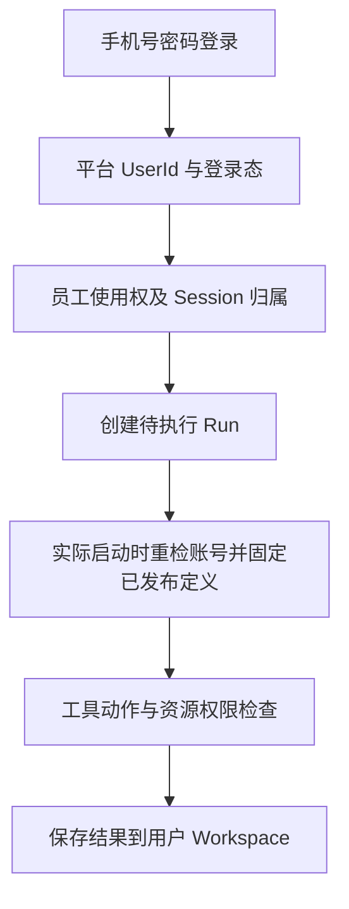

# 海卓智慧大脑：用户身份、内部权限与外部 Token 设计

| 项目 | 内容 |
| --- | --- |
| 版本 | 0.4，项目入库修订稿 |
| 日期 | 2026-09-26 |
| 基线 | 当前项目骨架及已确认的[数字员工多渠道设计](数字员工多渠道接入与消息流转设计.md) |
| 阶段 | 功能与职责骨架；暂不确定 API、数据库表和具体认证组件 |

> 本版修正此前的假设：智慧大脑**自己维护用户和手机号密码登录**；其他系统的 Token 用于访问对应系统，**不承担智慧大脑的登录**。项目只面向公司内部，身份模型不引入公司/租户维度。

## 1. 已确认的一期规则

1. **管理员创建用户**：普通用户没有自助注册功能。管理员负责创建、启用、停用及重置账号。
2. **手机号密码登录**：手机号在平台内唯一，是登录名，也是未来查找其他系统对应用户的业务标识。
3. **内部权限自主管理**：智慧大脑决定谁能管理平台、使用数字员工、访问平台资料及调用 Agent 能力。其他系统的角色或 Token 不自动变成平台权限。
4. **默认员工使用权**：管理员创建并启用的普通用户默认可使用唯一的预置数字员工；每位用户默认只能访问自己的 Session、Workspace、资料和成果。
5. **外部 Token 独立**：登录成功后可按手机号为已接入系统准备对应 Token，并在调用时维护有效性；它按平台用户和目标系统单独管理，不属于 MCP 或 Tool 的绑定内容。目标系统如何提供 Token，留待逐个系统协调。

这五条足以先定义产品骨架。即使只有一个数字员工，仍保留“员工已发布定义—能力绑定—用户授权”的关系，避免以后增加员工或工具时改变身份模型。

## 2. 先分清四种对象

| 对象 | 代表什么 | 一期规则 |
| --- | --- | --- |
| `User` / `UserId` | 智慧大脑中的真实员工及稳定内部身份 | 管理员创建；手机号唯一；Session、成果、授权和审计关联 `UserId` |
| 登录凭证与平台登录态 | 手机号密码验证后，智慧大脑认可的当前会话 | 只用于访问智慧大脑；停用账号或必要的安全操作后可失效 |
| 平台权限 | 用户在智慧大脑内对某资源执行某动作的资格 | 由本平台判定；包含管理权限、数字员工使用权、个人资源归属和工具动作权限 |
| 外部系统用户凭证 | 某个用户访问某一个目标系统的 Token | 由凭证管理职责按“平台 `UserId` + 目标系统”关联、更新和撤销；不绑定到员工、MCP 或 Tool，不进入 Prompt、AgentState 或平台登录态 |

**手机号用于登录和对接定位，`UserId` 用于稳定归属。** 员工换手机号时，经管理员核验后修改登录名与外部关联；原 Session、Workspace、成果和授权仍属于原 `UserId`。旧号码重新分配给别人时，新用户不能继承旧用户的数据。当前工程里出现的 `TenantId` / `tenantId` 是既有骨架命名，不代表产品现在需要完整多租户；详细设计时再统一校准。

## 3. 用户与登录的功能边界

| 操作 | 建议的一期行为 |
| --- | --- |
| 创建账号 | 管理员录入并核验手机号，分配基础角色，完成安全的首次密码设置；不提供公开注册 |
| 登录 | 用户提交手机号与密码；平台确认账号启用后建立自己的登录态 |
| 修改或重置密码 | 用户可修改自己的密码；管理员可发起受控重置，但不应获知用户原密码 |
| 停用账号 | 阻止后续登录并使有效登录态失效；渠道新工作接收、待执行 Run 启动、等待续接及实际资源或工具操作按各自边界复核账号状态 |
| 更换手机号 | 核验归属与唯一性，保留 `UserId` 和历史资源；逐一检查外部系统关联 |

登录回答的是“**现在是谁**”；授权回答的是“**这个人现在能做什么**”。两者都由智慧大脑掌握，不能把成功登录等同于拥有管理员权限、别人的资料或外部系统操作权。

## 4. 一期内部权限怎样保持简单且可扩展

建议先落地**角色权限 + 资源归属 + 动作授权**三类判断，不为将来的所有组织形态一次性建完整权限后台。

| 判断 | 一期规则 | 后续扩展 |
| --- | --- | --- |
| 管理权限 | 管理员可管理用户、基础角色和平台配置；普通用户不能 | 员工配置管理员、审计员等职责再拆分 |
| 使用数字员工 | 所有已启用普通用户默认可用预置员工；停用即拒绝新工作 | 多员工时增加员工可用范围与分配规则 |
| 个人资源 | Session、个人 Workspace、资料和成果默认仅所有者可读写 | 明确的部门共享、协作或受控代办 |
| Agent 动作 | 员工定义先限制可见的 Skill/Tool；工具执行前再查用户对动作和目标资源的权限 | 细分系统、业务动作、资源范围与任务授权 |
| 操作确认 | 对重要外部写操作要求用户确认；确认后仍重新检查原有权限 | 审批、有效期、撤销与审计 |

用熟悉的权限语言表达：`Subject` 首先是平台用户，`Role` 是一组平台内 Permission，`Resource + Action` 表示目标与动作，`Scope` 限定个人或以后明确开放的组织范围。`Group`、服务账号和 Agent 身份保留为以后需要的主体类型；**数字员工不是一个可替代真实用户的登录账号**。管理员拥有管理能力，也不因此默认获得查看所有人私人会话正文的权限。

Agent 工具调用的有效许可可以理解为：**已发布员工定义绑定的能力 ∩ 当前用户的动作权限 ∩ 目标资源的可访问范围**。必要确认是额外条件，不扩大这个交集。主 Agent 即使委派内部子 Agent，也不能把用户权限扩大。

## 5. 一次请求在平台内部怎么走

用户从 Web 提交工作时，平台从自身登录态确定 `UserId`，由服务端配置找到数字员工，检查其发布定义存在并创建用户自己的 Session/Run；实际执行开始时再次检查账号并固定届时的定义与能力修订。资源读取和工具操作按实际目标检查权限；主 `HarnessAgent` 只收到已确定的用户、Session、能力与必要资源引用，不从请求体自行推断身份。同一用户从 Web、OA 或消息渠道进入时可以关联同一平台用户，但不同渠道的 Session 默认不合并。

消息渠道若不能直接使用本平台登录态，须设计可信的渠道身份绑定或二次核验；**单靠消息里自报手机号，不可读取该手机号用户的 Workspace**。这一点属于渠道接入，不改变 Web 的手机号密码登录规则。

渠道身份绑定只能解析稳定 `UserId`，不能证明账号仍启用。停用用户的消息渠道回调可按提供方协议 ACK，避免无效重投；内部应记录拒绝，不创建新业务 Run，也不让旧 Run 产生新的操作。已完成的外部操作按真实结果记录。

## 6. 与其他系统的 Token 关系

你的目标流程可概括为：**登录本平台 → 用平台内已核验手机号定位目标系统用户 → 获取或更新该系统认可的 Token → 对该系统发请求时携带它**。建议把“平台登录成功”和“外部 Token 已准备好”定义为两个独立状态：

- 登录后可预先准备常用系统的 Token，但某个系统暂时不可用时，用户仍能进入智慧大脑并使用不依赖它的能力。
- 某次能力调用确实需要目标系统时，对接层根据已验证的 `UserId` 和目标系统向独立凭证管理职责获取有效 Token；过期则按其协议更新，获取失败只让该能力失败或等待，不冒充成功。
- 外部用户 Token 不写在员工发布版本、`CapabilityBinding`、Tool 定义或 MCP 工具绑定中。不能把 A 系统 Token 用到 B 系统，也不能把外部 Token 当平台用户的身份或权限记录。

需要区分两类凭证：**MCP 连接可能需要的服务/连接密钥**由连接配置引用并由凭证管理部分提供；**员工访问外部业务系统所需的用户 Token**按 `UserId + 目标系统` 动态维护。它们不因使用同一个 MCP Tool 就合并。仅轮换密钥值不改变员工能力修订；若服务身份、授权范围、目标连接或认证方式改变，则属于需要另行审核的配置变化。某 MCP 连接能否携带每次调用的用户身份，仍须在具体对接中验证，不能假定共享连接自动具备用户级授权。

**待协调的关键前提**：手机号只能帮助对方找到用户，不能单凭一个手机号要求对方签发该用户 Token。目标系统还需要认可智慧大脑的服务身份，并约定“代该用户获取凭证/执行操作”的授权方式。若某系统不支持，先标记该能力不可用或要求在其自身登录上下文完成，不能在设计上预设已经打通。外部凭证的存放、更新、撤销与审计由后续具体对接方案确定。

实际接入还须建立稳定的 `UserId + 目标系统 + 外部账号` 映射。手机号变更、外部账号解绑或重绑时核验映射，撤销或更新旧凭证；不能因为新用户取得旧手机号而继承旧用户的外部 Token。每次调用复核凭证属于当前平台用户与目标账号。

## 7. 模块归属与现有骨架

| 位置 | 目标职责 | 当前骨架状态 |
| --- | --- | --- |
| `api` | 登录与管理员接口、Webhook 验签和协议处理；将已验证请求交给对应业务边界 | 尚无可用登录、用户管理或对话入口 |
| `security` | 用户账号、密码与登录态、角色/权限、资源授权、确认与撤销规则 | 有 `Subject`、`Role`、`Scope`、`AuthorizationService` 等契约，尚无可用实现 |
| `platform.channel` | 经核验的外部渠道身份与 `UserId` 绑定、员工路由、Session 接入 | 有渠道身份与入站契约；真实身份绑定和持久化待实现 |
| `platform` 其他分区 | 员工发布、资源归属、Session/Run 与成果规则 | 有部分对象及端口，完整功能未接通 |
| `infrastructure` | 平台用户与权限事实持久化；独立维护 `UserId + 目标系统` 的外部用户 Token 与连接密钥；提供对接适配 | 具体存储与外部适配尚未实现 |
| `runtime-agentscope` | 使用平台传入的 `UserId`、Session 和受限能力执行 | 不负责登录，也不自行按手机号获取外部 Token；真实执行仍待接通 |

继续使用现有模块化单体。用户和权限管理归于现有 `security` 的职责，外部 Token 适配是基础设施能力；无需为了这一期另建登录中心或认证微服务。

## 8. 下一阶段设计验收

进入接口与数据库设计前，团队应能一致回答：

1. 管理员创建并启用张三后，张三能使用预置员工，但能否读取李四的历史 Session？**不能。**
2. 员工绑定了“修改业务系统订单”的工具，张三能否因为员工有工具就执行？**不能；还要检查张三的动作与目标资源权限及必要确认。**
3. 张三登录成功，但目标系统 Token 获取失败，能否继续使用平台内的会话和不依赖该系统的能力？**能；目标系统能力明确失败或等待。**
4. 张三更换手机号，原有成果是否跟随旧手机号转给新持有人？**不能；始终归稳定 `UserId`。**
5. 管理员可否仅凭管理用户的角色查看所有人的私密对话？**默认不能；这需要另行定义受控的审计或代办权限。**

后续需要单独确认的对接事实：各目标系统能否按已核验手机号定位用户、认可哪种智慧大脑服务身份、如何签发/更新用户对应 Token，以及目标系统对业务动作的最终授权规则。这些不应阻碍先把平台内部身份和权限骨架设计清楚。
