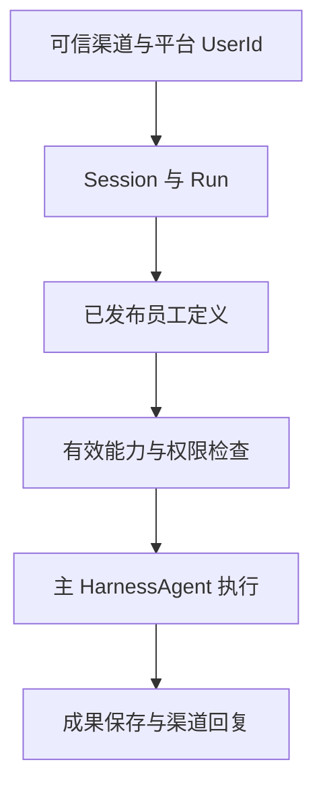

# 海卓智慧大脑：当前设计文档总览

| 项目 | 内容 |
| --- | --- |
| 汇总日期 | 2026-09-26 |
| 版本 | 0.1，项目入库修订稿 |
| 范围 | 数字员工平台的产品功能与框架骨架、多渠道、身份、权限、能力配置与发布 |
| 阶段 | 当前讨论结论的设计汇总；尚未进入 API、数据库和完整功能实现定稿 |

## 阅读顺序与文档清单

| 顺序 | 文档 | 当前版本 | 主要回答的问题 |
| --- | --- | --- | --- |
| 1 | [功能地图与框架骨架](功能地图与框架骨架.md) | 0.3 | 产品有哪些功能域，现有模块各负责什么 |
| 2 | [数字员工多渠道接入与消息流转](数字员工多渠道接入与消息流转设计.md) | 0.3 | Web、飞书、企微等入口如何识别用户、建立 Session/Run 并回复 |
| 3 | [用户身份、内部权限与外部 Token](用户身份与跨系统Token设计.md) | 0.4 | 平台怎样登录和管用户，外部系统用户 Token 如何独立维护 |
| 4 | [Agent 资源与动作权限](Agent资源与动作权限设计.md) | 0.4 | 员工能力、平台授权、具体资源和外部系统权限如何配合 |
| 5 | [Agent 能力配置与发布架构](Agent能力配置与发布架构.md) | 0.5 | 借鉴 StaffDeck 后，能力目录、修订、绑定、发布和运行怎样衔接 |

这五份文档组成当前的**产品与架构设计基线**。功能地图用于总览，专题文档用于判断相应功能的细则；如果早期仓库概要或旧设计稿与此处已确认的决策冲突，以本清单中较新的专题规则为准。文档中的字段、记录和模块名是设计表达，不能据此认定功能已实现。

## 一页看清当前结论

| 主题 | 已确认的规则 |
| --- | --- |
| 数字员工 | 一期一个预置 `DigitalEmployee`，指向一个当前已发布且不可变的 `AgentDefinitionVersion`；其中引用若干确定修订的 `CapabilityBinding`，运行时由一个主 `HarnessAgent` 执行，按需委派内部子 Agent。 |
| 业务与框架 | 会议整理是验证场景，业务内容可以由 Skill 和 Tool 提供；不恢复独立 `meeting` 框架模块。平台负责发布、用户、资源、Session/Run 和交付，AgentScope 负责 Harness 执行机制。 |
| 多渠道 | Web 与消息渠道统一进入平台身份、Session、Run 和权限规则。渠道验证和绑定到平台 `UserId`；同一用户在不同渠道默认拥有不同 Session。活动 Run 的等待回复关联原 Run，普通新任务一期不自动排队。消息渠道异步投递，Web 从工作事件读取结果。 |
| 用户登录 | 仅管理员创建用户；普通用户没有自助注册。用户以唯一手机号和密码登录；稳定 `UserId` 作为数据归属与授权主体。仅面向公司内部，不引入公司或租户产品维度。 |
| 平台权限 | 启用的普通用户默认可用预置员工，默认仅能访问自己的 Session、Workspace、资料与成果。绑定了能力不等于用户获得动作权限；重要操作的确认也不提升原有权限。 |
| 企业知识与外部动作 | 管理员开放并绑定的公司公共知识源可供启用用户使用，个人资料按 `UserId` 隔离。外部只读动作只有管理员按“目标系统 + 业务动作”明确列入，才作为普通用户默认权限；外部写动作须明确授权，必要时确认。 |
| 外部 Token | 平台登录态与外部系统用户 Token 分开。用户 Token 由独立凭证管理职责按 `UserId + 目标系统` 维护，适配器调用时取得；不与员工、Tool 或 MCP 绑定。MCP 连接所需服务密钥另行管理。 |
| 能力变化 | Skill 内容、Tool 行为或 MCP 子工具 schema 改变时产生新修订。MCP 新发现的工具只进候选清单，经过管理员选择、登记、绑定和发布后才进入员工配置；单纯轮换密钥值不产生能力修订。 |
| 发布与运行 | 新 Run 实际启动时固定定义和能力修订；同一 Session 后续新 Run 可用最新发布版，原 Run 等待与续接仍用旧版。紧急停用限制未越过执行前检查的调用；回滚通过发布一个新版本完成。 |

## 关系示意

外部系统 Token 由执行时的受控适配器按 `UserId + 目标系统` 获取。渠道凭据、MCP 连接密钥及外部系统用户 Token 的用途不同，均不应写入能力绑定或 Prompt。

## 仍待下一阶段决定

1. 各外部系统是否支持按已核验手机号定位用户、怎样授权平台代用户取 Token，以及各业务动作的最终权限和默认只读清单。
2. 哪些写动作需要本次用户确认或业务审批；共享资料、部门范围和一次性任务授权何时引入。
3. API、数据库与并发恢复机制、AgentScope 装配方式、真实渠道协议和凭证的具体安全存储方案。
4. 多员工、用户自建员工、群聊、跨渠道显式转移 Session 等后续范围。

一期已确定数据库 inbox/outbox 与单体内有界 worker，不引入独立消息队列。以上其余项目是**未定实现与后续产品问题**，不影响当前五份文档作为这一阶段的共同设计依据。

## 历史文档的使用方式

早期的会议助手 MVP、按用户组管理 Skill、StaffDeck 选型蓝图，以及工程初始化和模块命名方案，仍可作为讨论过程或工程参考，但包含早期目标与假设；不能覆盖本清单中已经确认的单公司、管理员开户、平台登录、权限、凭证和发布规则。旧稿的迁移取舍及当前代码差距见[历史设计文档核对与迁移说明](历史设计文档核对与迁移说明.md)。五份专题是当前有效的产品与架构基线。
