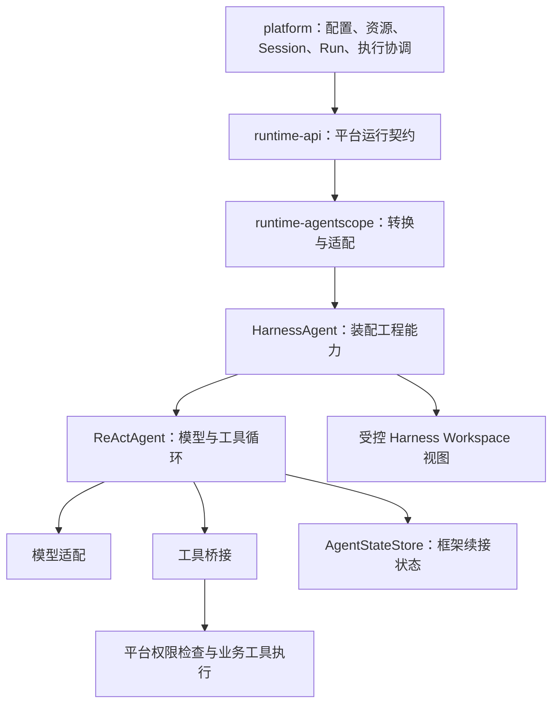

# AgentScope Java：Agent 与 Harness 能力参考

| 项目 | 说明 |
| --- | --- |
| 状态 | 官方资料与源码核查；不是运行验证报告，也不改变已确认设计 |
| 版本 | 0.1 |
| 更新日期 | 2026-09-23 |
| 适用范围 | 根 pom.xml 锁定的 AgentScope Java 2.0.3；官方仓库 `v2.0.3` 标签 |
| 配套阅读 | [源码阅读与接入验证](agentscope-java-integration-checklist.md)、[整体架构](../design/agent-platform/architecture.md) |

## 1. 在本项目中怎样理解 Agent 和 Harness

当用户要求“根据资料生成一份报告”时，模型负责判断下一步需要读资料、调用工具还是直接回答；Agent 负责组织这轮判断与行动；Harness 为这种持续工作补上配置加载、上下文管理、文件访问和委派等工程能力。平台仍负责这是谁的请求、可以访问哪些资料、Run 何时结束，以及报告如何成为正式产物。

`HarnessAgent` 包装 `ReActAgent`，通过装配工具和中间件增加能力。二者不是必须分别部署的服务，也不要求引入消息队列。[官方 Harness 架构](https://github.com/agentscope-ai/agentscope-java/blob/v2.0.3/docs/v2/en/docs/harness/architecture.md)

图中箭头表示调用或接入关系，不是 Maven 编译依赖图。业务模块看见平台契约，框架对象留在适配边界。

不能把 ReActAgent 理解成“完全无状态的单次模型调用”：core 已有消息状态、状态存储接入、权限确认、外部执行等待和中间件。Harness 在此基础上组合更完整的工作环境。[官方 Agent 文档](https://github.com/agentscope-ai/agentscope-java/blob/v2.0.3/docs/v2/en/docs/building-blocks/agent.md)

## 2. Agent 层有哪些可复用能力

| 能力 | 框架提供的机制 | 当前项目如何使用或限定 |
| --- | --- | --- |
| 推理与行动循环 | ReAct 循环连接模型、工具及结果，支持迭代限制 | 主 Agent 可直接组合工具与 Skills；平台控制 Run 总体生命周期 |
| 普通调用与事件流 | `call` 返回结果，`streamEvents` 输出执行事件 | 适配为平台事件供前端使用；流结束不直接等于业务成功 |
| 结构化输出 | 按模型能力使用原生结构化输出或工具形式的替代路径 | 适用于内部结构化结果；业务校验仍由平台完成 |
| 持续上下文 | `RuntimeContext` 携带本次调用身份，`AgentStateStore` 保存续接状态 | 显式传入用户和 Session 标识；Run 标识单独关联 |
| 用户确认 | 发出确认事件，后续调用携带确认结果继续 | 复用交互机制；有效权限和授权由平台判断 |
| 外部工具执行 | 发出外部执行请求，接收关联的工具结果后继续 | 可作为平台托管工具执行的候选桥接方式，先验证暂停与保存时序 |

依据：[Agent 接口、调用与交互说明](https://github.com/agentscope-ai/agentscope-java/blob/v2.0.3/docs/v2/en/docs/building-blocks/agent.md)。最后一列是本项目的设计映射，不是框架自动提供的平台功能。

### 2.1 模型适配

core 定义模型契约，供应商实现位于独立扩展。官方列出 DashScope、OpenAI、Anthropic、Gemini、Ollama 等适配；多模态、推理、结构化输出等实际可用性取决于供应商、模型和配置，不能因框架支持就认为所有模型具备相同能力。[官方模型文档](https://github.com/agentscope-ai/agentscope-java/blob/v2.0.3/docs/v2/en/docs/building-blocks/model.md)

本仓库目前声明 DashScope 扩展，并不表示上述所有扩展已经接入。平台保存模型配置与版本依据，适配层创建框架模型实例。模型实例复用必须区分凭据和有效配置，不能只按模型名称混用。

### 2.2 工具与 Skills 的差别

工具提供实际操作及参数描述；Skills 提供可加载的任务知识和工作方法，不能代替工具的执行权限。`Toolkit` 负责工具注册与分发，支持 Java 注解工具、自定义 `ToolBase`、MCP、工具分组和动态加载。运行上下文可以由程序注入，而非由模型填写可信用户身份。[官方工具文档](https://github.com/agentscope-ai/agentscope-java/blob/v2.0.3/docs/v2/en/docs/building-blocks/tool.md)

例如，“报告编写 Skill”说明如何组织内容，“读取资料工具”取回允许访问的文件，“提交产物工具”登记结果。Skill 中写了某个工具名称，不会因此获得该工具的权限。

### 2.3 扩展执行行为

`MiddlewareBase` 提供 Agent、推理、行动、模型调用和系统提示词等扩展点，可以在调用链中转换输入、处理事件、增加上下文。扩展必须明确作用阶段和组合顺序；适配器使用这些扩展点，不要求业务服务直接依赖框架中间件。[中间件文档](https://github.com/agentscope-ai/agentscope-java/blob/v2.0.3/docs/v2/en/docs/building-blocks/middleware.md)、[接口源码](https://github.com/agentscope-ai/agentscope-java/blob/v2.0.3/agentscope-core/src/main/java/io/agentscope/core/middleware/MiddlewareBase.java)

## 3. Harness 增加哪些工程能力

### 3.1 Workspace：配置和工作内容的组织

官方 Harness Workspace 可组织 `AGENTS.md` 指令、Skills、子 Agent 定义、工具配置、知识、记忆、计划及日志。底层可以是本地或远程文件系统、沙箱；不要求用户提供本地目录。它既涉及 Agent 定义，也涉及持续工作内容，不能只理解成临时目录。[官方 Workspace 文档](https://github.com/agentscope-ai/agentscope-java/blob/v2.0.3/docs/v2/en/docs/harness/workspace.md)

| 概念 | 本项目中的定位 |
| --- | --- |
| 平台 Workspace | 用户个人资源的业务归属空间 |
| 平台 Agent Profile | 平台管理的可复用 Agent 配置；本次 core / harness 核查未发现与其定义对应的独立 `AgentProfile` 类型 |
| Harness Workspace | 向框架提供配置与工作文件的组织机制；与 Profile 的部分内容重叠 |
| AgentState | 模型继续运行所需的内部状态，由独立状态存储管理 |

本项目采用受控映射：Profile 和允许访问的资源进入框架视图；不把个人资源空间整体挂载，也不把上传文件中的 `AGENTS.md` 自动提升为可信配置。具体映射仍待验证，已确认职责见[架构第 5 节](../design/agent-platform/architecture.md)。

### 3.2 Skills 发现、加载和来源扩展

Harness 支持 Workspace Skills 及可组合的 Skill 仓库，包括 Git、Nacos、MySQL、classpath 和自定义来源，并提供动态加载及可选自学习能力。[官方 Skills 文档](https://github.com/agentscope-ai/agentscope-java/blob/v2.0.3/docs/v2/en/docs/harness/skill.md)

平台负责目录、发布修订和可用范围，优先复用框架加载机制。进入 Run 的有效来源必须固定；初版不启用自学习发布，不能让多个来源的覆盖规则改变已记录的修订。

### 3.3 上下文压缩、原文日志和长期记忆

三者解决不同问题：压缩减少当前模型上下文；transcript 留存会话原文；长期记忆提取并复用跨轮积累的信息。框架还提供大型工具结果转存、溢出处理等上下文管理手段。[官方压缩文档](https://github.com/agentscope-ai/agentscope-java/blob/v2.0.3/docs/v2/en/docs/harness/compaction.md)

记忆处理可能发生在每轮调用、压缩以及后台维护等路径。仅将每轮 flush 设置为 NEVER 不等于关闭全部记忆处理；关闭 memory hooks、memory tools 与控制压缩配置需要结合验证。[官方记忆文档](https://github.com/agentscope-ai/agentscope-java/blob/v2.0.3/docs/v2/en/docs/harness/memory.md)

本项目优先复用压缩，不运行两套独立摘要循环；保留业务原文和摘要关联。长期自动记忆、自学习与跨 Session 原文检索不因采用 Harness 自动开放。压缩后的上下文不能作为完整业务审计记录。

### 3.4 子 Agent 委派

Harness 支持声明子 Agent、创建及后续沟通、同步或后台运行、收集结果、取消后台任务，也支持通过 Channel 暴露子 Agent 或连接远程 Agent。这些能力范围大于本项目初版需要。[官方子 Agent 文档](https://github.com/agentscope-ai/agentscope-java/blob/v2.0.3/docs/v2/en/docs/harness/subagent.md)

本项目保持主 Agent 统一交付，初版只采用受控顺序委派。特别注意：普通同步等待超时可以转为后台执行；`CTX_FORCE_SYNC` 可禁止这种转移，但同一轮多个工具仍可能并行。顺序委派需要同时控制委派模式与工具调度，并验证超时后的真实停止行为。[AgentSpawnTool 源码](https://github.com/agentscope-ai/agentscope-java/blob/v2.0.3/agentscope-harness/src/main/java/io/agentscope/harness/agent/tool/AgentSpawnTool.java)

框架的后台 task 标识是内部执行概念，不直接等于平台业务 Task，也不替代平台 Run。

### 3.5 文件系统、沙箱与计划

Harness 提供沙箱接入与执行环境管理能力；具体隔离、文件流转和生命周期依赖所选实现与配置。Workspace 是文件组织，沙箱是执行环境，两者不能互换。[官方沙箱文档](https://github.com/agentscope-ai/agentscope-java/blob/v2.0.3/docs/v2/en/docs/harness/sandbox.md)

Harness 还提供 Plan Mode、Channel / Gateway 等装配能力。[官方能力分工](https://github.com/agentscope-ai/agentscope-java/blob/v2.0.3/docs/v2/en/docs/harness/architecture.md) 本轮只记录其存在：Plan Mode 不直接对应业务 Task；Channel 不直接接管平台会话和 Run 接入。是否复用具体部分，需要以现有架构边界为前提。

## 4. 等待、补充输入、取消和恢复：支持机制不等于平台语义

| 场景 | 已核查的框架机制 | 尚不能直接承诺 |
| --- | --- | --- |
| 等待确认 | `RequireUserConfirmEvent` 与后续确认输入 | 事件发出时已完成状态落盘、平台等待态事务和执行槽释放 |
| 等待外部结果 | `RequireExternalExecutionEvent` 与匹配的 `ToolResultBlock` | 任意业务等待都能无改造接入，或重复结果天然幂等 |
| 补充输入 | `observe` 可向 Agent 添加消息 | 向指定用户正在运行的 Session 安全插入并立即生效 |
| 取消 | 中断信号及循环中的检查点 | 外部 HTTP、文件写入、子进程已停止或副作用已撤销 |
| 恢复 | 加载 AgentState 后继续调用 | 任意故障点自动恢复，或者自动重放工具不会重复操作 |

依据：[ReActAgent 实现](https://github.com/agentscope-ai/agentscope-java/blob/v2.0.3/agentscope-core/src/main/java/io/agentscope/core/ReActAgent.java)、[中断控制实现](https://github.com/agentscope-ai/agentscope-java/blob/v2.0.3/agentscope-core/src/main/java/io/agentscope/core/interruption/InterruptControl.java)、[工具执行器](https://github.com/agentscope-ai/agentscope-java/blob/v2.0.3/agentscope-core/src/main/java/io/agentscope/core/tool/ToolExecutor.java)。

平台继续拥有补充输入收件箱、等待调度、取消协调和恢复判断。适配器将框架机制映射为这些业务行为；每项映射都要经过实验，不能仅凭 API 名称完成设计。

## 5. 持久化与 Langfuse 的位置

项目声明的 JDBC 扩展提供 `JdbcAgentStateStore`，可作为框架状态存储接入候选。本地 2.0.3 JAR 中已确认类存在；这不意味着它已与本项目数据库、事务或状态模型接通。[官方 JDBC 状态存储源码](https://github.com/agentscope-ai/agentscope-java/blob/v2.0.3/agentscope-extensions/agentscope-extensions-jdbc/src/main/java/io/agentscope/extensions/jdbc/state/JdbcAgentStateStore.java)

Spring Boot 负责应用装配和服务运行；MyBatis-Plus 服务于平台业务持久化；AgentScope 负责 Agent 执行机制。采用框架 JDBC 存储不要求把 Session、Run、资源和配置也改为框架模型，更不自动提供跨两套存储的原子事务。

官方 `OtelTracingMiddleware` 已提供 Agent 调用、模型调用与工具行动的 OpenTelemetry 跟踪。源码的工具 span 位于 `onActing`，一批工具可能对应一个 span，不能直接假定每个实际工具都已有独立明细。[跟踪源码](https://github.com/agentscope-ai/agentscope-java/blob/v2.0.3/agentscope-core/src/main/java/io/agentscope/core/tracing/OtelTracingMiddleware.java)

用户已确认由 `observability` 接入 Langfuse。建议优先验证官方跟踪经 OpenTelemetry 导出到 Langfuse，再补充平台 Run / Session 关联和必要的工具粒度。Langfuse 官方 Java 说明推荐 OpenTelemetry；这条说明是核查日的外部集成参考，仓库尚未锁定 Langfuse / OTel 版本。[Langfuse Java 官方说明](https://github.com/langfuse/langfuse-java/blob/main/README.md)

Langfuse 保存观测数据，不作为 Run 状态、权限、恢复检查点或实时预算的权威来源。上传失败隔离、脱敏与线程切换后的 trace 关联属于接入验证内容。

## 6. 接下来的阅读顺序

先理解本文件的职责图，再沿[源码阅读与接入验证](agentscope-java-integration-checklist.md)跟踪一次调用。优先解决统一工具检查、等待与保存时序、受控 Harness 装配三个问题，然后再决定更细的接口和实现方式。未列出的生态能力不代表框架不支持，只表示本轮没有把它们作为当前项目的设计依据。
